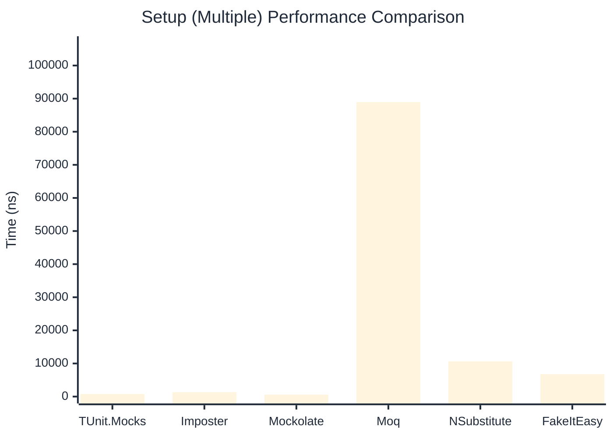

# Setup Benchmark

> Mock behavior configuration (returns, matchers) — comparing **TUnit.Mocks** (source-generated) against runtime proxy-based mocking libraries.

:::info Last Updated
This benchmark was automatically generated on **2026-06-01** from the latest CI run.

**Environment:** Ubuntu Latest • .NET SDK 10.0.300
:::

## 📊 Results

Mock behavior configuration (returns, matchers):

| Library | Mean | Error | StdDev | Allocated |
|---------|------|-------|--------|-----------|
| **TUnit.Mocks** | 531.0 ns | 2.36 ns | 1.84 ns | 2.31 KB |
| Imposter | 735.5 ns | 2.07 ns | 1.84 ns | 6.12 KB |
| Mockolate | 346.6 ns | 2.64 ns | 2.47 ns | 1.65 KB |
| Moq | 299,758.5 ns | 3,083.12 ns | 2,883.95 ns | 28.52 KB |
| NSubstitute | 5,060.3 ns | 11.85 ns | 9.25 ns | 9.01 KB |
| FakeItEasy | 6,822.2 ns | 53.32 ns | 47.26 ns | 10.45 KB |

---

### Multiple

| Library | Mean | Error | StdDev | Allocated |
|---------|------|-------|--------|-----------|
| **TUnit.Mocks** | 765.0 ns | 3.07 ns | 2.87 ns | 3.09 KB |
| Imposter | 1,339.6 ns | 5.96 ns | 4.98 ns | 10.59 KB |
| Mockolate | 574.6 ns | 1.43 ns | 1.34 ns | 2.6 KB |
| Moq | 88,949.6 ns | 373.22 ns | 330.85 ns | 16.64 KB |
| NSubstitute | 10,630.5 ns | 51.82 ns | 48.48 ns | 20.66 KB |
| FakeItEasy | 6,759.8 ns | 18.04 ns | 15.99 ns | 11.71 KB |

## 🎯 Key Insights

This benchmark compares **TUnit.Mocks** (source-generated) against runtime proxy-based mocking libraries for mock behavior configuration (returns, matchers).

---

:::note Methodology
View the [mock benchmarks overview](/docs/benchmarks/mocks) for methodology details and environment information.
:::

*Last generated: 2026-06-01T03:31:09.013Z*
