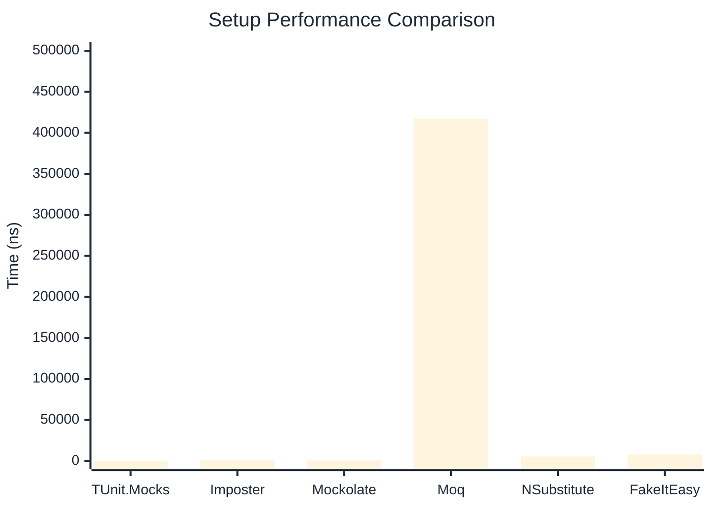

# Setup Benchmark

:::info Last Updated
This benchmark was automatically generated on **2026-05-02** from the latest CI run.

**Environment:** Ubuntu Latest • .NET SDK 10.0.203
:::

## 📊 Results

Mock behavior configuration (returns, matchers):

| Library | Mean | Error | StdDev | Allocated |
|---------|------|-------|--------|-----------|
| **TUnit.Mocks** | 413.0 ns | 2.66 ns | 2.36 ns | 2.01 KB |
| Imposter | 749.5 ns | 3.24 ns | 3.03 ns | 6.12 KB |
| Mockolate | 578.9 ns | 5.11 ns | 4.53 ns | 2.5 KB |
| Moq | 417,219.0 ns | 2,336.39 ns | 2,185.46 ns | 28.52 KB |
| NSubstitute | 5,473.3 ns | 10.69 ns | 10.00 ns | 9.01 KB |
| FakeItEasy | 7,966.6 ns | 72.63 ns | 60.65 ns | 10.45 KB |

---

### Multiple

| Library | Mean | Error | StdDev | Allocated |
|---------|------|-------|--------|-----------|
| **TUnit.Mocks** | 582.3 ns | 1.12 ns | 0.94 ns | 2.59 KB |
| Imposter | 1,352.6 ns | 2.97 ns | 2.78 ns | 10.59 KB |
| Mockolate | 1,003.1 ns | 2.73 ns | 2.55 ns | 4.09 KB |
| Moq | 111,298.8 ns | 786.57 ns | 735.76 ns | 16.64 KB |
| NSubstitute | 11,323.2 ns | 27.20 ns | 24.11 ns | 20.31 KB |
| FakeItEasy | 7,582.1 ns | 27.60 ns | 24.46 ns | 11.71 KB |

## 🎯 Key Insights

This benchmark compares **TUnit.Mocks** (source-generated) against runtime proxy-based mocking libraries for mock behavior configuration (returns, matchers).

---

:::note Methodology
View the [mock benchmarks overview](/docs/benchmarks/mocks) for methodology details and environment information.
:::

*Last generated: 2026-05-02T03:24:38.193Z*
