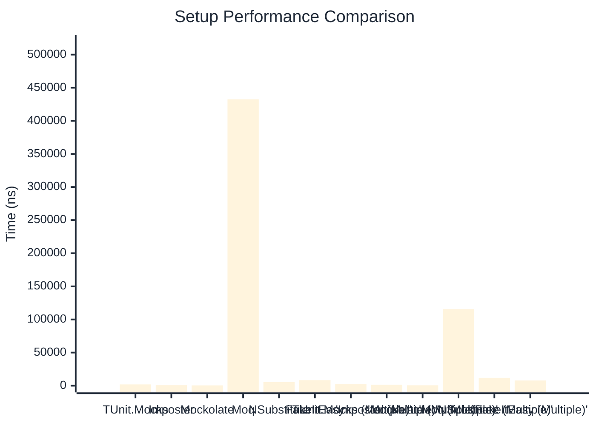

# Setup Benchmark

:::info Last Updated
This benchmark was automatically generated on **2026-03-29** from the latest CI run.

**Environment:** Ubuntu Latest • .NET SDK 10.0.201
:::

## 📊 Results

Mock behavior configuration (returns, matchers):

| Method | Mean | Error | StdDev | Allocated |
|--------|------|-------|--------|-----------|
| **TUnit.Mocks** | 1,957.0 ns | 38.85 ns | 49.13 ns | 3.36 KB |
| Imposter | 803.6 ns | 15.70 ns | 25.35 ns | 6.12 KB |
| Mockolate | 417.0 ns | 8.41 ns | 17.93 ns | 2.04 KB |
| Moq | 432,549.4 ns | 4,149.09 ns | 3,881.06 ns | 28.63 KB |
| NSubstitute | 5,552.5 ns | 56.45 ns | 52.80 ns | 9.01 KB |
| FakeItEasy | 8,322.1 ns | 88.83 ns | 83.09 ns | 10.45 KB |
| **'TUnit.Mocks (Multiple)'** | 2,166.1 ns | 43.37 ns | 74.81 ns | 4.43 KB |
| 'Imposter (Multiple)' | 1,411.4 ns | 26.37 ns | 47.55 ns | 10.59 KB |
| 'Mockolate (Multiple)' | 621.0 ns | 10.57 ns | 8.25 ns | 3.05 KB |
| 'Moq (Multiple)' | 115,662.2 ns | 903.12 ns | 844.78 ns | 16.53 KB |
| 'NSubstitute (Multiple)' | 11,975.8 ns | 195.78 ns | 192.28 ns | 20.5 KB |
| 'FakeItEasy (Multiple)' | 7,841.5 ns | 154.50 ns | 158.66 ns | 11.71 KB |

## 📈 Visual Comparison

## 🎯 Key Insights

This benchmark compares **TUnit.Mocks** (source-generated) against runtime proxy-based mocking libraries for mock behavior configuration (returns, matchers).

---

:::note Methodology
View the [mock benchmarks overview](/docs/benchmarks/mocks) for methodology details and environment information.
:::

*Last generated: 2026-03-29T21:50:09.525Z*
