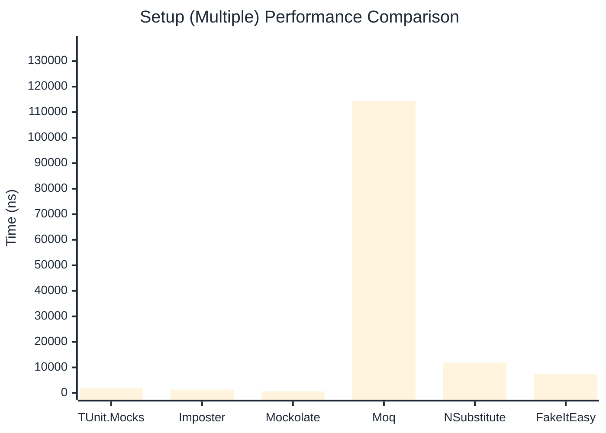

# Setup Benchmark

:::info Last Updated
This benchmark was automatically generated on **2026-03-29** from the latest CI run.

**Environment:** Ubuntu Latest • .NET SDK 10.0.201
:::

## 📊 Results

Mock behavior configuration (returns, matchers):

| Library | Mean | Error | StdDev | Allocated |
|---------|------|-------|--------|-----------|
| **TUnit.Mocks** | 1,793.8 ns | 34.46 ns | 33.84 ns | 3.36 KB |
| Imposter | 746.7 ns | 11.23 ns | 9.95 ns | 6.12 KB |
| Mockolate | 391.5 ns | 3.45 ns | 2.88 ns | 2.04 KB |
| Moq | 421,294.9 ns | 2,417.52 ns | 2,261.35 ns | 28.67 KB |
| NSubstitute | 5,447.6 ns | 104.01 ns | 102.15 ns | 9.01 KB |
| FakeItEasy | 8,081.0 ns | 71.42 ns | 63.32 ns | 10.45 KB |

---

### Multiple

| Library | Mean | Error | StdDev | Allocated |
|---------|------|-------|--------|-----------|
| **TUnit.Mocks** | 2,031.2 ns | 39.10 ns | 41.83 ns | 4.43 KB |
| Imposter | 1,333.1 ns | 20.38 ns | 18.07 ns | 10.59 KB |
| Mockolate | 595.7 ns | 11.60 ns | 10.29 ns | 3.05 KB |
| Moq | 114,306.5 ns | 670.70 ns | 594.56 ns | 16.53 KB |
| NSubstitute | 11,905.7 ns | 142.89 ns | 133.66 ns | 20.31 KB |
| FakeItEasy | 7,435.7 ns | 98.84 ns | 82.53 ns | 11.71 KB |

## 🎯 Key Insights

This benchmark compares **TUnit.Mocks** (source-generated) against runtime proxy-based mocking libraries for mock behavior configuration (returns, matchers).

---

:::note Methodology
View the [mock benchmarks overview](/docs/benchmarks/mocks) for methodology details and environment information.
:::

*Last generated: 2026-03-29T22:20:59.126Z*
