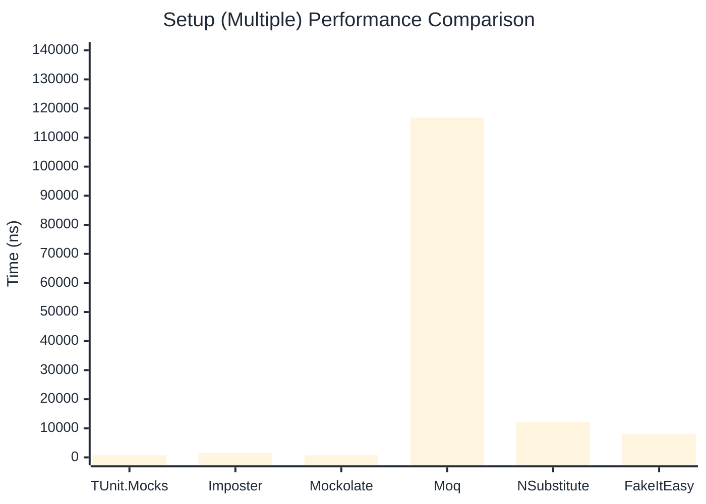

# Setup Benchmark

:::info Last Updated
This benchmark was automatically generated on **2026-04-17** from the latest CI run.

**Environment:** Ubuntu Latest • .NET SDK 10.0.202
:::

## 📊 Results

Mock behavior configuration (returns, matchers):

| Library | Mean | Error | StdDev | Allocated |
|---------|------|-------|--------|-----------|
| **TUnit.Mocks** | 555.9 ns | 5.00 ns | 4.68 ns | 2.34 KB |
| Imposter | 865.2 ns | 8.72 ns | 8.15 ns | 6.12 KB |
| Mockolate | 483.5 ns | 6.29 ns | 5.58 ns | 2.03 KB |
| Moq | 429,288.1 ns | 1,670.44 ns | 1,480.80 ns | 28.71 KB |
| NSubstitute | 5,857.1 ns | 89.45 ns | 79.29 ns | 9.01 KB |
| FakeItEasy | 8,801.0 ns | 82.60 ns | 77.27 ns | 10.45 KB |

---

### Multiple

| Library | Mean | Error | StdDev | Allocated |
|---------|------|-------|--------|-----------|
| **TUnit.Mocks** | 756.4 ns | 7.27 ns | 6.80 ns | 2.93 KB |
| Imposter | 1,480.8 ns | 19.28 ns | 18.03 ns | 10.59 KB |
| Mockolate | 743.4 ns | 8.35 ns | 7.81 ns | 3.07 KB |
| Moq | 116,804.7 ns | 677.37 ns | 633.61 ns | 16.53 KB |
| NSubstitute | 12,220.0 ns | 82.31 ns | 64.26 ns | 20.34 KB |
| FakeItEasy | 7,978.2 ns | 113.55 ns | 94.82 ns | 11.71 KB |

## 🎯 Key Insights

This benchmark compares **TUnit.Mocks** (source-generated) against runtime proxy-based mocking libraries for mock behavior configuration (returns, matchers).

---

:::note Methodology
View the [mock benchmarks overview](/docs/benchmarks/mocks) for methodology details and environment information.
:::

*Last generated: 2026-04-17T03:23:50.633Z*
