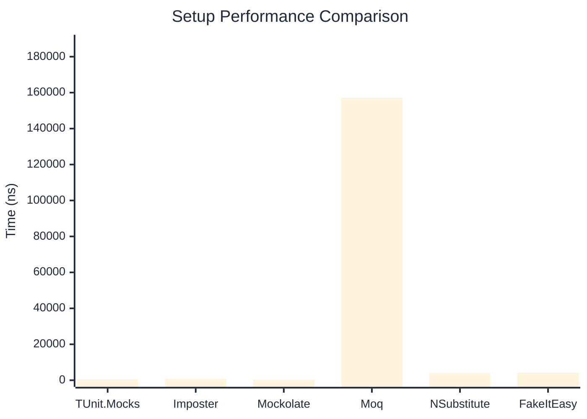
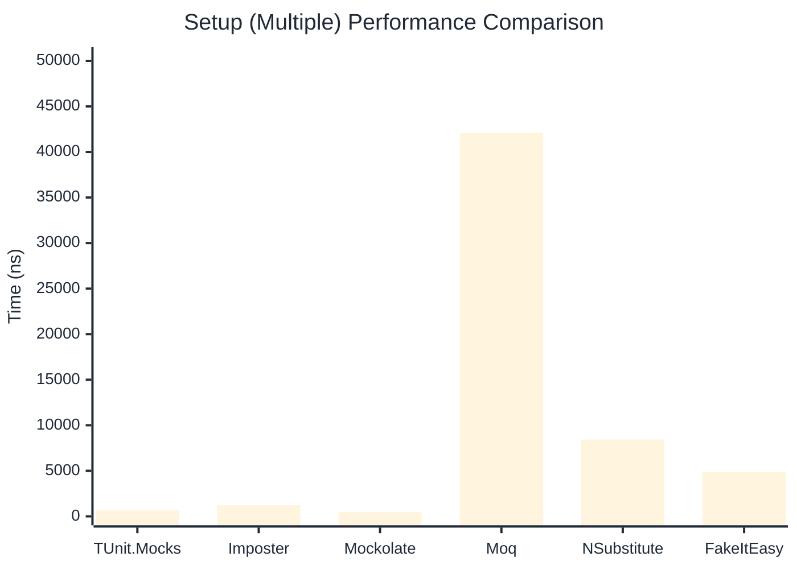

# Setup Benchmark

> Mock behavior configuration (returns, matchers) — comparing **TUnit.Mocks** (source-generated) against runtime proxy-based mocking libraries.

:::info Last Updated
This benchmark was automatically generated on **2026-07-15** from the latest CI run.

**Environment:** Ubuntu Latest • .NET SDK 10.0.302
:::

## 📊 Results

Mock behavior configuration (returns, matchers):

| Library | Mean | Error | StdDev | Allocated |
|---------|------|-------|--------|-----------|
| **TUnit.Mocks** | 481.8 ns | 9.65 ns | 11.49 ns | 2.34 KB |
| Imposter | 721.6 ns | 14.10 ns | 22.76 ns | 6.12 KB |
| Mockolate | 275.4 ns | 5.43 ns | 12.70 ns | 1.41 KB |
| Moq | 157,069.9 ns | 974.57 ns | 813.81 ns | 28.54 KB |
| NSubstitute | 4,014.3 ns | 78.08 ns | 69.22 ns | 9.01 KB |
| FakeItEasy | 4,190.0 ns | 62.91 ns | 58.85 ns | 10.44 KB |

---

### Multiple

| Library | Mean | Error | StdDev | Allocated |
|---------|------|-------|--------|-----------|
| **TUnit.Mocks** | 683.5 ns | 9.70 ns | 8.60 ns | 3.15 KB |
| Imposter | 1,214.3 ns | 21.66 ns | 18.09 ns | 10.59 KB |
| Mockolate | 457.3 ns | 12.06 ns | 35.38 ns | 2.35 KB |
| Moq | 42,088.4 ns | 142.64 ns | 190.42 ns | 16.52 KB |
| NSubstitute | 8,431.0 ns | 163.36 ns | 167.75 ns | 20.31 KB |
| FakeItEasy | 4,830.9 ns | 42.91 ns | 40.14 ns | 11.78 KB |

## 🎯 Key Insights

This benchmark compares **TUnit.Mocks** (source-generated) against runtime proxy-based mocking libraries for mock behavior configuration (returns, matchers).

---

:::note Methodology
View the [mock benchmarks overview](/docs/benchmarks/mocks) for methodology details and environment information.
:::

*Last generated: 2026-07-15T03:20:35.055Z*
