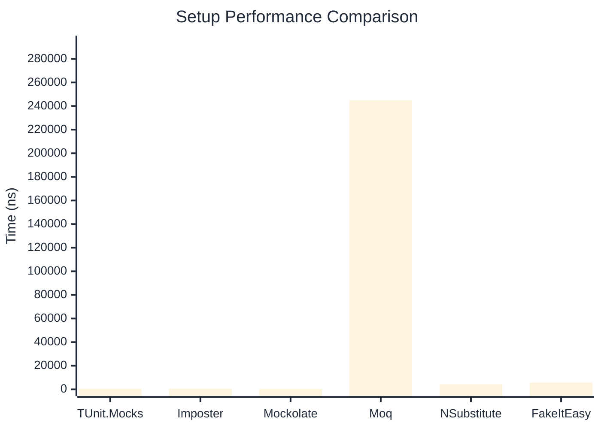

# Setup Benchmark

:::info Last Updated
This benchmark was automatically generated on **2026-05-25** from the latest CI run.

**Environment:** Ubuntu Latest • .NET SDK 10.0.300
:::

## 📊 Results

Mock behavior configuration (returns, matchers):

| Library | Mean | Error | StdDev | Allocated |
|---------|------|-------|--------|-----------|
| **TUnit.Mocks** | 447.7 ns | 7.04 ns | 6.58 ns | 2.31 KB |
| Imposter | 652.9 ns | 11.43 ns | 26.04 ns | 6.12 KB |
| Mockolate | 280.1 ns | 3.80 ns | 3.36 ns | 1.65 KB |
| Moq | 244,947.3 ns | 1,959.41 ns | 1,736.97 ns | 28.56 KB |
| NSubstitute | 4,170.7 ns | 72.04 ns | 73.98 ns | 9.01 KB |
| FakeItEasy | 5,698.9 ns | 111.02 ns | 136.35 ns | 10.45 KB |

---

### Multiple

| Library | Mean | Error | StdDev | Allocated |
|---------|------|-------|--------|-----------|
| **TUnit.Mocks** | 644.7 ns | 12.11 ns | 11.33 ns | 3.09 KB |
| Imposter | 1,162.7 ns | 23.05 ns | 29.98 ns | 10.59 KB |
| Mockolate | 502.4 ns | 7.59 ns | 7.10 ns | 2.6 KB |
| Moq | 68,766.8 ns | 435.45 ns | 386.01 ns | 16.53 KB |
| NSubstitute | 8,554.8 ns | 167.73 ns | 172.25 ns | 20.31 KB |
| FakeItEasy | 5,684.8 ns | 113.62 ns | 180.21 ns | 11.71 KB |

## 🎯 Key Insights

This benchmark compares **TUnit.Mocks** (source-generated) against runtime proxy-based mocking libraries for mock behavior configuration (returns, matchers).

---

:::note Methodology
View the [mock benchmarks overview](/docs/benchmarks/mocks) for methodology details and environment information.
:::

*Last generated: 2026-05-25T03:29:24.567Z*
