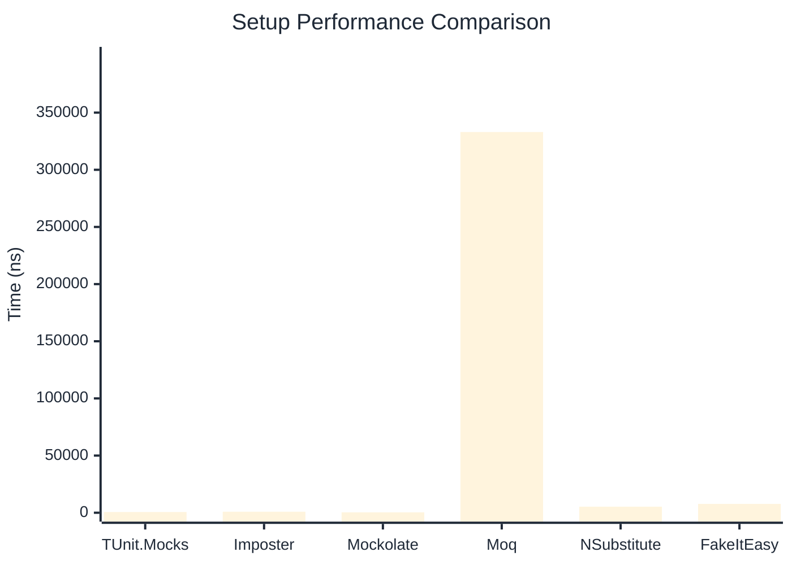

# Setup Benchmark

> Mock behavior configuration (returns, matchers) — comparing **TUnit.Mocks** (source-generated) against runtime proxy-based mocking libraries.

:::info Last Updated
This benchmark was automatically generated on **2026-06-21** from the latest CI run.

**Environment:** Ubuntu Latest • .NET SDK 10.0.301
:::

## 📊 Results

Mock behavior configuration (returns, matchers):

| Library | Mean | Error | StdDev | Allocated |
|---------|------|-------|--------|-----------|
| **TUnit.Mocks** | 608.5 ns | 8.76 ns | 8.19 ns | 2.34 KB |
| Imposter | 867.2 ns | 16.69 ns | 21.70 ns | 6.12 KB |
| Mockolate | 355.7 ns | 7.18 ns | 10.52 ns | 1.65 KB |
| Moq | 333,046.2 ns | 3,900.93 ns | 3,648.93 ns | 28.67 KB |
| NSubstitute | 5,307.8 ns | 53.55 ns | 50.09 ns | 9.01 KB |
| FakeItEasy | 7,719.0 ns | 65.41 ns | 61.19 ns | 10.46 KB |

---

### Multiple

| Library | Mean | Error | StdDev | Allocated |
|---------|------|-------|--------|-----------|
| **TUnit.Mocks** | 948.2 ns | 18.31 ns | 17.13 ns | 3.15 KB |
| Imposter | 1,432.8 ns | 23.89 ns | 19.95 ns | 10.59 KB |
| Mockolate | 618.0 ns | 11.94 ns | 11.73 ns | 2.6 KB |
| Moq | 86,199.4 ns | 420.95 ns | 393.76 ns | 16.53 KB |
| NSubstitute | 11,248.5 ns | 72.02 ns | 63.84 ns | 20.49 KB |
| FakeItEasy | 7,494.7 ns | 135.78 ns | 127.01 ns | 11.72 KB |

## 🎯 Key Insights

This benchmark compares **TUnit.Mocks** (source-generated) against runtime proxy-based mocking libraries for mock behavior configuration (returns, matchers).

---

:::note Methodology
View the [mock benchmarks overview](/docs/benchmarks/mocks) for methodology details and environment information.
:::

*Last generated: 2026-06-21T03:36:43.702Z*
