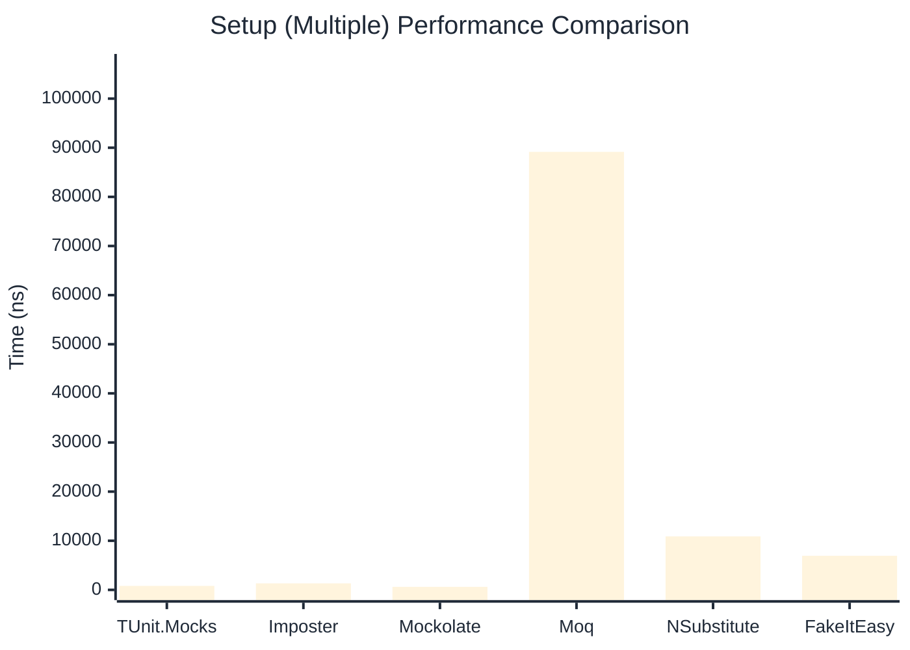

# Setup Benchmark

> Mock behavior configuration (returns, matchers) — comparing **TUnit.Mocks** (source-generated) against runtime proxy-based mocking libraries.

:::info Last Updated
This benchmark was automatically generated on **2026-06-20** from the latest CI run.

**Environment:** Ubuntu Latest • .NET SDK 10.0.301
:::

## 📊 Results

Mock behavior configuration (returns, matchers):

| Library | Mean | Error | StdDev | Allocated |
|---------|------|-------|--------|-----------|
| **TUnit.Mocks** | 550.8 ns | 2.59 ns | 2.17 ns | 2.34 KB |
| Imposter | 767.2 ns | 7.00 ns | 6.21 ns | 6.12 KB |
| Mockolate | 360.6 ns | 2.23 ns | 2.09 ns | 1.65 KB |
| Moq | 298,742.0 ns | 2,003.40 ns | 1,775.97 ns | 28.63 KB |
| NSubstitute | 5,081.8 ns | 22.97 ns | 20.36 ns | 9.01 KB |
| FakeItEasy | 7,061.5 ns | 42.75 ns | 37.90 ns | 10.45 KB |

---

### Multiple

| Library | Mean | Error | StdDev | Allocated |
|---------|------|-------|--------|-----------|
| **TUnit.Mocks** | 811.6 ns | 3.56 ns | 3.16 ns | 3.15 KB |
| Imposter | 1,327.6 ns | 3.05 ns | 2.70 ns | 10.59 KB |
| Mockolate | 617.0 ns | 4.87 ns | 4.56 ns | 2.6 KB |
| Moq | 89,159.1 ns | 866.16 ns | 767.83 ns | 16.53 KB |
| NSubstitute | 10,883.1 ns | 122.31 ns | 114.41 ns | 20.31 KB |
| FakeItEasy | 6,939.3 ns | 131.67 ns | 140.89 ns | 11.71 KB |

## 🎯 Key Insights

This benchmark compares **TUnit.Mocks** (source-generated) against runtime proxy-based mocking libraries for mock behavior configuration (returns, matchers).

---

:::note Methodology
View the [mock benchmarks overview](/docs/benchmarks/mocks) for methodology details and environment information.
:::

*Last generated: 2026-06-20T03:29:22.484Z*
