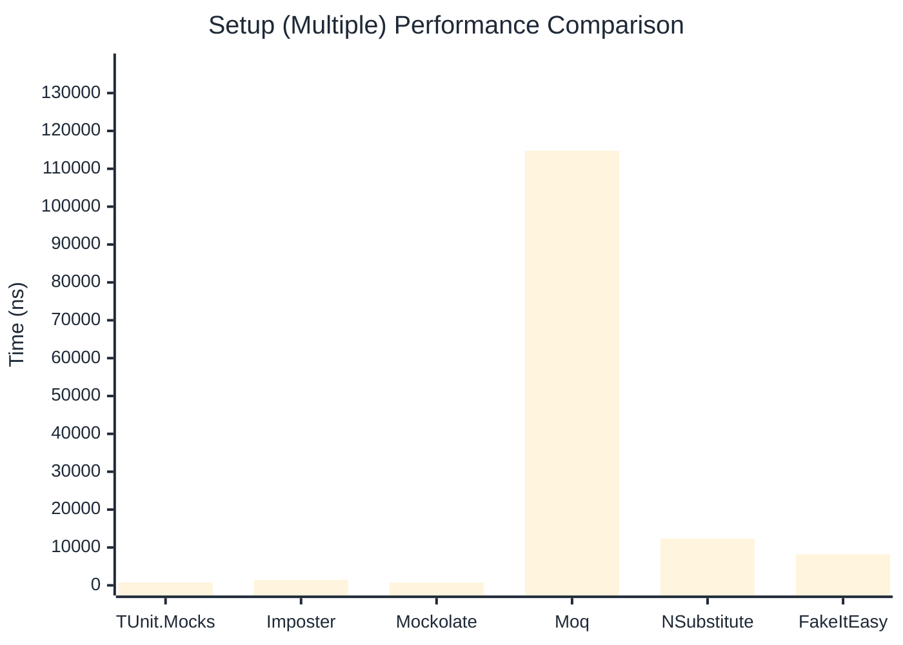

# Setup Benchmark

:::info Last Updated
This benchmark was automatically generated on **2026-04-09** from the latest CI run.

**Environment:** Ubuntu Latest • .NET SDK 10.0.201
:::

## 📊 Results

Mock behavior configuration (returns, matchers):

| Library | Mean | Error | StdDev | Allocated |
|---------|------|-------|--------|-----------|
| **TUnit.Mocks** | 605.2 ns | 11.26 ns | 10.53 ns | 2.34 KB |
| Imposter | 889.7 ns | 17.54 ns | 17.23 ns | 6.12 KB |
| Mockolate | 534.2 ns | 5.47 ns | 5.11 ns | 2.03 KB |
| Moq | 433,029.3 ns | 1,280.50 ns | 1,135.13 ns | 28.63 KB |
| NSubstitute | 5,727.9 ns | 20.62 ns | 19.29 ns | 9.06 KB |
| FakeItEasy | 8,193.3 ns | 65.14 ns | 60.93 ns | 10.45 KB |

---

### Multiple

| Library | Mean | Error | StdDev | Allocated |
|---------|------|-------|--------|-----------|
| **TUnit.Mocks** | 754.8 ns | 13.52 ns | 12.64 ns | 2.93 KB |
| Imposter | 1,424.6 ns | 27.92 ns | 34.28 ns | 10.59 KB |
| Mockolate | 735.1 ns | 14.57 ns | 24.35 ns | 3.07 KB |
| Moq | 114,776.0 ns | 496.05 ns | 439.73 ns | 16.53 KB |
| NSubstitute | 12,347.5 ns | 104.15 ns | 97.42 ns | 20.31 KB |
| FakeItEasy | 8,232.0 ns | 140.57 ns | 131.49 ns | 11.85 KB |

## 🎯 Key Insights

This benchmark compares **TUnit.Mocks** (source-generated) against runtime proxy-based mocking libraries for mock behavior configuration (returns, matchers).

---

:::note Methodology
View the [mock benchmarks overview](/docs/benchmarks/mocks) for methodology details and environment information.
:::

*Last generated: 2026-04-09T03:21:47.332Z*
