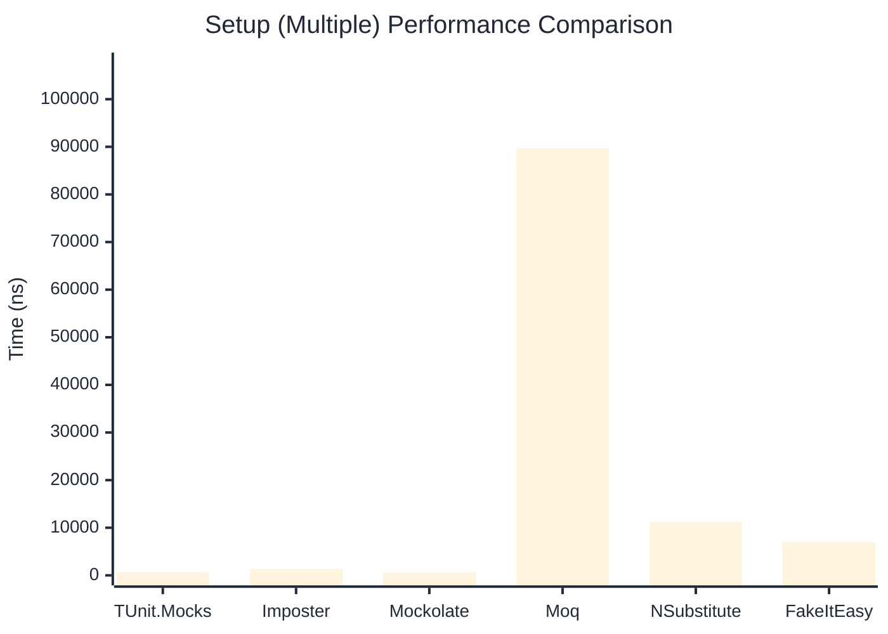

# Setup Benchmark

:::info Last Updated
This benchmark was automatically generated on **2026-05-15** from the latest CI run.

**Environment:** Ubuntu Latest • .NET SDK 10.0.300
:::

## 📊 Results

Mock behavior configuration (returns, matchers):

| Library | Mean | Error | StdDev | Allocated |
|---------|------|-------|--------|-----------|
| **TUnit.Mocks** | 444.7 ns | 2.63 ns | 2.46 ns | 2.01 KB |
| Imposter | 767.4 ns | 13.24 ns | 12.38 ns | 6.12 KB |
| Mockolate | 354.8 ns | 4.17 ns | 3.90 ns | 1.65 KB |
| Moq | 303,336.0 ns | 3,076.17 ns | 2,726.95 ns | 28.52 KB |
| NSubstitute | 5,136.8 ns | 62.97 ns | 58.90 ns | 9.01 KB |
| FakeItEasy | 7,086.8 ns | 96.81 ns | 90.56 ns | 10.45 KB |

---

### Multiple

| Library | Mean | Error | StdDev | Allocated |
|---------|------|-------|--------|-----------|
| **TUnit.Mocks** | 659.5 ns | 9.50 ns | 8.89 ns | 2.59 KB |
| Imposter | 1,341.4 ns | 9.47 ns | 8.39 ns | 10.59 KB |
| Mockolate | 623.0 ns | 12.52 ns | 14.91 ns | 2.6 KB |
| Moq | 89,722.8 ns | 647.82 ns | 574.28 ns | 16.53 KB |
| NSubstitute | 11,226.4 ns | 89.17 ns | 83.41 ns | 20.5 KB |
| FakeItEasy | 6,963.2 ns | 87.32 ns | 81.67 ns | 11.71 KB |

## 🎯 Key Insights

This benchmark compares **TUnit.Mocks** (source-generated) against runtime proxy-based mocking libraries for mock behavior configuration (returns, matchers).

---

:::note Methodology
View the [mock benchmarks overview](/docs/benchmarks/mocks) for methodology details and environment information.
:::

*Last generated: 2026-05-15T03:27:25.234Z*
