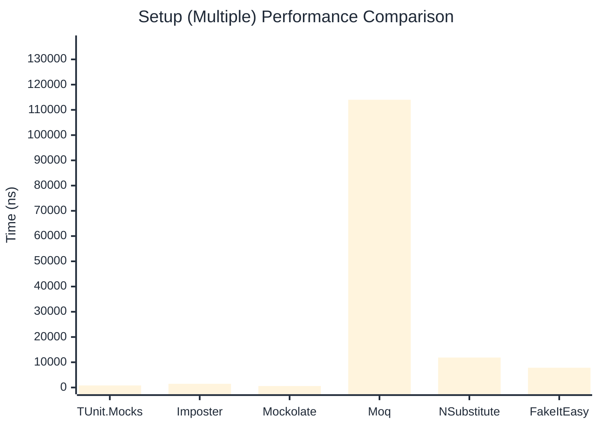

# Setup Benchmark

> Mock behavior configuration (returns, matchers) — comparing **TUnit.Mocks** (source-generated) against runtime proxy-based mocking libraries.

:::info Last Updated
This benchmark was automatically generated on **2026-08-08** from the latest CI run.

**Environment:** Ubuntu Latest • .NET SDK 10.0.302
:::

## 📊 Results

Mock behavior configuration (returns, matchers):

| Library | Mean | Error | StdDev | Allocated |
|---------|------|-------|--------|-----------|
| **TUnit.Mocks** | 535.7 ns | 4.47 ns | 4.18 ns | 2.34 KB |
| Imposter | 838.7 ns | 16.62 ns | 15.55 ns | 6.12 KB |
| Mockolate | 336.5 ns | 4.17 ns | 3.70 ns | 1.41 KB |
| Moq | 437,823.2 ns | 1,802.25 ns | 1,504.96 ns | 28.67 KB |
| NSubstitute | 5,935.9 ns | 47.81 ns | 44.72 ns | 9.01 KB |
| FakeItEasy | 8,670.0 ns | 85.24 ns | 79.73 ns | 10.45 KB |

```mermaid
%%{init: {
  'theme':'base',
  'themeVariables': {
    'primaryColor': '#2563eb',
    'primaryTextColor': '#1f2937',
    'primaryBorderColor': '#1e40af',
    'lineColor': '#6b7280',
    'secondaryColor': '#7c3aed',
    'tertiaryColor': '#dc2626',
    'background': '#ffffff',
    'pie1': '#2563eb',
    'pie2': '#7c3aed',
    'pie3': '#dc2626',
    'pie4': '#f59e0b',
    'pie5': '#10b981',
    'pie6': '#06b6d4',
    'pie7': '#ec4899',
    'pie8': '#6366f1'
  }
}}%%
xychart-beta
  title "Setup Performance Comparison"
  x-axis ["TUnit.Mocks", "Imposter", "Mockolate", "Moq", "NSubstitute", "FakeItEasy"]
  y-axis "Time (ns)" 0 --> 525388
  bar [535.7, 838.7, 336.5, 437823.2, 5935.9, 8670]
```

---

### Multiple

| Library | Mean | Error | StdDev | Allocated |
|---------|------|-------|--------|-----------|
| **TUnit.Mocks** | 815.5 ns | 16.32 ns | 19.42 ns | 3.15 KB |
| Imposter | 1,479.5 ns | 29.19 ns | 60.28 ns | 10.59 KB |
| Mockolate | 581.4 ns | 9.08 ns | 8.49 ns | 2.35 KB |
| Moq | 114,005.4 ns | 1,156.97 ns | 1,082.23 ns | 16.53 KB |
| NSubstitute | 11,875.4 ns | 166.42 ns | 155.67 ns | 20.31 KB |
| FakeItEasy | 7,836.1 ns | 100.42 ns | 83.85 ns | 11.71 KB |

```mermaid
%%{init: {
  'theme':'base',
  'themeVariables': {
    'primaryColor': '#2563eb',
    'primaryTextColor': '#1f2937',
    'primaryBorderColor': '#1e40af',
    'lineColor': '#6b7280',
    'secondaryColor': '#7c3aed',
    'tertiaryColor': '#dc2626',
    'background': '#ffffff',
    'pie1': '#2563eb',
    'pie2': '#7c3aed',
    'pie3': '#dc2626',
    'pie4': '#f59e0b',
    'pie5': '#10b981',
    'pie6': '#06b6d4',
    'pie7': '#ec4899',
    'pie8': '#6366f1'
  }
}}%%
xychart-beta
  title "Setup (Multiple) Performance Comparison"
  x-axis ["TUnit.Mocks", "Imposter", "Mockolate", "Moq", "NSubstitute", "FakeItEasy"]
  y-axis "Time (ns)" 0 --> 136807
  bar [815.5, 1479.5, 581.4, 114005.4, 11875.4, 7836.1]
```

## 🎯 Key Insights

This benchmark compares **TUnit.Mocks** (source-generated) against runtime proxy-based mocking libraries for mock behavior configuration (returns, matchers).

---

:::note Methodology
View the [mock benchmarks overview](/docs/benchmarks/mocks) for methodology details and environment information.
:::

*Last generated: 2026-08-08T02:56:03.834Z*
