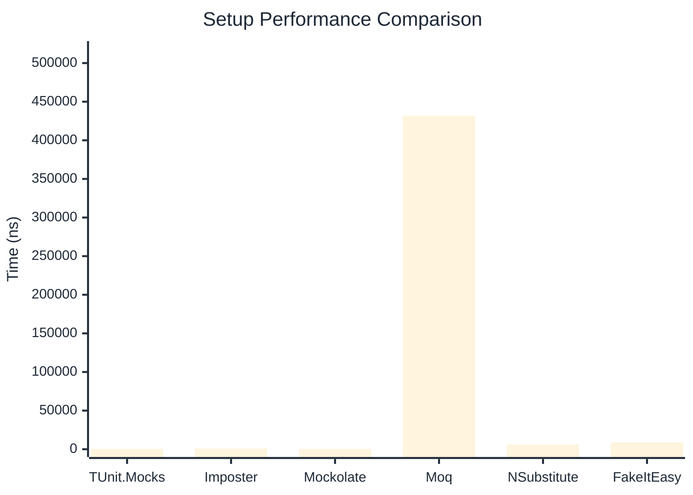

# Setup Benchmark

> Mock behavior configuration (returns, matchers) — comparing **TUnit.Mocks** (source-generated) against runtime proxy-based mocking libraries.

:::info Last Updated
This benchmark was automatically generated on **2026-09-21** from the latest CI run.

**Environment:** Ubuntu Latest • .NET SDK 10.0.401
:::

## 📊 Results

Mock behavior configuration (returns, matchers):

| Library | Mean | Error | StdDev | Allocated |
|---------|------|-------|--------|-----------|
| **TUnit.Mocks** | 513.9 ns | 3.07 ns | 2.57 ns | 2.34 KB |
| Imposter | 826.0 ns | 8.78 ns | 8.22 ns | 6.12 KB |
| Mockolate | 305.0 ns | 3.34 ns | 3.13 ns | 1.41 KB |
| Moq | 431,926.9 ns | 2,913.99 ns | 2,725.75 ns | 28.63 KB |
| NSubstitute | 6,083.8 ns | 35.96 ns | 33.63 ns | 9.01 KB |
| FakeItEasy | 8,817.6 ns | 58.25 ns | 51.64 ns | 10.57 KB |

```mermaid
%%{init: {
  'theme':'base',
  'themeVariables': {
    'primaryColor': '#2563eb',
    'primaryTextColor': '#1f2937',
    'primaryBorderColor': '#1e40af',
    'lineColor': '#6b7280',
    'secondaryColor': '#7c3aed',
    'tertiaryColor': '#dc2626',
    'background': '#ffffff',
    'pie1': '#2563eb',
    'pie2': '#7c3aed',
    'pie3': '#dc2626',
    'pie4': '#f59e0b',
    'pie5': '#10b981',
    'pie6': '#06b6d4',
    'pie7': '#ec4899',
    'pie8': '#6366f1'
  }
}}%%
xychart-beta
  title "Setup Performance Comparison"
  x-axis ["TUnit.Mocks", "Imposter", "Mockolate", "Moq", "NSubstitute", "FakeItEasy"]
  y-axis "Time (ns)" 0 --> 518313
  bar [513.9, 826, 305, 431926.9, 6083.8, 8817.6]
```

---

### Multiple

| Library | Mean | Error | StdDev | Allocated |
|---------|------|-------|--------|-----------|
| **TUnit.Mocks** | 781.9 ns | 4.15 ns | 3.88 ns | 3.15 KB |
| Imposter | 1,371.4 ns | 7.09 ns | 6.63 ns | 10.59 KB |
| Mockolate | 526.2 ns | 4.82 ns | 4.28 ns | 2.35 KB |
| Moq | 116,398.8 ns | 831.01 ns | 777.33 ns | 16.53 KB |
| NSubstitute | 12,664.7 ns | 249.74 ns | 256.46 ns | 20.5 KB |
| FakeItEasy | 8,239.5 ns | 102.88 ns | 85.91 ns | 11.82 KB |

```mermaid
%%{init: {
  'theme':'base',
  'themeVariables': {
    'primaryColor': '#2563eb',
    'primaryTextColor': '#1f2937',
    'primaryBorderColor': '#1e40af',
    'lineColor': '#6b7280',
    'secondaryColor': '#7c3aed',
    'tertiaryColor': '#dc2626',
    'background': '#ffffff',
    'pie1': '#2563eb',
    'pie2': '#7c3aed',
    'pie3': '#dc2626',
    'pie4': '#f59e0b',
    'pie5': '#10b981',
    'pie6': '#06b6d4',
    'pie7': '#ec4899',
    'pie8': '#6366f1'
  }
}}%%
xychart-beta
  title "Setup (Multiple) Performance Comparison"
  x-axis ["TUnit.Mocks", "Imposter", "Mockolate", "Moq", "NSubstitute", "FakeItEasy"]
  y-axis "Time (ns)" 0 --> 139679
  bar [781.9, 1371.4, 526.2, 116398.8, 12664.7, 8239.5]
```

## 🎯 Key Insights

This benchmark compares **TUnit.Mocks** (source-generated) against runtime proxy-based mocking libraries for mock behavior configuration (returns, matchers).

---

:::note Methodology
View the [mock benchmarks overview](/docs/benchmarks/mocks) for methodology details and environment information.
:::

*Last generated: 2026-09-21T02:37:24.392Z*
