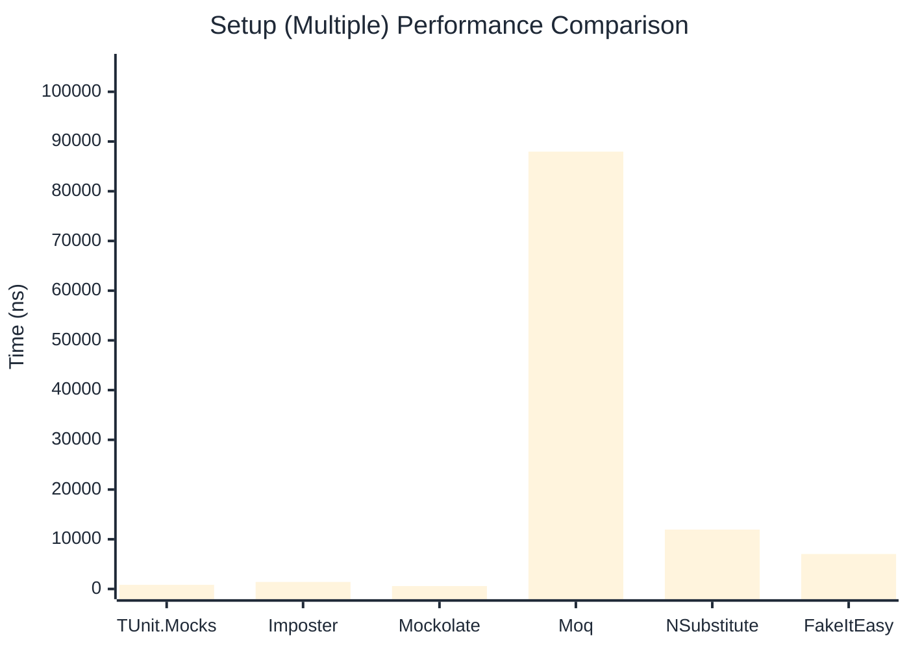

# Setup Benchmark

> Mock behavior configuration (returns, matchers) — comparing **TUnit.Mocks** (source-generated) against runtime proxy-based mocking libraries.

:::info Last Updated
This benchmark was automatically generated on **2026-09-14** from the latest CI run.

**Environment:** Ubuntu Latest • .NET SDK 10.0.401
:::

## 📊 Results

Mock behavior configuration (returns, matchers):

| Library | Mean | Error | StdDev | Allocated |
|---------|------|-------|--------|-----------|
| **TUnit.Mocks** | 564.5 ns | 3.97 ns | 3.52 ns | 2.34 KB |
| Imposter | 843.8 ns | 12.45 ns | 11.04 ns | 6.12 KB |
| Mockolate | 355.3 ns | 4.25 ns | 3.98 ns | 1.41 KB |
| Moq | 309,148.1 ns | 2,507.29 ns | 2,345.32 ns | 28.52 KB |
| NSubstitute | 6,016.9 ns | 49.10 ns | 38.33 ns | 9.01 KB |
| FakeItEasy | 7,421.2 ns | 127.89 ns | 119.63 ns | 10.45 KB |

```mermaid
%%{init: {
  'theme':'base',
  'themeVariables': {
    'primaryColor': '#2563eb',
    'primaryTextColor': '#1f2937',
    'primaryBorderColor': '#1e40af',
    'lineColor': '#6b7280',
    'secondaryColor': '#7c3aed',
    'tertiaryColor': '#dc2626',
    'background': '#ffffff',
    'pie1': '#2563eb',
    'pie2': '#7c3aed',
    'pie3': '#dc2626',
    'pie4': '#f59e0b',
    'pie5': '#10b981',
    'pie6': '#06b6d4',
    'pie7': '#ec4899',
    'pie8': '#6366f1'
  }
}}%%
xychart-beta
  title "Setup Performance Comparison"
  x-axis ["TUnit.Mocks", "Imposter", "Mockolate", "Moq", "NSubstitute", "FakeItEasy"]
  y-axis "Time (ns)" 0 --> 370978
  bar [564.5, 843.8, 355.3, 309148.1, 6016.9, 7421.2]
```

---

### Multiple

| Library | Mean | Error | StdDev | Allocated |
|---------|------|-------|--------|-----------|
| **TUnit.Mocks** | 831.7 ns | 15.93 ns | 16.36 ns | 3.15 KB |
| Imposter | 1,416.9 ns | 28.00 ns | 33.33 ns | 10.59 KB |
| Mockolate | 590.2 ns | 4.42 ns | 3.92 ns | 2.35 KB |
| Moq | 87,964.9 ns | 1,190.64 ns | 1,055.47 ns | 16.53 KB |
| NSubstitute | 11,943.4 ns | 100.08 ns | 93.61 ns | 20.31 KB |
| FakeItEasy | 7,036.4 ns | 86.93 ns | 77.06 ns | 11.71 KB |

```mermaid
%%{init: {
  'theme':'base',
  'themeVariables': {
    'primaryColor': '#2563eb',
    'primaryTextColor': '#1f2937',
    'primaryBorderColor': '#1e40af',
    'lineColor': '#6b7280',
    'secondaryColor': '#7c3aed',
    'tertiaryColor': '#dc2626',
    'background': '#ffffff',
    'pie1': '#2563eb',
    'pie2': '#7c3aed',
    'pie3': '#dc2626',
    'pie4': '#f59e0b',
    'pie5': '#10b981',
    'pie6': '#06b6d4',
    'pie7': '#ec4899',
    'pie8': '#6366f1'
  }
}}%%
xychart-beta
  title "Setup (Multiple) Performance Comparison"
  x-axis ["TUnit.Mocks", "Imposter", "Mockolate", "Moq", "NSubstitute", "FakeItEasy"]
  y-axis "Time (ns)" 0 --> 105558
  bar [831.7, 1416.9, 590.2, 87964.9, 11943.4, 7036.4]
```

## 🎯 Key Insights

This benchmark compares **TUnit.Mocks** (source-generated) against runtime proxy-based mocking libraries for mock behavior configuration (returns, matchers).

---

:::note Methodology
View the [mock benchmarks overview](/docs/benchmarks/mocks) for methodology details and environment information.
:::

*Last generated: 2026-09-14T02:37:23.172Z*
