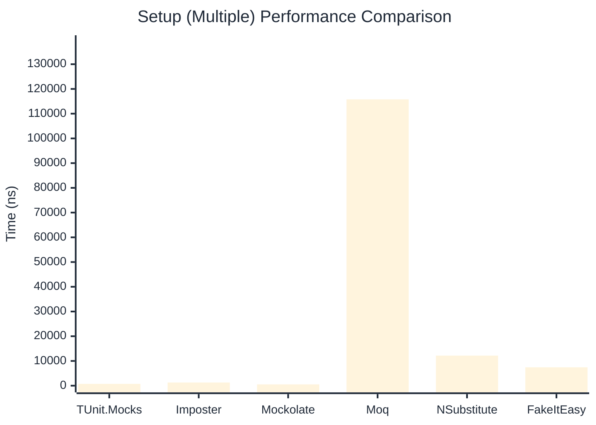

# Setup Benchmark

> Mock behavior configuration (returns, matchers) — comparing **TUnit.Mocks** (source-generated) against runtime proxy-based mocking libraries.

:::info Last Updated
This benchmark was automatically generated on **2026-09-13** from the latest CI run.

**Environment:** Ubuntu Latest • .NET SDK 10.0.401
:::

## 📊 Results

Mock behavior configuration (returns, matchers):

| Library | Mean | Error | StdDev | Allocated |
|---------|------|-------|--------|-----------|
| **TUnit.Mocks** | 499.6 ns | 3.13 ns | 2.93 ns | 2.34 KB |
| Imposter | 743.5 ns | 1.96 ns | 1.64 ns | 6.12 KB |
| Mockolate | 293.4 ns | 1.50 ns | 1.33 ns | 1.41 KB |
| Moq | 425,730.6 ns | 1,669.72 ns | 1,480.16 ns | 28.52 KB |
| NSubstitute | 6,194.8 ns | 24.91 ns | 22.08 ns | 9.06 KB |
| FakeItEasy | 7,938.8 ns | 30.80 ns | 27.30 ns | 10.45 KB |

```mermaid
%%{init: {
  'theme':'base',
  'themeVariables': {
    'primaryColor': '#2563eb',
    'primaryTextColor': '#1f2937',
    'primaryBorderColor': '#1e40af',
    'lineColor': '#6b7280',
    'secondaryColor': '#7c3aed',
    'tertiaryColor': '#dc2626',
    'background': '#ffffff',
    'pie1': '#2563eb',
    'pie2': '#7c3aed',
    'pie3': '#dc2626',
    'pie4': '#f59e0b',
    'pie5': '#10b981',
    'pie6': '#06b6d4',
    'pie7': '#ec4899',
    'pie8': '#6366f1'
  }
}}%%
xychart-beta
  title "Setup Performance Comparison"
  x-axis ["TUnit.Mocks", "Imposter", "Mockolate", "Moq", "NSubstitute", "FakeItEasy"]
  y-axis "Time (ns)" 0 --> 510877
  bar [499.6, 743.5, 293.4, 425730.6, 6194.8, 7938.8]
```

---

### Multiple

| Library | Mean | Error | StdDev | Allocated |
|---------|------|-------|--------|-----------|
| **TUnit.Mocks** | 734.8 ns | 1.70 ns | 1.51 ns | 3.15 KB |
| Imposter | 1,284.9 ns | 3.41 ns | 3.02 ns | 10.59 KB |
| Mockolate | 521.3 ns | 3.02 ns | 2.36 ns | 2.35 KB |
| Moq | 115,815.6 ns | 410.57 ns | 363.96 ns | 16.53 KB |
| NSubstitute | 12,172.9 ns | 33.02 ns | 27.57 ns | 20.31 KB |
| FakeItEasy | 7,432.0 ns | 54.65 ns | 48.45 ns | 11.71 KB |

```mermaid
%%{init: {
  'theme':'base',
  'themeVariables': {
    'primaryColor': '#2563eb',
    'primaryTextColor': '#1f2937',
    'primaryBorderColor': '#1e40af',
    'lineColor': '#6b7280',
    'secondaryColor': '#7c3aed',
    'tertiaryColor': '#dc2626',
    'background': '#ffffff',
    'pie1': '#2563eb',
    'pie2': '#7c3aed',
    'pie3': '#dc2626',
    'pie4': '#f59e0b',
    'pie5': '#10b981',
    'pie6': '#06b6d4',
    'pie7': '#ec4899',
    'pie8': '#6366f1'
  }
}}%%
xychart-beta
  title "Setup (Multiple) Performance Comparison"
  x-axis ["TUnit.Mocks", "Imposter", "Mockolate", "Moq", "NSubstitute", "FakeItEasy"]
  y-axis "Time (ns)" 0 --> 138979
  bar [734.8, 1284.9, 521.3, 115815.6, 12172.9, 7432]
```

## 🎯 Key Insights

This benchmark compares **TUnit.Mocks** (source-generated) against runtime proxy-based mocking libraries for mock behavior configuration (returns, matchers).

---

:::note Methodology
View the [mock benchmarks overview](/docs/benchmarks/mocks) for methodology details and environment information.
:::

*Last generated: 2026-09-13T02:33:28.296Z*
