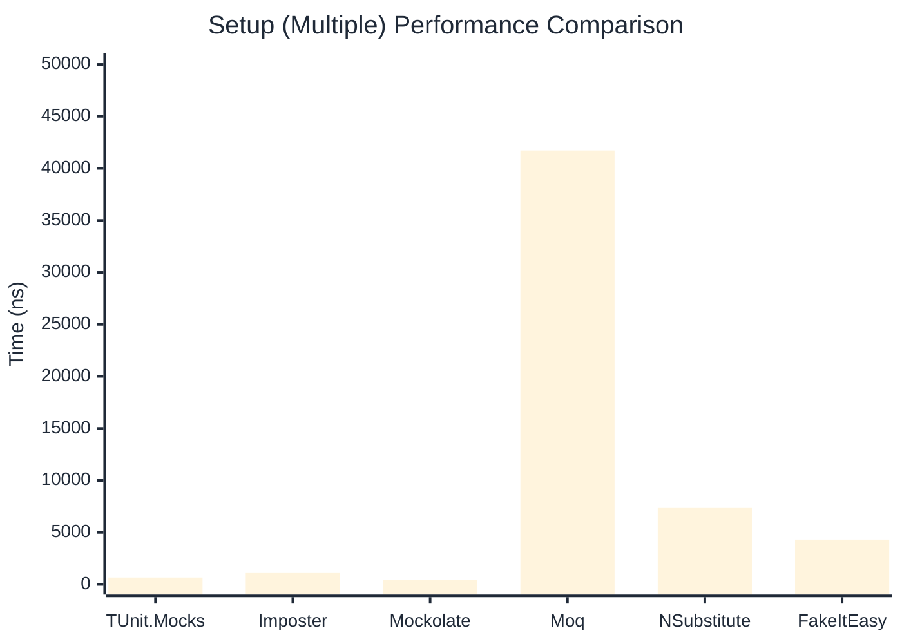

# Setup Benchmark

> Mock behavior configuration (returns, matchers) — comparing **TUnit.Mocks** (source-generated) against runtime proxy-based mocking libraries.

:::info Last Updated
This benchmark was automatically generated on **2026-08-04** from the latest CI run.

**Environment:** Ubuntu Latest • .NET SDK 10.0.302
:::

## 📊 Results

Mock behavior configuration (returns, matchers):

| Library | Mean | Error | StdDev | Allocated |
|---------|------|-------|--------|-----------|
| **TUnit.Mocks** | 451.4 ns | 7.28 ns | 7.15 ns | 2.34 KB |
| Imposter | 659.0 ns | 10.04 ns | 8.38 ns | 6.12 KB |
| Mockolate | 253.1 ns | 4.90 ns | 6.87 ns | 1.41 KB |
| Moq | 159,613.7 ns | 984.14 ns | 821.80 ns | 28.54 KB |
| NSubstitute | 4,242.6 ns | 83.27 ns | 119.43 ns | 9.01 KB |
| FakeItEasy | 4,564.2 ns | 83.26 ns | 77.88 ns | 10.56 KB |

```mermaid
%%{init: {
  'theme':'base',
  'themeVariables': {
    'primaryColor': '#2563eb',
    'primaryTextColor': '#1f2937',
    'primaryBorderColor': '#1e40af',
    'lineColor': '#6b7280',
    'secondaryColor': '#7c3aed',
    'tertiaryColor': '#dc2626',
    'background': '#ffffff',
    'pie1': '#2563eb',
    'pie2': '#7c3aed',
    'pie3': '#dc2626',
    'pie4': '#f59e0b',
    'pie5': '#10b981',
    'pie6': '#06b6d4',
    'pie7': '#ec4899',
    'pie8': '#6366f1'
  }
}}%%
xychart-beta
  title "Setup Performance Comparison"
  x-axis ["TUnit.Mocks", "Imposter", "Mockolate", "Moq", "NSubstitute", "FakeItEasy"]
  y-axis "Time (ns)" 0 --> 191537
  bar [451.4, 659, 253.1, 159613.7, 4242.6, 4564.2]
```

---

### Multiple

| Library | Mean | Error | StdDev | Allocated |
|---------|------|-------|--------|-----------|
| **TUnit.Mocks** | 665.1 ns | 6.19 ns | 5.17 ns | 3.15 KB |
| Imposter | 1,155.1 ns | 21.77 ns | 31.22 ns | 10.59 KB |
| Mockolate | 451.9 ns | 9.05 ns | 11.77 ns | 2.35 KB |
| Moq | 41,726.0 ns | 193.74 ns | 181.23 ns | 16.67 KB |
| NSubstitute | 7,351.5 ns | 100.99 ns | 78.85 ns | 20.31 KB |
| FakeItEasy | 4,310.4 ns | 85.34 ns | 98.28 ns | 11.7 KB |

```mermaid
%%{init: {
  'theme':'base',
  'themeVariables': {
    'primaryColor': '#2563eb',
    'primaryTextColor': '#1f2937',
    'primaryBorderColor': '#1e40af',
    'lineColor': '#6b7280',
    'secondaryColor': '#7c3aed',
    'tertiaryColor': '#dc2626',
    'background': '#ffffff',
    'pie1': '#2563eb',
    'pie2': '#7c3aed',
    'pie3': '#dc2626',
    'pie4': '#f59e0b',
    'pie5': '#10b981',
    'pie6': '#06b6d4',
    'pie7': '#ec4899',
    'pie8': '#6366f1'
  }
}}%%
xychart-beta
  title "Setup (Multiple) Performance Comparison"
  x-axis ["TUnit.Mocks", "Imposter", "Mockolate", "Moq", "NSubstitute", "FakeItEasy"]
  y-axis "Time (ns)" 0 --> 50072
  bar [665.1, 1155.1, 451.9, 41726, 7351.5, 4310.4]
```

## 🎯 Key Insights

This benchmark compares **TUnit.Mocks** (source-generated) against runtime proxy-based mocking libraries for mock behavior configuration (returns, matchers).

---

:::note Methodology
View the [mock benchmarks overview](/docs/benchmarks/mocks) for methodology details and environment information.
:::

*Last generated: 2026-08-04T03:21:55.003Z*
