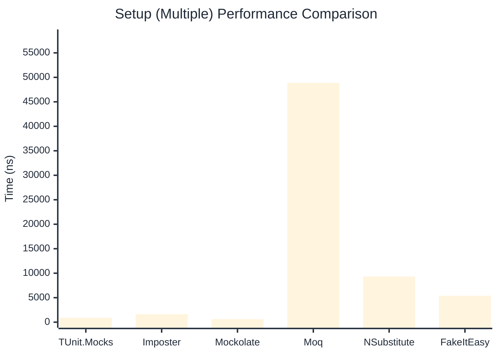

# Setup Benchmark

> Mock behavior configuration (returns, matchers) — comparing **TUnit.Mocks** (source-generated) against runtime proxy-based mocking libraries.

:::info Last Updated
This benchmark was automatically generated on **2026-08-05** from the latest CI run.

**Environment:** Ubuntu Latest • .NET SDK 10.0.302
:::

## 📊 Results

Mock behavior configuration (returns, matchers):

| Library | Mean | Error | StdDev | Allocated |
|---------|------|-------|--------|-----------|
| **TUnit.Mocks** | 593.3 ns | 2.96 ns | 2.77 ns | 2.34 KB |
| Imposter | 828.5 ns | 16.61 ns | 29.09 ns | 6.12 KB |
| Mockolate | 358.1 ns | 3.38 ns | 3.17 ns | 1.41 KB |
| Moq | 176,172.8 ns | 1,170.65 ns | 1,037.75 ns | 28.46 KB |
| NSubstitute | 5,236.1 ns | 8.82 ns | 8.25 ns | 9.06 KB |
| FakeItEasy | 5,599.5 ns | 15.29 ns | 14.30 ns | 10.44 KB |

```mermaid
%%{init: {
  'theme':'base',
  'themeVariables': {
    'primaryColor': '#2563eb',
    'primaryTextColor': '#1f2937',
    'primaryBorderColor': '#1e40af',
    'lineColor': '#6b7280',
    'secondaryColor': '#7c3aed',
    'tertiaryColor': '#dc2626',
    'background': '#ffffff',
    'pie1': '#2563eb',
    'pie2': '#7c3aed',
    'pie3': '#dc2626',
    'pie4': '#f59e0b',
    'pie5': '#10b981',
    'pie6': '#06b6d4',
    'pie7': '#ec4899',
    'pie8': '#6366f1'
  }
}}%%
xychart-beta
  title "Setup Performance Comparison"
  x-axis ["TUnit.Mocks", "Imposter", "Mockolate", "Moq", "NSubstitute", "FakeItEasy"]
  y-axis "Time (ns)" 0 --> 211408
  bar [593.3, 828.5, 358.1, 176172.8, 5236.1, 5599.5]
```

---

### Multiple

| Library | Mean | Error | StdDev | Allocated |
|---------|------|-------|--------|-----------|
| **TUnit.Mocks** | 871.2 ns | 2.90 ns | 2.42 ns | 3.15 KB |
| Imposter | 1,626.9 ns | 32.16 ns | 44.03 ns | 10.59 KB |
| Mockolate | 607.4 ns | 2.15 ns | 1.90 ns | 2.35 KB |
| Moq | 48,856.2 ns | 338.80 ns | 316.91 ns | 16.52 KB |
| NSubstitute | 9,311.0 ns | 36.40 ns | 34.05 ns | 20.31 KB |
| FakeItEasy | 5,404.5 ns | 29.99 ns | 26.59 ns | 11.7 KB |

```mermaid
%%{init: {
  'theme':'base',
  'themeVariables': {
    'primaryColor': '#2563eb',
    'primaryTextColor': '#1f2937',
    'primaryBorderColor': '#1e40af',
    'lineColor': '#6b7280',
    'secondaryColor': '#7c3aed',
    'tertiaryColor': '#dc2626',
    'background': '#ffffff',
    'pie1': '#2563eb',
    'pie2': '#7c3aed',
    'pie3': '#dc2626',
    'pie4': '#f59e0b',
    'pie5': '#10b981',
    'pie6': '#06b6d4',
    'pie7': '#ec4899',
    'pie8': '#6366f1'
  }
}}%%
xychart-beta
  title "Setup (Multiple) Performance Comparison"
  x-axis ["TUnit.Mocks", "Imposter", "Mockolate", "Moq", "NSubstitute", "FakeItEasy"]
  y-axis "Time (ns)" 0 --> 58628
  bar [871.2, 1626.9, 607.4, 48856.2, 9311, 5404.5]
```

## 🎯 Key Insights

This benchmark compares **TUnit.Mocks** (source-generated) against runtime proxy-based mocking libraries for mock behavior configuration (returns, matchers).

---

:::note Methodology
View the [mock benchmarks overview](/docs/benchmarks/mocks) for methodology details and environment information.
:::

*Last generated: 2026-08-05T03:21:19.181Z*
