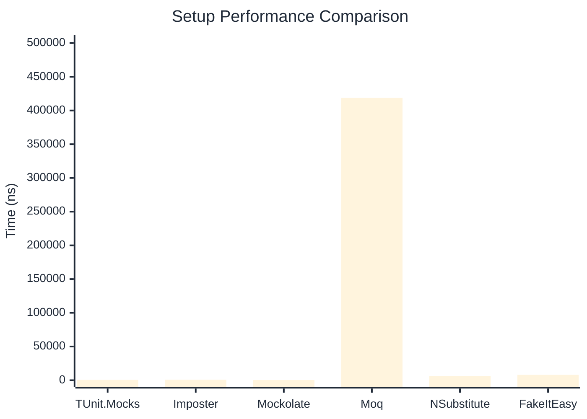

# Setup Benchmark

> Mock behavior configuration (returns, matchers) — comparing **TUnit.Mocks** (source-generated) against runtime proxy-based mocking libraries.

:::info Last Updated
This benchmark was automatically generated on **2026-08-30** from the latest CI run.

**Environment:** Ubuntu Latest • .NET SDK 10.0.400
:::

## 📊 Results

Mock behavior configuration (returns, matchers):

| Library | Mean | Error | StdDev | Allocated |
|---------|------|-------|--------|-----------|
| **TUnit.Mocks** | 517.7 ns | 1.58 ns | 1.32 ns | 2.34 KB |
| Imposter | 804.1 ns | 3.62 ns | 3.21 ns | 6.12 KB |
| Mockolate | 301.3 ns | 1.63 ns | 1.45 ns | 1.41 KB |
| Moq | 418,696.1 ns | 2,699.34 ns | 2,392.90 ns | 28.52 KB |
| NSubstitute | 5,994.3 ns | 24.86 ns | 20.76 ns | 9.01 KB |
| FakeItEasy | 8,009.3 ns | 58.37 ns | 45.57 ns | 10.45 KB |

```mermaid
%%{init: {
  'theme':'base',
  'themeVariables': {
    'primaryColor': '#2563eb',
    'primaryTextColor': '#1f2937',
    'primaryBorderColor': '#1e40af',
    'lineColor': '#6b7280',
    'secondaryColor': '#7c3aed',
    'tertiaryColor': '#dc2626',
    'background': '#ffffff',
    'pie1': '#2563eb',
    'pie2': '#7c3aed',
    'pie3': '#dc2626',
    'pie4': '#f59e0b',
    'pie5': '#10b981',
    'pie6': '#06b6d4',
    'pie7': '#ec4899',
    'pie8': '#6366f1'
  }
}}%%
xychart-beta
  title "Setup Performance Comparison"
  x-axis ["TUnit.Mocks", "Imposter", "Mockolate", "Moq", "NSubstitute", "FakeItEasy"]
  y-axis "Time (ns)" 0 --> 502436
  bar [517.7, 804.1, 301.3, 418696.1, 5994.3, 8009.3]
```

---

### Multiple

| Library | Mean | Error | StdDev | Allocated |
|---------|------|-------|--------|-----------|
| **TUnit.Mocks** | 762.8 ns | 1.83 ns | 1.53 ns | 3.15 KB |
| Imposter | 1,364.7 ns | 3.46 ns | 3.24 ns | 10.59 KB |
| Mockolate | 527.3 ns | 3.45 ns | 3.06 ns | 2.35 KB |
| Moq | 113,034.0 ns | 402.10 ns | 356.46 ns | 16.64 KB |
| NSubstitute | 12,275.3 ns | 147.32 ns | 130.60 ns | 20.31 KB |
| FakeItEasy | 7,454.1 ns | 32.39 ns | 28.71 ns | 11.71 KB |

```mermaid
%%{init: {
  'theme':'base',
  'themeVariables': {
    'primaryColor': '#2563eb',
    'primaryTextColor': '#1f2937',
    'primaryBorderColor': '#1e40af',
    'lineColor': '#6b7280',
    'secondaryColor': '#7c3aed',
    'tertiaryColor': '#dc2626',
    'background': '#ffffff',
    'pie1': '#2563eb',
    'pie2': '#7c3aed',
    'pie3': '#dc2626',
    'pie4': '#f59e0b',
    'pie5': '#10b981',
    'pie6': '#06b6d4',
    'pie7': '#ec4899',
    'pie8': '#6366f1'
  }
}}%%
xychart-beta
  title "Setup (Multiple) Performance Comparison"
  x-axis ["TUnit.Mocks", "Imposter", "Mockolate", "Moq", "NSubstitute", "FakeItEasy"]
  y-axis "Time (ns)" 0 --> 135641
  bar [762.8, 1364.7, 527.3, 113034, 12275.3, 7454.1]
```

## 🎯 Key Insights

This benchmark compares **TUnit.Mocks** (source-generated) against runtime proxy-based mocking libraries for mock behavior configuration (returns, matchers).

---

:::note Methodology
View the [mock benchmarks overview](/docs/benchmarks/mocks) for methodology details and environment information.
:::

*Last generated: 2026-08-30T02:44:44.759Z*
