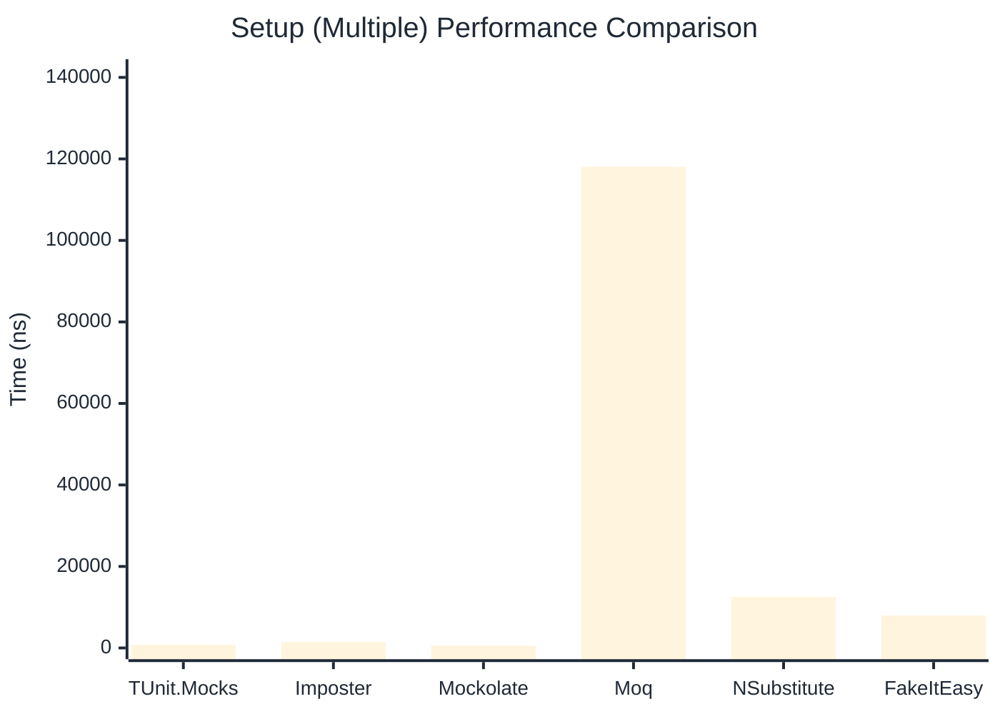

# Setup Benchmark

> Mock behavior configuration (returns, matchers) — comparing **TUnit.Mocks** (source-generated) against runtime proxy-based mocking libraries.

:::info Last Updated
This benchmark was automatically generated on **2026-08-31** from the latest CI run.

**Environment:** Ubuntu Latest • .NET SDK 10.0.400
:::

## 📊 Results

Mock behavior configuration (returns, matchers):

| Library | Mean | Error | StdDev | Allocated |
|---------|------|-------|--------|-----------|
| **TUnit.Mocks** | 539.7 ns | 7.01 ns | 6.56 ns | 2.34 KB |
| Imposter | 869.6 ns | 12.66 ns | 10.57 ns | 6.12 KB |
| Mockolate | 318.9 ns | 4.87 ns | 4.56 ns | 1.41 KB |
| Moq | 433,864.2 ns | 2,999.88 ns | 2,659.31 ns | 28.52 KB |
| NSubstitute | 6,307.8 ns | 35.83 ns | 29.92 ns | 9.06 KB |
| FakeItEasy | 7,885.3 ns | 45.54 ns | 40.37 ns | 10.45 KB |

```mermaid
%%{init: {
  'theme':'base',
  'themeVariables': {
    'primaryColor': '#2563eb',
    'primaryTextColor': '#1f2937',
    'primaryBorderColor': '#1e40af',
    'lineColor': '#6b7280',
    'secondaryColor': '#7c3aed',
    'tertiaryColor': '#dc2626',
    'background': '#ffffff',
    'pie1': '#2563eb',
    'pie2': '#7c3aed',
    'pie3': '#dc2626',
    'pie4': '#f59e0b',
    'pie5': '#10b981',
    'pie6': '#06b6d4',
    'pie7': '#ec4899',
    'pie8': '#6366f1'
  }
}}%%
xychart-beta
  title "Setup Performance Comparison"
  x-axis ["TUnit.Mocks", "Imposter", "Mockolate", "Moq", "NSubstitute", "FakeItEasy"]
  y-axis "Time (ns)" 0 --> 520638
  bar [539.7, 869.6, 318.9, 433864.2, 6307.8, 7885.3]
```

---

### Multiple

| Library | Mean | Error | StdDev | Allocated |
|---------|------|-------|--------|-----------|
| **TUnit.Mocks** | 777.1 ns | 4.61 ns | 3.85 ns | 3.15 KB |
| Imposter | 1,429.2 ns | 11.89 ns | 9.93 ns | 10.59 KB |
| Mockolate | 558.2 ns | 5.20 ns | 4.61 ns | 2.35 KB |
| Moq | 118,060.3 ns | 729.79 ns | 609.41 ns | 16.61 KB |
| NSubstitute | 12,539.7 ns | 95.80 ns | 84.92 ns | 20.31 KB |
| FakeItEasy | 7,957.0 ns | 84.32 ns | 70.41 ns | 11.71 KB |

```mermaid
%%{init: {
  'theme':'base',
  'themeVariables': {
    'primaryColor': '#2563eb',
    'primaryTextColor': '#1f2937',
    'primaryBorderColor': '#1e40af',
    'lineColor': '#6b7280',
    'secondaryColor': '#7c3aed',
    'tertiaryColor': '#dc2626',
    'background': '#ffffff',
    'pie1': '#2563eb',
    'pie2': '#7c3aed',
    'pie3': '#dc2626',
    'pie4': '#f59e0b',
    'pie5': '#10b981',
    'pie6': '#06b6d4',
    'pie7': '#ec4899',
    'pie8': '#6366f1'
  }
}}%%
xychart-beta
  title "Setup (Multiple) Performance Comparison"
  x-axis ["TUnit.Mocks", "Imposter", "Mockolate", "Moq", "NSubstitute", "FakeItEasy"]
  y-axis "Time (ns)" 0 --> 141673
  bar [777.1, 1429.2, 558.2, 118060.3, 12539.7, 7957]
```

## 🎯 Key Insights

This benchmark compares **TUnit.Mocks** (source-generated) against runtime proxy-based mocking libraries for mock behavior configuration (returns, matchers).

---

:::note Methodology
View the [mock benchmarks overview](/docs/benchmarks/mocks) for methodology details and environment information.
:::

*Last generated: 2026-08-31T02:34:36.043Z*
