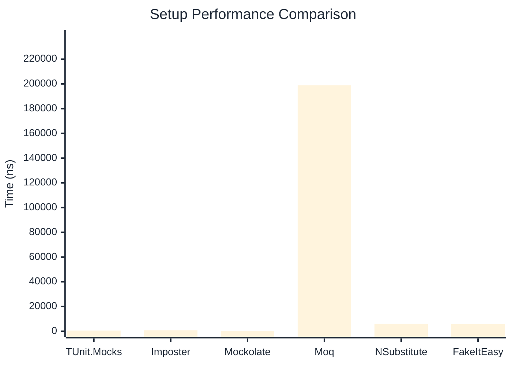

# Setup Benchmark

> Mock behavior configuration (returns, matchers) — comparing **TUnit.Mocks** (source-generated) against runtime proxy-based mocking libraries.

:::info Last Updated
This benchmark was automatically generated on **2026-09-02** from the latest CI run.

**Environment:** Ubuntu Latest • .NET SDK 10.0.400
:::

## 📊 Results

Mock behavior configuration (returns, matchers):

| Library | Mean | Error | StdDev | Allocated |
|---------|------|-------|--------|-----------|
| **TUnit.Mocks** | 556.1 ns | 10.89 ns | 13.78 ns | 2.34 KB |
| Imposter | 691.4 ns | 13.73 ns | 18.79 ns | 6.12 KB |
| Mockolate | 332.1 ns | 5.09 ns | 4.52 ns | 1.41 KB |
| Moq | 198,905.2 ns | 3,941.47 ns | 3,291.30 ns | 28.47 KB |
| NSubstitute | 6,086.9 ns | 120.49 ns | 201.31 ns | 9.06 KB |
| FakeItEasy | 5,964.1 ns | 118.51 ns | 126.81 ns | 10.55 KB |

```mermaid
%%{init: {
  'theme':'base',
  'themeVariables': {
    'primaryColor': '#2563eb',
    'primaryTextColor': '#1f2937',
    'primaryBorderColor': '#1e40af',
    'lineColor': '#6b7280',
    'secondaryColor': '#7c3aed',
    'tertiaryColor': '#dc2626',
    'background': '#ffffff',
    'pie1': '#2563eb',
    'pie2': '#7c3aed',
    'pie3': '#dc2626',
    'pie4': '#f59e0b',
    'pie5': '#10b981',
    'pie6': '#06b6d4',
    'pie7': '#ec4899',
    'pie8': '#6366f1'
  }
}}%%
xychart-beta
  title "Setup Performance Comparison"
  x-axis ["TUnit.Mocks", "Imposter", "Mockolate", "Moq", "NSubstitute", "FakeItEasy"]
  y-axis "Time (ns)" 0 --> 238687
  bar [556.1, 691.4, 332.1, 198905.2, 6086.9, 5964.1]
```

---

### Multiple

| Library | Mean | Error | StdDev | Allocated |
|---------|------|-------|--------|-----------|
| **TUnit.Mocks** | 848.5 ns | 16.63 ns | 20.42 ns | 3.15 KB |
| Imposter | 1,326.7 ns | 26.08 ns | 36.56 ns | 10.59 KB |
| Mockolate | 576.8 ns | 10.19 ns | 10.00 ns | 2.35 KB |
| Moq | 53,960.2 ns | 1,068.11 ns | 1,142.86 ns | 16.52 KB |
| NSubstitute | 9,627.4 ns | 183.28 ns | 231.79 ns | 20.49 KB |
| FakeItEasy | 5,541.2 ns | 108.38 ns | 184.03 ns | 11.7 KB |

```mermaid
%%{init: {
  'theme':'base',
  'themeVariables': {
    'primaryColor': '#2563eb',
    'primaryTextColor': '#1f2937',
    'primaryBorderColor': '#1e40af',
    'lineColor': '#6b7280',
    'secondaryColor': '#7c3aed',
    'tertiaryColor': '#dc2626',
    'background': '#ffffff',
    'pie1': '#2563eb',
    'pie2': '#7c3aed',
    'pie3': '#dc2626',
    'pie4': '#f59e0b',
    'pie5': '#10b981',
    'pie6': '#06b6d4',
    'pie7': '#ec4899',
    'pie8': '#6366f1'
  }
}}%%
xychart-beta
  title "Setup (Multiple) Performance Comparison"
  x-axis ["TUnit.Mocks", "Imposter", "Mockolate", "Moq", "NSubstitute", "FakeItEasy"]
  y-axis "Time (ns)" 0 --> 64753
  bar [848.5, 1326.7, 576.8, 53960.2, 9627.4, 5541.2]
```

## 🎯 Key Insights

This benchmark compares **TUnit.Mocks** (source-generated) against runtime proxy-based mocking libraries for mock behavior configuration (returns, matchers).

---

:::note Methodology
View the [mock benchmarks overview](/docs/benchmarks/mocks) for methodology details and environment information.
:::

*Last generated: 2026-09-02T02:49:53.672Z*
