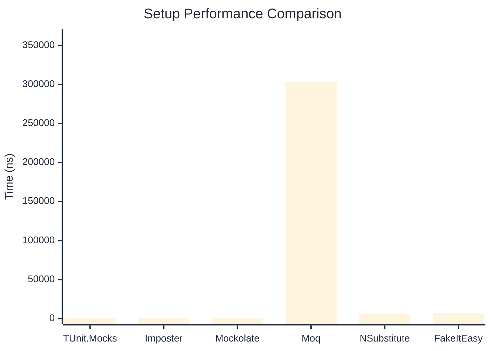

# Setup Benchmark

> Mock behavior configuration (returns, matchers) — comparing **TUnit.Mocks** (source-generated) against runtime proxy-based mocking libraries.

:::info Last Updated
This benchmark was automatically generated on **2026-09-08** from the latest CI run.

**Environment:** Ubuntu Latest • .NET SDK 10.0.400
:::

## 📊 Results

Mock behavior configuration (returns, matchers):

| Library | Mean | Error | StdDev | Allocated |
|---------|------|-------|--------|-----------|
| **TUnit.Mocks** | 554.1 ns | 8.57 ns | 7.60 ns | 2.34 KB |
| Imposter | 770.6 ns | 7.14 ns | 6.68 ns | 6.12 KB |
| Mockolate | 580.1 ns | 11.10 ns | 10.38 ns | 1.41 KB |
| Moq | 303,213.2 ns | 1,749.47 ns | 1,636.46 ns | 28.52 KB |
| NSubstitute | 5,838.7 ns | 48.78 ns | 43.24 ns | 9.01 KB |
| FakeItEasy | 7,087.0 ns | 76.23 ns | 67.57 ns | 10.45 KB |

```mermaid
%%{init: {
  'theme':'base',
  'themeVariables': {
    'primaryColor': '#2563eb',
    'primaryTextColor': '#1f2937',
    'primaryBorderColor': '#1e40af',
    'lineColor': '#6b7280',
    'secondaryColor': '#7c3aed',
    'tertiaryColor': '#dc2626',
    'background': '#ffffff',
    'pie1': '#2563eb',
    'pie2': '#7c3aed',
    'pie3': '#dc2626',
    'pie4': '#f59e0b',
    'pie5': '#10b981',
    'pie6': '#06b6d4',
    'pie7': '#ec4899',
    'pie8': '#6366f1'
  }
}}%%
xychart-beta
  title "Setup Performance Comparison"
  x-axis ["TUnit.Mocks", "Imposter", "Mockolate", "Moq", "NSubstitute", "FakeItEasy"]
  y-axis "Time (ns)" 0 --> 363856
  bar [554.1, 770.6, 580.1, 303213.2, 5838.7, 7087]
```

---

### Multiple

| Library | Mean | Error | StdDev | Allocated |
|---------|------|-------|--------|-----------|
| **TUnit.Mocks** | 814.0 ns | 8.85 ns | 8.28 ns | 3.15 KB |
| Imposter | 1,325.0 ns | 4.59 ns | 4.07 ns | 10.59 KB |
| Mockolate | 556.6 ns | 1.58 ns | 1.32 ns | 2.35 KB |
| Moq | 89,908.6 ns | 481.06 ns | 401.71 ns | 16.53 KB |
| NSubstitute | 11,070.9 ns | 26.19 ns | 21.87 ns | 20.31 KB |
| FakeItEasy | 6,778.8 ns | 90.88 ns | 75.89 ns | 11.71 KB |

```mermaid
%%{init: {
  'theme':'base',
  'themeVariables': {
    'primaryColor': '#2563eb',
    'primaryTextColor': '#1f2937',
    'primaryBorderColor': '#1e40af',
    'lineColor': '#6b7280',
    'secondaryColor': '#7c3aed',
    'tertiaryColor': '#dc2626',
    'background': '#ffffff',
    'pie1': '#2563eb',
    'pie2': '#7c3aed',
    'pie3': '#dc2626',
    'pie4': '#f59e0b',
    'pie5': '#10b981',
    'pie6': '#06b6d4',
    'pie7': '#ec4899',
    'pie8': '#6366f1'
  }
}}%%
xychart-beta
  title "Setup (Multiple) Performance Comparison"
  x-axis ["TUnit.Mocks", "Imposter", "Mockolate", "Moq", "NSubstitute", "FakeItEasy"]
  y-axis "Time (ns)" 0 --> 107891
  bar [814, 1325, 556.6, 89908.6, 11070.9, 6778.8]
```

## 🎯 Key Insights

This benchmark compares **TUnit.Mocks** (source-generated) against runtime proxy-based mocking libraries for mock behavior configuration (returns, matchers).

---

:::note Methodology
View the [mock benchmarks overview](/docs/benchmarks/mocks) for methodology details and environment information.
:::

*Last generated: 2026-09-08T02:32:39.573Z*
