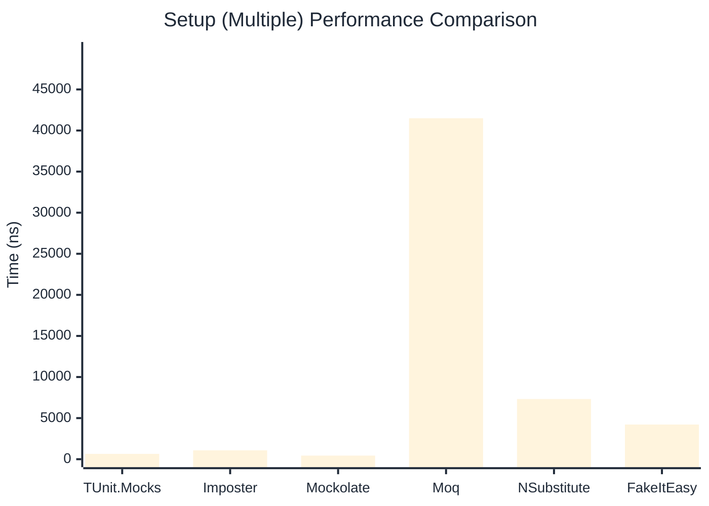

# Setup Benchmark

> Mock behavior configuration (returns, matchers) — comparing **TUnit.Mocks** (source-generated) against runtime proxy-based mocking libraries.

:::info Last Updated
This benchmark was automatically generated on **2026-08-19** from the latest CI run.

**Environment:** Ubuntu Latest • .NET SDK 10.0.400
:::

## 📊 Results

Mock behavior configuration (returns, matchers):

| Library | Mean | Error | StdDev | Allocated |
|---------|------|-------|--------|-----------|
| **TUnit.Mocks** | 428.0 ns | 6.51 ns | 6.08 ns | 2.34 KB |
| Imposter | 631.9 ns | 12.55 ns | 28.84 ns | 6.12 KB |
| Mockolate | 247.7 ns | 5.00 ns | 13.26 ns | 1.41 KB |
| Moq | 159,268.4 ns | 822.00 ns | 641.76 ns | 28.54 KB |
| NSubstitute | 4,525.9 ns | 71.05 ns | 62.98 ns | 9.01 KB |
| FakeItEasy | 4,487.9 ns | 69.22 ns | 126.56 ns | 10.44 KB |

```mermaid
%%{init: {
  'theme':'base',
  'themeVariables': {
    'primaryColor': '#2563eb',
    'primaryTextColor': '#1f2937',
    'primaryBorderColor': '#1e40af',
    'lineColor': '#6b7280',
    'secondaryColor': '#7c3aed',
    'tertiaryColor': '#dc2626',
    'background': '#ffffff',
    'pie1': '#2563eb',
    'pie2': '#7c3aed',
    'pie3': '#dc2626',
    'pie4': '#f59e0b',
    'pie5': '#10b981',
    'pie6': '#06b6d4',
    'pie7': '#ec4899',
    'pie8': '#6366f1'
  }
}}%%
xychart-beta
  title "Setup Performance Comparison"
  x-axis ["TUnit.Mocks", "Imposter", "Mockolate", "Moq", "NSubstitute", "FakeItEasy"]
  y-axis "Time (ns)" 0 --> 191123
  bar [428, 631.9, 247.7, 159268.4, 4525.9, 4487.9]
```

---

### Multiple

| Library | Mean | Error | StdDev | Allocated |
|---------|------|-------|--------|-----------|
| **TUnit.Mocks** | 646.8 ns | 10.82 ns | 12.03 ns | 3.15 KB |
| Imposter | 1,081.8 ns | 21.67 ns | 31.76 ns | 10.59 KB |
| Mockolate | 436.4 ns | 7.12 ns | 13.03 ns | 2.35 KB |
| Moq | 41,496.1 ns | 492.88 ns | 850.19 ns | 16.52 KB |
| NSubstitute | 7,324.3 ns | 141.95 ns | 189.50 ns | 20.49 KB |
| FakeItEasy | 4,219.3 ns | 79.78 ns | 81.93 ns | 11.7 KB |

```mermaid
%%{init: {
  'theme':'base',
  'themeVariables': {
    'primaryColor': '#2563eb',
    'primaryTextColor': '#1f2937',
    'primaryBorderColor': '#1e40af',
    'lineColor': '#6b7280',
    'secondaryColor': '#7c3aed',
    'tertiaryColor': '#dc2626',
    'background': '#ffffff',
    'pie1': '#2563eb',
    'pie2': '#7c3aed',
    'pie3': '#dc2626',
    'pie4': '#f59e0b',
    'pie5': '#10b981',
    'pie6': '#06b6d4',
    'pie7': '#ec4899',
    'pie8': '#6366f1'
  }
}}%%
xychart-beta
  title "Setup (Multiple) Performance Comparison"
  x-axis ["TUnit.Mocks", "Imposter", "Mockolate", "Moq", "NSubstitute", "FakeItEasy"]
  y-axis "Time (ns)" 0 --> 49796
  bar [646.8, 1081.8, 436.4, 41496.1, 7324.3, 4219.3]
```

## 🎯 Key Insights

This benchmark compares **TUnit.Mocks** (source-generated) against runtime proxy-based mocking libraries for mock behavior configuration (returns, matchers).

---

:::note Methodology
View the [mock benchmarks overview](/docs/benchmarks/mocks) for methodology details and environment information.
:::

*Last generated: 2026-08-19T02:42:18.029Z*
