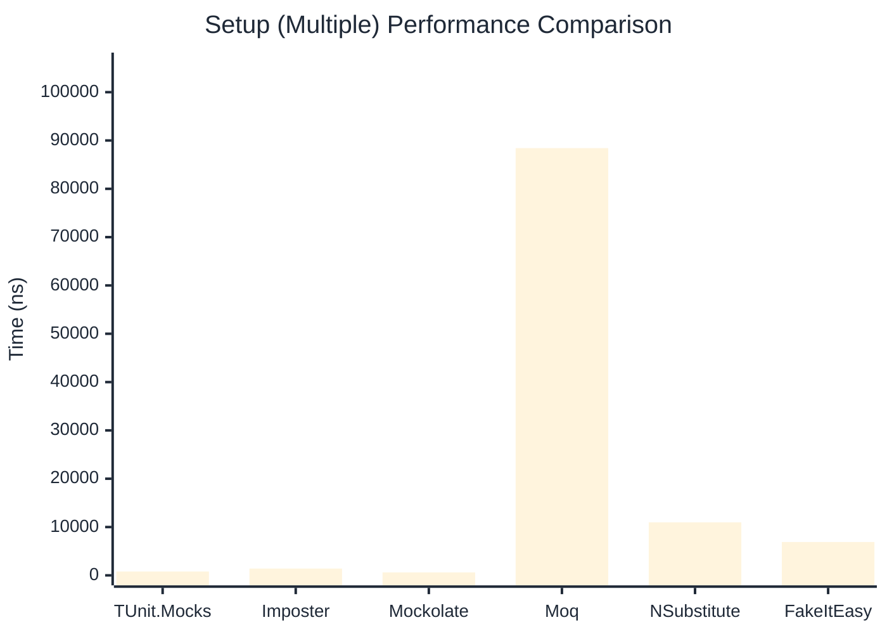

# Setup Benchmark

> Mock behavior configuration (returns, matchers) — comparing **TUnit.Mocks** (source-generated) against runtime proxy-based mocking libraries.

:::info Last Updated
This benchmark was automatically generated on **2026-08-02** from the latest CI run.

**Environment:** Ubuntu Latest • .NET SDK 10.0.302
:::

## 📊 Results

Mock behavior configuration (returns, matchers):

| Library | Mean | Error | StdDev | Allocated |
|---------|------|-------|--------|-----------|
| **TUnit.Mocks** | 559.3 ns | 1.90 ns | 1.69 ns | 2.34 KB |
| Imposter | 781.0 ns | 4.77 ns | 3.98 ns | 6.12 KB |
| Mockolate | 327.7 ns | 2.84 ns | 2.66 ns | 1.41 KB |
| Moq | 306,250.9 ns | 1,681.53 ns | 1,490.63 ns | 28.52 KB |
| NSubstitute | 5,281.6 ns | 46.51 ns | 41.23 ns | 9.06 KB |
| FakeItEasy | 7,069.9 ns | 46.93 ns | 41.61 ns | 10.45 KB |

```mermaid
%%{init: {
  'theme':'base',
  'themeVariables': {
    'primaryColor': '#2563eb',
    'primaryTextColor': '#1f2937',
    'primaryBorderColor': '#1e40af',
    'lineColor': '#6b7280',
    'secondaryColor': '#7c3aed',
    'tertiaryColor': '#dc2626',
    'background': '#ffffff',
    'pie1': '#2563eb',
    'pie2': '#7c3aed',
    'pie3': '#dc2626',
    'pie4': '#f59e0b',
    'pie5': '#10b981',
    'pie6': '#06b6d4',
    'pie7': '#ec4899',
    'pie8': '#6366f1'
  }
}}%%
xychart-beta
  title "Setup Performance Comparison"
  x-axis ["TUnit.Mocks", "Imposter", "Mockolate", "Moq", "NSubstitute", "FakeItEasy"]
  y-axis "Time (ns)" 0 --> 367502
  bar [559.3, 781, 327.7, 306250.9, 5281.6, 7069.9]
```

---

### Multiple

| Library | Mean | Error | StdDev | Allocated |
|---------|------|-------|--------|-----------|
| **TUnit.Mocks** | 795.3 ns | 3.41 ns | 3.02 ns | 3.15 KB |
| Imposter | 1,407.5 ns | 17.85 ns | 16.70 ns | 10.59 KB |
| Mockolate | 613.0 ns | 10.73 ns | 10.04 ns | 2.35 KB |
| Moq | 88,420.0 ns | 1,451.97 ns | 1,358.18 ns | 16.53 KB |
| NSubstitute | 10,975.5 ns | 186.50 ns | 155.74 ns | 20.31 KB |
| FakeItEasy | 6,901.6 ns | 68.48 ns | 57.18 ns | 11.79 KB |

```mermaid
%%{init: {
  'theme':'base',
  'themeVariables': {
    'primaryColor': '#2563eb',
    'primaryTextColor': '#1f2937',
    'primaryBorderColor': '#1e40af',
    'lineColor': '#6b7280',
    'secondaryColor': '#7c3aed',
    'tertiaryColor': '#dc2626',
    'background': '#ffffff',
    'pie1': '#2563eb',
    'pie2': '#7c3aed',
    'pie3': '#dc2626',
    'pie4': '#f59e0b',
    'pie5': '#10b981',
    'pie6': '#06b6d4',
    'pie7': '#ec4899',
    'pie8': '#6366f1'
  }
}}%%
xychart-beta
  title "Setup (Multiple) Performance Comparison"
  x-axis ["TUnit.Mocks", "Imposter", "Mockolate", "Moq", "NSubstitute", "FakeItEasy"]
  y-axis "Time (ns)" 0 --> 106104
  bar [795.3, 1407.5, 613, 88420, 10975.5, 6901.6]
```

## 🎯 Key Insights

This benchmark compares **TUnit.Mocks** (source-generated) against runtime proxy-based mocking libraries for mock behavior configuration (returns, matchers).

---

:::note Methodology
View the [mock benchmarks overview](/docs/benchmarks/mocks) for methodology details and environment information.
:::

*Last generated: 2026-08-02T03:23:38.806Z*
