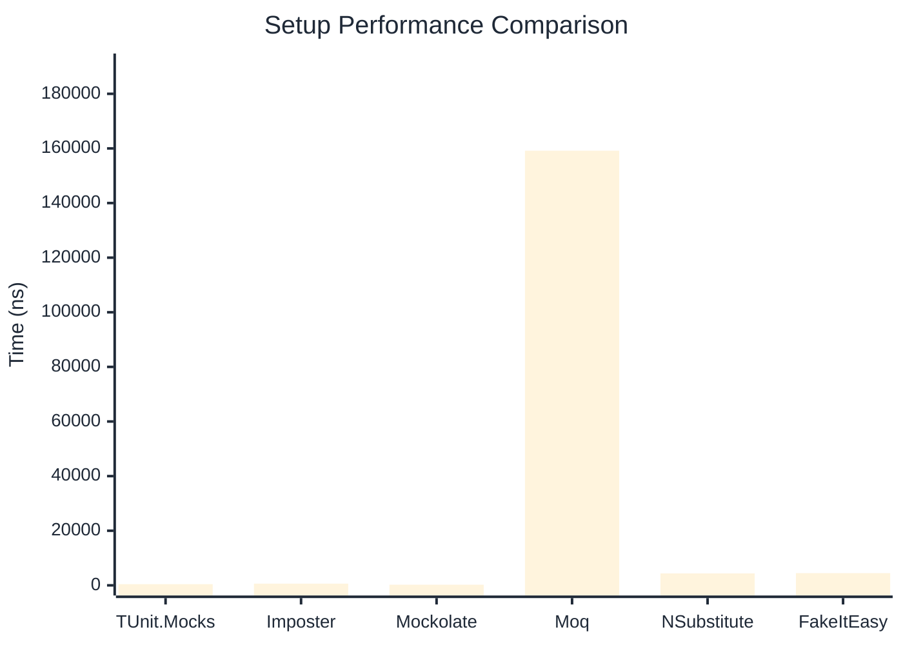

# Setup Benchmark

> Mock behavior configuration (returns, matchers) — comparing **TUnit.Mocks** (source-generated) against runtime proxy-based mocking libraries.

:::info Last Updated
This benchmark was automatically generated on **2026-09-15** from the latest CI run.

**Environment:** Ubuntu Latest • .NET SDK 10.0.401
:::

## 📊 Results

Mock behavior configuration (returns, matchers):

| Library | Mean | Error | StdDev | Allocated |
|---------|------|-------|--------|-----------|
| **TUnit.Mocks** | 430.7 ns | 8.25 ns | 9.50 ns | 2.34 KB |
| Imposter | 618.2 ns | 7.27 ns | 6.80 ns | 6.12 KB |
| Mockolate | 235.9 ns | 3.60 ns | 3.19 ns | 1.41 KB |
| Moq | 159,172.0 ns | 624.87 ns | 521.79 ns | 28.54 KB |
| NSubstitute | 4,368.7 ns | 43.33 ns | 33.83 ns | 9.06 KB |
| FakeItEasy | 4,468.8 ns | 89.27 ns | 91.67 ns | 10.44 KB |

```mermaid
%%{init: {
  'theme':'base',
  'themeVariables': {
    'primaryColor': '#2563eb',
    'primaryTextColor': '#1f2937',
    'primaryBorderColor': '#1e40af',
    'lineColor': '#6b7280',
    'secondaryColor': '#7c3aed',
    'tertiaryColor': '#dc2626',
    'background': '#ffffff',
    'pie1': '#2563eb',
    'pie2': '#7c3aed',
    'pie3': '#dc2626',
    'pie4': '#f59e0b',
    'pie5': '#10b981',
    'pie6': '#06b6d4',
    'pie7': '#ec4899',
    'pie8': '#6366f1'
  }
}}%%
xychart-beta
  title "Setup Performance Comparison"
  x-axis ["TUnit.Mocks", "Imposter", "Mockolate", "Moq", "NSubstitute", "FakeItEasy"]
  y-axis "Time (ns)" 0 --> 191007
  bar [430.7, 618.2, 235.9, 159172, 4368.7, 4468.8]
```

---

### Multiple

| Library | Mean | Error | StdDev | Allocated |
|---------|------|-------|--------|-----------|
| **TUnit.Mocks** | 642.3 ns | 7.83 ns | 7.32 ns | 3.15 KB |
| Imposter | 1,066.7 ns | 12.29 ns | 11.50 ns | 10.59 KB |
| Mockolate | 422.4 ns | 3.66 ns | 3.24 ns | 2.35 KB |
| Moq | 41,854.3 ns | 146.68 ns | 137.20 ns | 16.52 KB |
| NSubstitute | 7,077.8 ns | 104.02 ns | 234.78 ns | 20.31 KB |
| FakeItEasy | 4,429.5 ns | 29.33 ns | 36.01 ns | 11.7 KB |

```mermaid
%%{init: {
  'theme':'base',
  'themeVariables': {
    'primaryColor': '#2563eb',
    'primaryTextColor': '#1f2937',
    'primaryBorderColor': '#1e40af',
    'lineColor': '#6b7280',
    'secondaryColor': '#7c3aed',
    'tertiaryColor': '#dc2626',
    'background': '#ffffff',
    'pie1': '#2563eb',
    'pie2': '#7c3aed',
    'pie3': '#dc2626',
    'pie4': '#f59e0b',
    'pie5': '#10b981',
    'pie6': '#06b6d4',
    'pie7': '#ec4899',
    'pie8': '#6366f1'
  }
}}%%
xychart-beta
  title "Setup (Multiple) Performance Comparison"
  x-axis ["TUnit.Mocks", "Imposter", "Mockolate", "Moq", "NSubstitute", "FakeItEasy"]
  y-axis "Time (ns)" 0 --> 50226
  bar [642.3, 1066.7, 422.4, 41854.3, 7077.8, 4429.5]
```

## 🎯 Key Insights

This benchmark compares **TUnit.Mocks** (source-generated) against runtime proxy-based mocking libraries for mock behavior configuration (returns, matchers).

---

:::note Methodology
View the [mock benchmarks overview](/docs/benchmarks/mocks) for methodology details and environment information.
:::

*Last generated: 2026-09-15T02:33:23.208Z*
