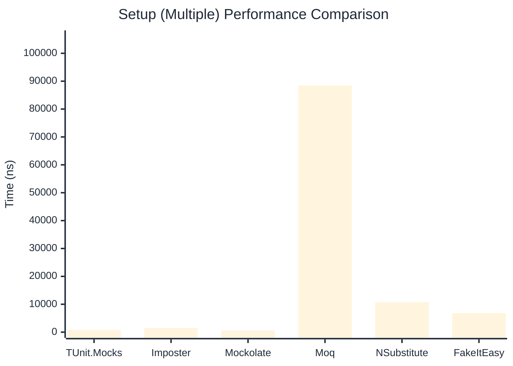

# Setup Benchmark

> Mock behavior configuration (returns, matchers) — comparing **TUnit.Mocks** (source-generated) against runtime proxy-based mocking libraries.

:::info Last Updated
This benchmark was automatically generated on **2026-08-07** from the latest CI run.

**Environment:** Ubuntu Latest • .NET SDK 10.0.302
:::

## 📊 Results

Mock behavior configuration (returns, matchers):

| Library | Mean | Error | StdDev | Allocated |
|---------|------|-------|--------|-----------|
| **TUnit.Mocks** | 537.5 ns | 6.08 ns | 5.39 ns | 2.34 KB |
| Imposter | 774.2 ns | 7.81 ns | 7.30 ns | 6.12 KB |
| Mockolate | 326.7 ns | 2.52 ns | 2.35 ns | 1.41 KB |
| Moq | 298,338.8 ns | 2,773.96 ns | 2,594.77 ns | 28.63 KB |
| NSubstitute | 5,158.5 ns | 77.25 ns | 72.26 ns | 9.01 KB |
| FakeItEasy | 7,284.2 ns | 47.09 ns | 41.74 ns | 10.6 KB |

```mermaid
%%{init: {
  'theme':'base',
  'themeVariables': {
    'primaryColor': '#2563eb',
    'primaryTextColor': '#1f2937',
    'primaryBorderColor': '#1e40af',
    'lineColor': '#6b7280',
    'secondaryColor': '#7c3aed',
    'tertiaryColor': '#dc2626',
    'background': '#ffffff',
    'pie1': '#2563eb',
    'pie2': '#7c3aed',
    'pie3': '#dc2626',
    'pie4': '#f59e0b',
    'pie5': '#10b981',
    'pie6': '#06b6d4',
    'pie7': '#ec4899',
    'pie8': '#6366f1'
  }
}}%%
xychart-beta
  title "Setup Performance Comparison"
  x-axis ["TUnit.Mocks", "Imposter", "Mockolate", "Moq", "NSubstitute", "FakeItEasy"]
  y-axis "Time (ns)" 0 --> 358007
  bar [537.5, 774.2, 326.7, 298338.8, 5158.5, 7284.2]
```

---

### Multiple

| Library | Mean | Error | StdDev | Allocated |
|---------|------|-------|--------|-----------|
| **TUnit.Mocks** | 798.2 ns | 3.75 ns | 3.51 ns | 3.15 KB |
| Imposter | 1,469.5 ns | 27.69 ns | 29.62 ns | 10.59 KB |
| Mockolate | 580.4 ns | 5.62 ns | 4.39 ns | 2.35 KB |
| Moq | 88,448.7 ns | 748.83 ns | 663.82 ns | 16.67 KB |
| NSubstitute | 10,730.0 ns | 184.00 ns | 163.11 ns | 20.31 KB |
| FakeItEasy | 6,810.8 ns | 135.28 ns | 144.74 ns | 11.71 KB |

```mermaid
%%{init: {
  'theme':'base',
  'themeVariables': {
    'primaryColor': '#2563eb',
    'primaryTextColor': '#1f2937',
    'primaryBorderColor': '#1e40af',
    'lineColor': '#6b7280',
    'secondaryColor': '#7c3aed',
    'tertiaryColor': '#dc2626',
    'background': '#ffffff',
    'pie1': '#2563eb',
    'pie2': '#7c3aed',
    'pie3': '#dc2626',
    'pie4': '#f59e0b',
    'pie5': '#10b981',
    'pie6': '#06b6d4',
    'pie7': '#ec4899',
    'pie8': '#6366f1'
  }
}}%%
xychart-beta
  title "Setup (Multiple) Performance Comparison"
  x-axis ["TUnit.Mocks", "Imposter", "Mockolate", "Moq", "NSubstitute", "FakeItEasy"]
  y-axis "Time (ns)" 0 --> 106139
  bar [798.2, 1469.5, 580.4, 88448.7, 10730, 6810.8]
```

## 🎯 Key Insights

This benchmark compares **TUnit.Mocks** (source-generated) against runtime proxy-based mocking libraries for mock behavior configuration (returns, matchers).

---

:::note Methodology
View the [mock benchmarks overview](/docs/benchmarks/mocks) for methodology details and environment information.
:::

*Last generated: 2026-08-07T03:18:12.757Z*
