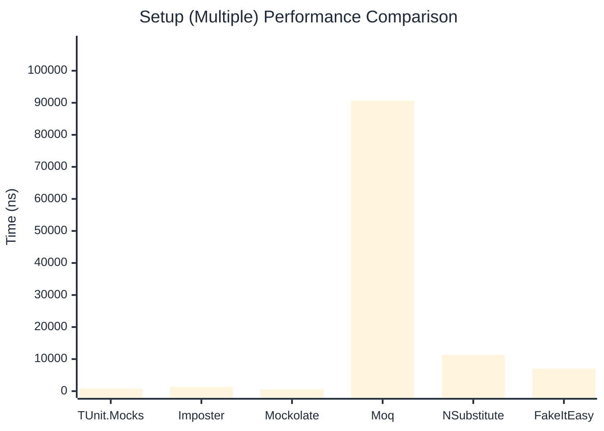

# Setup Benchmark

> Mock behavior configuration (returns, matchers) — comparing **TUnit.Mocks** (source-generated) against runtime proxy-based mocking libraries.

:::info Last Updated
This benchmark was automatically generated on **2026-08-28** from the latest CI run.

**Environment:** Ubuntu Latest • .NET SDK 10.0.400
:::

## 📊 Results

Mock behavior configuration (returns, matchers):

| Library | Mean | Error | StdDev | Allocated |
|---------|------|-------|--------|-----------|
| **TUnit.Mocks** | 551.8 ns | 5.82 ns | 5.44 ns | 2.34 KB |
| Imposter | 788.5 ns | 3.17 ns | 2.81 ns | 6.12 KB |
| Mockolate | 327.3 ns | 1.94 ns | 1.82 ns | 1.41 KB |
| Moq | 294,481.6 ns | 1,480.09 ns | 1,312.06 ns | 28.52 KB |
| NSubstitute | 5,794.7 ns | 19.75 ns | 16.49 ns | 9.01 KB |
| FakeItEasy | 6,917.3 ns | 34.30 ns | 28.64 ns | 10.45 KB |

```mermaid
%%{init: {
  'theme':'base',
  'themeVariables': {
    'primaryColor': '#2563eb',
    'primaryTextColor': '#1f2937',
    'primaryBorderColor': '#1e40af',
    'lineColor': '#6b7280',
    'secondaryColor': '#7c3aed',
    'tertiaryColor': '#dc2626',
    'background': '#ffffff',
    'pie1': '#2563eb',
    'pie2': '#7c3aed',
    'pie3': '#dc2626',
    'pie4': '#f59e0b',
    'pie5': '#10b981',
    'pie6': '#06b6d4',
    'pie7': '#ec4899',
    'pie8': '#6366f1'
  }
}}%%
xychart-beta
  title "Setup Performance Comparison"
  x-axis ["TUnit.Mocks", "Imposter", "Mockolate", "Moq", "NSubstitute", "FakeItEasy"]
  y-axis "Time (ns)" 0 --> 353378
  bar [551.8, 788.5, 327.3, 294481.6, 5794.7, 6917.3]
```

---

### Multiple

| Library | Mean | Error | StdDev | Allocated |
|---------|------|-------|--------|-----------|
| **TUnit.Mocks** | 823.4 ns | 6.73 ns | 6.29 ns | 3.15 KB |
| Imposter | 1,347.1 ns | 4.07 ns | 3.40 ns | 10.59 KB |
| Mockolate | 563.6 ns | 3.31 ns | 2.77 ns | 2.35 KB |
| Moq | 90,652.6 ns | 627.87 ns | 524.30 ns | 16.64 KB |
| NSubstitute | 11,296.1 ns | 83.24 ns | 77.86 ns | 20.31 KB |
| FakeItEasy | 7,030.0 ns | 31.54 ns | 29.50 ns | 11.71 KB |

```mermaid
%%{init: {
  'theme':'base',
  'themeVariables': {
    'primaryColor': '#2563eb',
    'primaryTextColor': '#1f2937',
    'primaryBorderColor': '#1e40af',
    'lineColor': '#6b7280',
    'secondaryColor': '#7c3aed',
    'tertiaryColor': '#dc2626',
    'background': '#ffffff',
    'pie1': '#2563eb',
    'pie2': '#7c3aed',
    'pie3': '#dc2626',
    'pie4': '#f59e0b',
    'pie5': '#10b981',
    'pie6': '#06b6d4',
    'pie7': '#ec4899',
    'pie8': '#6366f1'
  }
}}%%
xychart-beta
  title "Setup (Multiple) Performance Comparison"
  x-axis ["TUnit.Mocks", "Imposter", "Mockolate", "Moq", "NSubstitute", "FakeItEasy"]
  y-axis "Time (ns)" 0 --> 108784
  bar [823.4, 1347.1, 563.6, 90652.6, 11296.1, 7030]
```

## 🎯 Key Insights

This benchmark compares **TUnit.Mocks** (source-generated) against runtime proxy-based mocking libraries for mock behavior configuration (returns, matchers).

---

:::note Methodology
View the [mock benchmarks overview](/docs/benchmarks/mocks) for methodology details and environment information.
:::

*Last generated: 2026-08-28T05:02:48.374Z*
