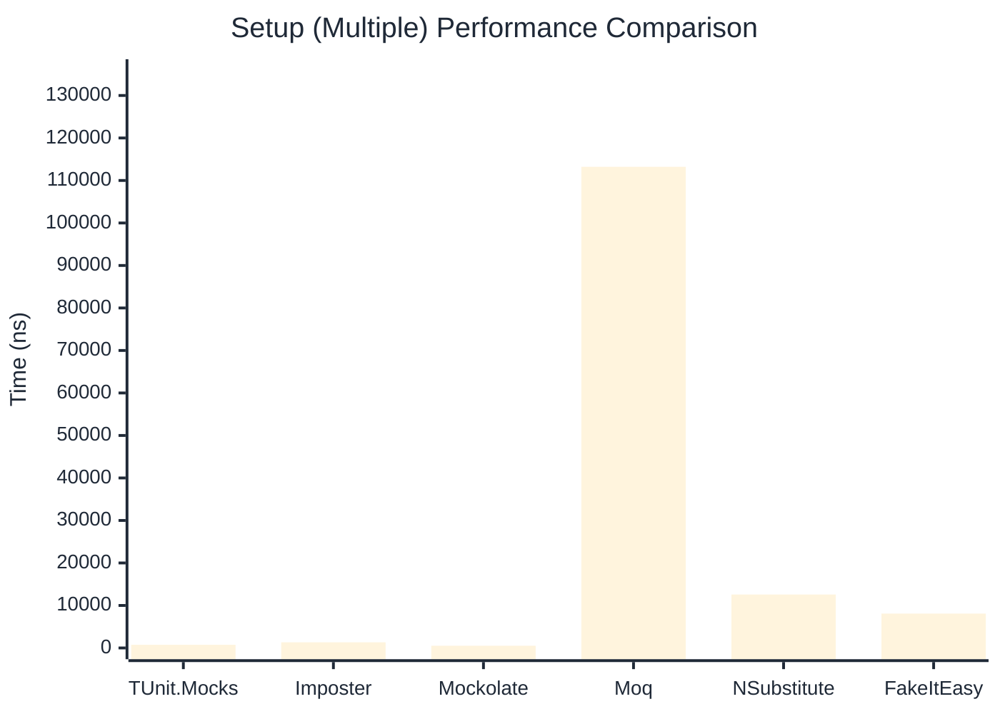

# Setup Benchmark

> Mock behavior configuration (returns, matchers) — comparing **TUnit.Mocks** (source-generated) against runtime proxy-based mocking libraries.

:::info Last Updated
This benchmark was automatically generated on **2026-10-02** from the latest CI run.

**Environment:** Ubuntu Latest • .NET SDK 10.0.401
:::

## 📊 Results

Mock behavior configuration (returns, matchers):

| Library | Mean | Error | StdDev | Allocated |
|---------|------|-------|--------|-----------|
| **TUnit.Mocks** | 511.0 ns | 2.74 ns | 2.29 ns | 2.37 KB |
| Imposter | 814.2 ns | 14.14 ns | 13.23 ns | 6.12 KB |
| Mockolate | 298.4 ns | 4.39 ns | 3.43 ns | 1.41 KB |
| Moq | 429,060.0 ns | 916.75 ns | 765.53 ns | 28.67 KB |
| NSubstitute | 6,277.7 ns | 61.74 ns | 57.75 ns | 9.01 KB |
| FakeItEasy | 8,045.4 ns | 56.49 ns | 47.17 ns | 10.45 KB |

```mermaid
%%{init: {
  'theme':'base',
  'themeVariables': {
    'primaryColor': '#2563eb',
    'primaryTextColor': '#1f2937',
    'primaryBorderColor': '#1e40af',
    'lineColor': '#6b7280',
    'secondaryColor': '#7c3aed',
    'tertiaryColor': '#dc2626',
    'background': '#ffffff',
    'pie1': '#2563eb',
    'pie2': '#7c3aed',
    'pie3': '#dc2626',
    'pie4': '#f59e0b',
    'pie5': '#10b981',
    'pie6': '#06b6d4',
    'pie7': '#ec4899',
    'pie8': '#6366f1'
  }
}}%%
xychart-beta
  title "Setup Performance Comparison"
  x-axis ["TUnit.Mocks", "Imposter", "Mockolate", "Moq", "NSubstitute", "FakeItEasy"]
  y-axis "Time (ns)" 0 --> 514872
  bar [511, 814.2, 298.4, 429060, 6277.7, 8045.4]
```

---

### Multiple

| Library | Mean | Error | StdDev | Allocated |
|---------|------|-------|--------|-----------|
| **TUnit.Mocks** | 740.9 ns | 6.20 ns | 5.18 ns | 3.18 KB |
| Imposter | 1,324.4 ns | 26.01 ns | 25.54 ns | 10.59 KB |
| Mockolate | 518.9 ns | 4.76 ns | 4.45 ns | 2.35 KB |
| Moq | 113,215.0 ns | 499.97 ns | 467.67 ns | 16.35 KB |
| NSubstitute | 12,569.2 ns | 58.66 ns | 54.87 ns | 20.5 KB |
| FakeItEasy | 8,089.3 ns | 102.34 ns | 95.73 ns | 11.71 KB |

```mermaid
%%{init: {
  'theme':'base',
  'themeVariables': {
    'primaryColor': '#2563eb',
    'primaryTextColor': '#1f2937',
    'primaryBorderColor': '#1e40af',
    'lineColor': '#6b7280',
    'secondaryColor': '#7c3aed',
    'tertiaryColor': '#dc2626',
    'background': '#ffffff',
    'pie1': '#2563eb',
    'pie2': '#7c3aed',
    'pie3': '#dc2626',
    'pie4': '#f59e0b',
    'pie5': '#10b981',
    'pie6': '#06b6d4',
    'pie7': '#ec4899',
    'pie8': '#6366f1'
  }
}}%%
xychart-beta
  title "Setup (Multiple) Performance Comparison"
  x-axis ["TUnit.Mocks", "Imposter", "Mockolate", "Moq", "NSubstitute", "FakeItEasy"]
  y-axis "Time (ns)" 0 --> 135858
  bar [740.9, 1324.4, 518.9, 113215, 12569.2, 8089.3]
```

## 🎯 Key Insights

This benchmark compares **TUnit.Mocks** (source-generated) against runtime proxy-based mocking libraries for mock behavior configuration (returns, matchers).

---

:::note Methodology
View the [mock benchmarks overview](/docs/benchmarks/mocks) for methodology details and environment information.
:::

*Last generated: 2026-10-02T02:44:13.542Z*
