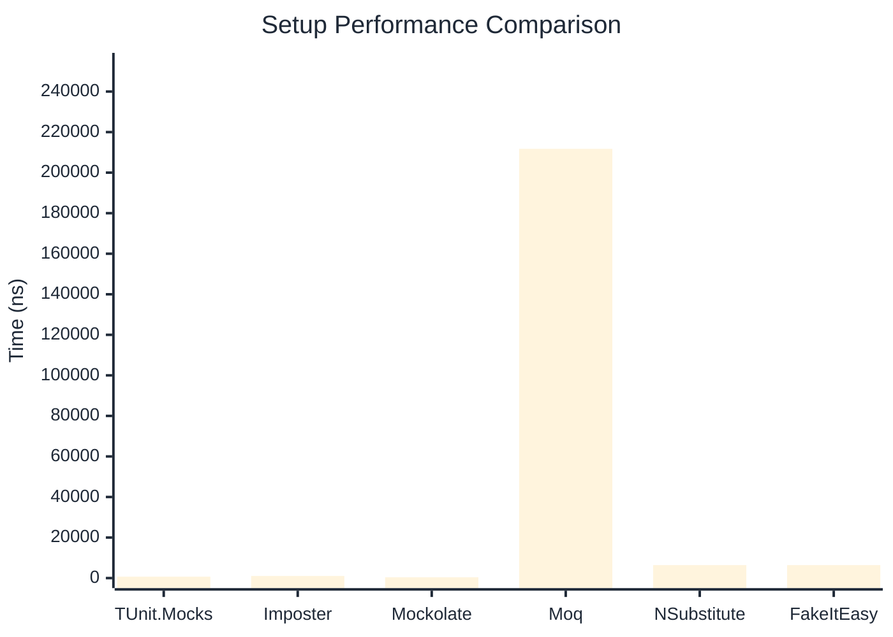
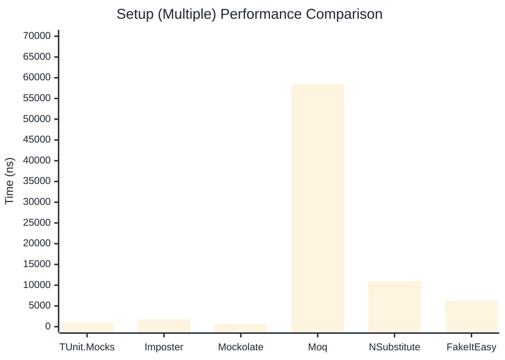

# Setup Benchmark

> Mock behavior configuration (returns, matchers) — comparing **TUnit.Mocks** (source-generated) against runtime proxy-based mocking libraries.

:::info Last Updated
This benchmark was automatically generated on **2026-10-08** from the latest CI run.

**Environment:** Ubuntu Latest • .NET SDK 10.0.401
:::

## 📊 Results

Mock behavior configuration (returns, matchers):

| Library | Mean | Error | StdDev | Allocated |
|---------|------|-------|--------|-----------|
| **TUnit.Mocks** | 683.1 ns | 2.08 ns | 1.84 ns | 2.37 KB |
| Imposter | 1,037.4 ns | 4.08 ns | 3.62 ns | 6.09 KB |
| Mockolate | 397.8 ns | 0.95 ns | 0.89 ns | 1.41 KB |
| Moq | 211,746.6 ns | 1,046.50 ns | 927.70 ns | 28.46 KB |
| NSubstitute | 6,392.7 ns | 64.05 ns | 59.91 ns | 9.01 KB |
| FakeItEasy | 6,395.1 ns | 15.07 ns | 13.36 ns | 10.44 KB |

```mermaid
%%{init: {
  'theme':'base',
  'themeVariables': {
    'primaryColor': '#2563eb',
    'primaryTextColor': '#1f2937',
    'primaryBorderColor': '#1e40af',
    'lineColor': '#6b7280',
    'secondaryColor': '#7c3aed',
    'tertiaryColor': '#dc2626',
    'background': '#ffffff',
    'pie1': '#2563eb',
    'pie2': '#7c3aed',
    'pie3': '#dc2626',
    'pie4': '#f59e0b',
    'pie5': '#10b981',
    'pie6': '#06b6d4',
    'pie7': '#ec4899',
    'pie8': '#6366f1'
  }
}}%%
xychart-beta
  title "Setup Performance Comparison"
  x-axis ["TUnit.Mocks", "Imposter", "Mockolate", "Moq", "NSubstitute", "FakeItEasy"]
  y-axis "Time (ns)" 0 --> 254096
  bar [683.1, 1037.4, 397.8, 211746.6, 6392.7, 6395.1]
```

---

### Multiple

| Library | Mean | Error | StdDev | Allocated |
|---------|------|-------|--------|-----------|
| **TUnit.Mocks** | 1,007.7 ns | 3.95 ns | 3.50 ns | 3.18 KB |
| Imposter | 1,837.5 ns | 6.33 ns | 5.92 ns | 10.55 KB |
| Mockolate | 671.3 ns | 2.77 ns | 2.59 ns | 2.35 KB |
| Moq | 58,465.1 ns | 570.37 ns | 505.62 ns | 16.33 KB |
| NSubstitute | 10,950.0 ns | 73.71 ns | 65.34 ns | 20.49 KB |
| FakeItEasy | 6,226.3 ns | 29.04 ns | 25.74 ns | 11.7 KB |

```mermaid
%%{init: {
  'theme':'base',
  'themeVariables': {
    'primaryColor': '#2563eb',
    'primaryTextColor': '#1f2937',
    'primaryBorderColor': '#1e40af',
    'lineColor': '#6b7280',
    'secondaryColor': '#7c3aed',
    'tertiaryColor': '#dc2626',
    'background': '#ffffff',
    'pie1': '#2563eb',
    'pie2': '#7c3aed',
    'pie3': '#dc2626',
    'pie4': '#f59e0b',
    'pie5': '#10b981',
    'pie6': '#06b6d4',
    'pie7': '#ec4899',
    'pie8': '#6366f1'
  }
}}%%
xychart-beta
  title "Setup (Multiple) Performance Comparison"
  x-axis ["TUnit.Mocks", "Imposter", "Mockolate", "Moq", "NSubstitute", "FakeItEasy"]
  y-axis "Time (ns)" 0 --> 70159
  bar [1007.7, 1837.5, 671.3, 58465.1, 10950, 6226.3]
```

## 🎯 Key Insights

This benchmark compares **TUnit.Mocks** (source-generated) against runtime proxy-based mocking libraries for mock behavior configuration (returns, matchers).

---

:::note Methodology
View the [mock benchmarks overview](/docs/benchmarks/mocks) for methodology details and environment information.
:::

*Last generated: 2026-10-08T02:41:51.713Z*
