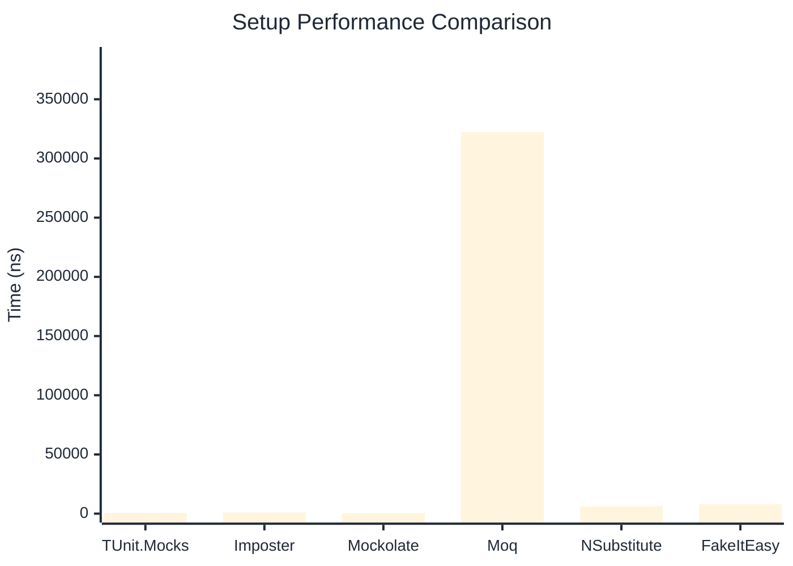

# Setup Benchmark

> Mock behavior configuration (returns, matchers) — comparing **TUnit.Mocks** (source-generated) against runtime proxy-based mocking libraries.

:::info Last Updated
This benchmark was automatically generated on **2026-09-29** from the latest CI run.

**Environment:** Ubuntu Latest • .NET SDK 10.0.401
:::

## 📊 Results

Mock behavior configuration (returns, matchers):

| Library | Mean | Error | StdDev | Allocated |
|---------|------|-------|--------|-----------|
| **TUnit.Mocks** | 635.2 ns | 6.05 ns | 5.66 ns | 2.34 KB |
| Imposter | 996.1 ns | 19.54 ns | 18.28 ns | 6.12 KB |
| Mockolate | 364.6 ns | 3.12 ns | 2.91 ns | 1.41 KB |
| Moq | 322,156.9 ns | 1,970.01 ns | 1,746.36 ns | 28.56 KB |
| NSubstitute | 6,137.6 ns | 19.42 ns | 17.21 ns | 9.01 KB |
| FakeItEasy | 7,843.7 ns | 16.93 ns | 14.13 ns | 10.72 KB |

```mermaid
%%{init: {
  'theme':'base',
  'themeVariables': {
    'primaryColor': '#2563eb',
    'primaryTextColor': '#1f2937',
    'primaryBorderColor': '#1e40af',
    'lineColor': '#6b7280',
    'secondaryColor': '#7c3aed',
    'tertiaryColor': '#dc2626',
    'background': '#ffffff',
    'pie1': '#2563eb',
    'pie2': '#7c3aed',
    'pie3': '#dc2626',
    'pie4': '#f59e0b',
    'pie5': '#10b981',
    'pie6': '#06b6d4',
    'pie7': '#ec4899',
    'pie8': '#6366f1'
  }
}}%%
xychart-beta
  title "Setup Performance Comparison"
  x-axis ["TUnit.Mocks", "Imposter", "Mockolate", "Moq", "NSubstitute", "FakeItEasy"]
  y-axis "Time (ns)" 0 --> 386589
  bar [635.2, 996.1, 364.6, 322156.9, 6137.6, 7843.7]
```

---

### Multiple

| Library | Mean | Error | StdDev | Allocated |
|---------|------|-------|--------|-----------|
| **TUnit.Mocks** | 940.3 ns | 7.71 ns | 6.84 ns | 3.15 KB |
| Imposter | 1,714.5 ns | 27.75 ns | 25.96 ns | 10.59 KB |
| Mockolate | 644.5 ns | 4.74 ns | 4.43 ns | 2.35 KB |
| Moq | 86,146.4 ns | 700.46 ns | 620.94 ns | 16.45 KB |
| NSubstitute | 12,029.1 ns | 58.68 ns | 52.02 ns | 20.5 KB |
| FakeItEasy | 7,456.2 ns | 43.53 ns | 38.59 ns | 11.72 KB |

```mermaid
%%{init: {
  'theme':'base',
  'themeVariables': {
    'primaryColor': '#2563eb',
    'primaryTextColor': '#1f2937',
    'primaryBorderColor': '#1e40af',
    'lineColor': '#6b7280',
    'secondaryColor': '#7c3aed',
    'tertiaryColor': '#dc2626',
    'background': '#ffffff',
    'pie1': '#2563eb',
    'pie2': '#7c3aed',
    'pie3': '#dc2626',
    'pie4': '#f59e0b',
    'pie5': '#10b981',
    'pie6': '#06b6d4',
    'pie7': '#ec4899',
    'pie8': '#6366f1'
  }
}}%%
xychart-beta
  title "Setup (Multiple) Performance Comparison"
  x-axis ["TUnit.Mocks", "Imposter", "Mockolate", "Moq", "NSubstitute", "FakeItEasy"]
  y-axis "Time (ns)" 0 --> 103376
  bar [940.3, 1714.5, 644.5, 86146.4, 12029.1, 7456.2]
```

## 🎯 Key Insights

This benchmark compares **TUnit.Mocks** (source-generated) against runtime proxy-based mocking libraries for mock behavior configuration (returns, matchers).

---

:::note Methodology
View the [mock benchmarks overview](/docs/benchmarks/mocks) for methodology details and environment information.
:::

*Last generated: 2026-09-29T02:35:19.410Z*
