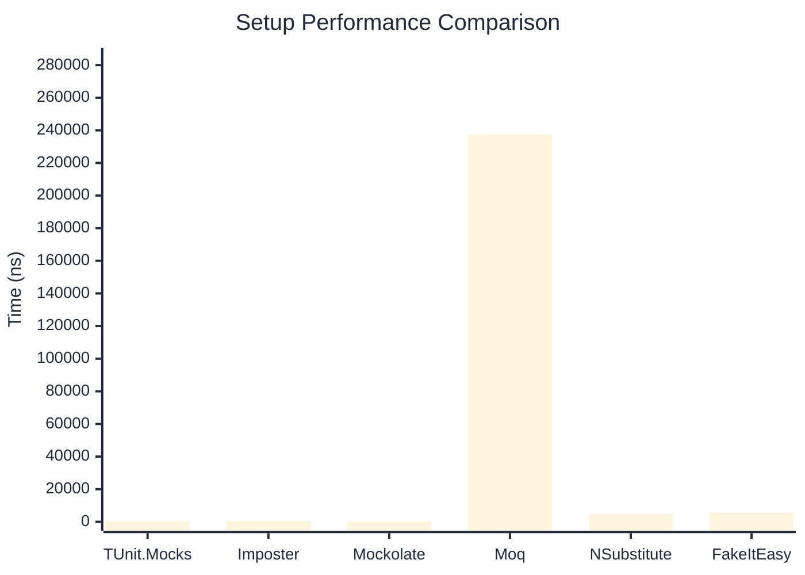

# Setup Benchmark

> Mock behavior configuration (returns, matchers) — comparing **TUnit.Mocks** (source-generated) against runtime proxy-based mocking libraries.

:::info Last Updated
This benchmark was automatically generated on **2026-10-07** from the latest CI run.

**Environment:** Ubuntu Latest • .NET SDK 10.0.401
:::

## 📊 Results

Mock behavior configuration (returns, matchers):

| Library | Mean | Error | StdDev | Allocated |
|---------|------|-------|--------|-----------|
| **TUnit.Mocks** | 430.8 ns | 3.08 ns | 2.57 ns | 2.37 KB |
| Imposter | 620.9 ns | 6.77 ns | 5.65 ns | 6.09 KB |
| Mockolate | 256.0 ns | 3.18 ns | 2.66 ns | 1.41 KB |
| Moq | 237,545.5 ns | 2,113.98 ns | 1,977.42 ns | 28.56 KB |
| NSubstitute | 4,702.9 ns | 79.40 ns | 74.27 ns | 9.01 KB |
| FakeItEasy | 5,663.7 ns | 50.53 ns | 44.80 ns | 10.45 KB |

```mermaid
%%{init: {
  'theme':'base',
  'themeVariables': {
    'primaryColor': '#2563eb',
    'primaryTextColor': '#1f2937',
    'primaryBorderColor': '#1e40af',
    'lineColor': '#6b7280',
    'secondaryColor': '#7c3aed',
    'tertiaryColor': '#dc2626',
    'background': '#ffffff',
    'pie1': '#2563eb',
    'pie2': '#7c3aed',
    'pie3': '#dc2626',
    'pie4': '#f59e0b',
    'pie5': '#10b981',
    'pie6': '#06b6d4',
    'pie7': '#ec4899',
    'pie8': '#6366f1'
  }
}}%%
xychart-beta
  title "Setup Performance Comparison"
  x-axis ["TUnit.Mocks", "Imposter", "Mockolate", "Moq", "NSubstitute", "FakeItEasy"]
  y-axis "Time (ns)" 0 --> 285055
  bar [430.8, 620.9, 256, 237545.5, 4702.9, 5663.7]
```

---

### Multiple

| Library | Mean | Error | StdDev | Allocated |
|---------|------|-------|--------|-----------|
| **TUnit.Mocks** | 640.3 ns | 8.03 ns | 7.12 ns | 3.18 KB |
| Imposter | 1,101.8 ns | 20.38 ns | 19.06 ns | 10.55 KB |
| Mockolate | 446.7 ns | 6.44 ns | 6.02 ns | 2.35 KB |
| Moq | 67,653.7 ns | 231.54 ns | 205.25 ns | 16.35 KB |
| NSubstitute | 8,761.9 ns | 165.68 ns | 162.72 ns | 20.34 KB |
| FakeItEasy | 5,281.2 ns | 79.00 ns | 61.68 ns | 11.71 KB |

```mermaid
%%{init: {
  'theme':'base',
  'themeVariables': {
    'primaryColor': '#2563eb',
    'primaryTextColor': '#1f2937',
    'primaryBorderColor': '#1e40af',
    'lineColor': '#6b7280',
    'secondaryColor': '#7c3aed',
    'tertiaryColor': '#dc2626',
    'background': '#ffffff',
    'pie1': '#2563eb',
    'pie2': '#7c3aed',
    'pie3': '#dc2626',
    'pie4': '#f59e0b',
    'pie5': '#10b981',
    'pie6': '#06b6d4',
    'pie7': '#ec4899',
    'pie8': '#6366f1'
  }
}}%%
xychart-beta
  title "Setup (Multiple) Performance Comparison"
  x-axis ["TUnit.Mocks", "Imposter", "Mockolate", "Moq", "NSubstitute", "FakeItEasy"]
  y-axis "Time (ns)" 0 --> 81185
  bar [640.3, 1101.8, 446.7, 67653.7, 8761.9, 5281.2]
```

## 🎯 Key Insights

This benchmark compares **TUnit.Mocks** (source-generated) against runtime proxy-based mocking libraries for mock behavior configuration (returns, matchers).

---

:::note Methodology
View the [mock benchmarks overview](/docs/benchmarks/mocks) for methodology details and environment information.
:::

*Last generated: 2026-10-07T02:41:59.908Z*
