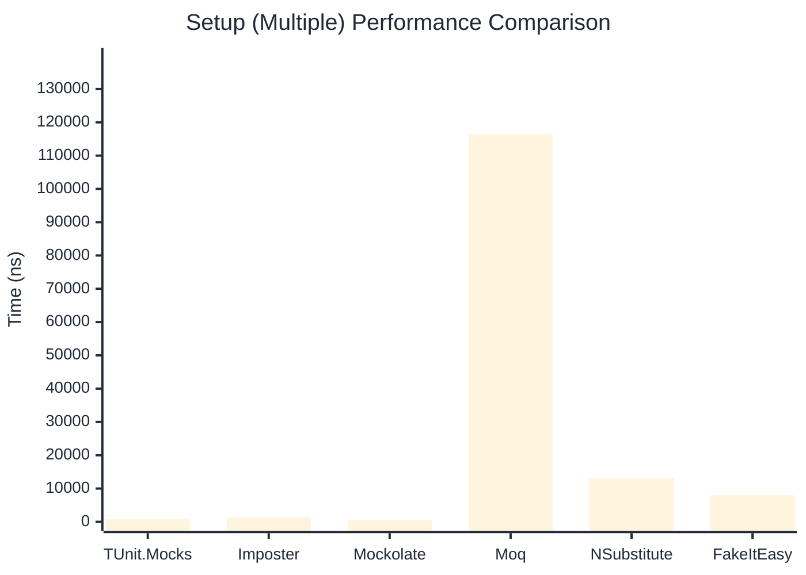

# Setup Benchmark

> Mock behavior configuration (returns, matchers) — comparing **TUnit.Mocks** (source-generated) against runtime proxy-based mocking libraries.

:::info Last Updated
This benchmark was automatically generated on **2026-10-10** from the latest CI run.

**Environment:** Ubuntu Latest • .NET SDK 10.0.401
:::

## 📊 Results

Mock behavior configuration (returns, matchers):

| Library | Mean | Error | StdDev | Allocated |
|---------|------|-------|--------|-----------|
| **TUnit.Mocks** | 554.8 ns | 7.61 ns | 7.12 ns | 2.37 KB |
| Imposter | 806.6 ns | 10.60 ns | 8.85 ns | 6.09 KB |
| Mockolate | 322.1 ns | 2.52 ns | 2.24 ns | 1.41 KB |
| Moq | 435,489.9 ns | 1,342.70 ns | 1,190.26 ns | 28.64 KB |
| NSubstitute | 6,469.0 ns | 27.78 ns | 25.99 ns | 9.01 KB |
| FakeItEasy | 8,700.2 ns | 56.77 ns | 50.33 ns | 10.45 KB |

```mermaid
%%{init: {
  'theme':'base',
  'themeVariables': {
    'primaryColor': '#2563eb',
    'primaryTextColor': '#1f2937',
    'primaryBorderColor': '#1e40af',
    'lineColor': '#6b7280',
    'secondaryColor': '#7c3aed',
    'tertiaryColor': '#dc2626',
    'background': '#ffffff',
    'pie1': '#2563eb',
    'pie2': '#7c3aed',
    'pie3': '#dc2626',
    'pie4': '#f59e0b',
    'pie5': '#10b981',
    'pie6': '#06b6d4',
    'pie7': '#ec4899',
    'pie8': '#6366f1'
  }
}}%%
xychart-beta
  title "Setup Performance Comparison"
  x-axis ["TUnit.Mocks", "Imposter", "Mockolate", "Moq", "NSubstitute", "FakeItEasy"]
  y-axis "Time (ns)" 0 --> 522588
  bar [554.8, 806.6, 322.1, 435489.9, 6469, 8700.2]
```

---

### Multiple

| Library | Mean | Error | StdDev | Allocated |
|---------|------|-------|--------|-----------|
| **TUnit.Mocks** | 800.4 ns | 11.83 ns | 10.49 ns | 3.18 KB |
| Imposter | 1,428.8 ns | 24.73 ns | 23.13 ns | 10.55 KB |
| Mockolate | 558.5 ns | 6.64 ns | 6.21 ns | 2.35 KB |
| Moq | 116,393.9 ns | 700.43 ns | 655.18 ns | 16.35 KB |
| NSubstitute | 13,223.4 ns | 139.50 ns | 130.49 ns | 20.31 KB |
| FakeItEasy | 7,989.4 ns | 111.02 ns | 92.70 ns | 11.71 KB |

```mermaid
%%{init: {
  'theme':'base',
  'themeVariables': {
    'primaryColor': '#2563eb',
    'primaryTextColor': '#1f2937',
    'primaryBorderColor': '#1e40af',
    'lineColor': '#6b7280',
    'secondaryColor': '#7c3aed',
    'tertiaryColor': '#dc2626',
    'background': '#ffffff',
    'pie1': '#2563eb',
    'pie2': '#7c3aed',
    'pie3': '#dc2626',
    'pie4': '#f59e0b',
    'pie5': '#10b981',
    'pie6': '#06b6d4',
    'pie7': '#ec4899',
    'pie8': '#6366f1'
  }
}}%%
xychart-beta
  title "Setup (Multiple) Performance Comparison"
  x-axis ["TUnit.Mocks", "Imposter", "Mockolate", "Moq", "NSubstitute", "FakeItEasy"]
  y-axis "Time (ns)" 0 --> 139673
  bar [800.4, 1428.8, 558.5, 116393.9, 13223.4, 7989.4]
```

## 🎯 Key Insights

This benchmark compares **TUnit.Mocks** (source-generated) against runtime proxy-based mocking libraries for mock behavior configuration (returns, matchers).

---

:::note Methodology
View the [mock benchmarks overview](/docs/benchmarks/mocks) for methodology details and environment information.
:::

*Last generated: 2026-10-10T02:40:36.038Z*
