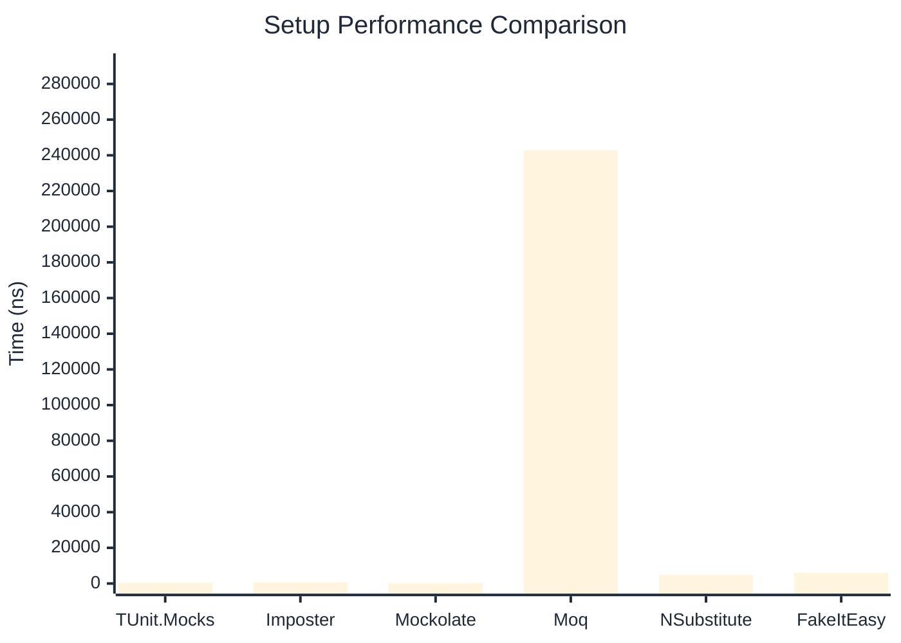

# Setup Benchmark

> Mock behavior configuration (returns, matchers) — comparing **TUnit.Mocks** (source-generated) against runtime proxy-based mocking libraries.

:::info Last Updated
This benchmark was automatically generated on **2026-10-04** from the latest CI run.

**Environment:** Ubuntu Latest • .NET SDK 10.0.401
:::

## 📊 Results

Mock behavior configuration (returns, matchers):

| Library | Mean | Error | StdDev | Allocated |
|---------|------|-------|--------|-----------|
| **TUnit.Mocks** | 437.1 ns | 5.49 ns | 5.13 ns | 2.37 KB |
| Imposter | 647.9 ns | 10.24 ns | 9.08 ns | 6.12 KB |
| Mockolate | 251.0 ns | 4.17 ns | 3.70 ns | 1.41 KB |
| Moq | 242,848.4 ns | 1,072.53 ns | 837.36 ns | 28.66 KB |
| NSubstitute | 4,753.3 ns | 50.39 ns | 42.08 ns | 9.01 KB |
| FakeItEasy | 5,904.7 ns | 63.49 ns | 59.39 ns | 10.45 KB |

```mermaid
%%{init: {
  'theme':'base',
  'themeVariables': {
    'primaryColor': '#2563eb',
    'primaryTextColor': '#1f2937',
    'primaryBorderColor': '#1e40af',
    'lineColor': '#6b7280',
    'secondaryColor': '#7c3aed',
    'tertiaryColor': '#dc2626',
    'background': '#ffffff',
    'pie1': '#2563eb',
    'pie2': '#7c3aed',
    'pie3': '#dc2626',
    'pie4': '#f59e0b',
    'pie5': '#10b981',
    'pie6': '#06b6d4',
    'pie7': '#ec4899',
    'pie8': '#6366f1'
  }
}}%%
xychart-beta
  title "Setup Performance Comparison"
  x-axis ["TUnit.Mocks", "Imposter", "Mockolate", "Moq", "NSubstitute", "FakeItEasy"]
  y-axis "Time (ns)" 0 --> 291419
  bar [437.1, 647.9, 251, 242848.4, 4753.3, 5904.7]
```

---

### Multiple

| Library | Mean | Error | StdDev | Allocated |
|---------|------|-------|--------|-----------|
| **TUnit.Mocks** | 654.0 ns | 8.70 ns | 8.14 ns | 3.18 KB |
| Imposter | 1,091.6 ns | 21.12 ns | 22.60 ns | 10.59 KB |
| Mockolate | 445.7 ns | 4.71 ns | 4.41 ns | 2.35 KB |
| Moq | 68,349.3 ns | 235.96 ns | 209.17 ns | 16.35 KB |
| NSubstitute | 8,620.8 ns | 111.32 ns | 98.68 ns | 20.31 KB |
| FakeItEasy | 5,334.7 ns | 103.42 ns | 96.74 ns | 11.71 KB |

```mermaid
%%{init: {
  'theme':'base',
  'themeVariables': {
    'primaryColor': '#2563eb',
    'primaryTextColor': '#1f2937',
    'primaryBorderColor': '#1e40af',
    'lineColor': '#6b7280',
    'secondaryColor': '#7c3aed',
    'tertiaryColor': '#dc2626',
    'background': '#ffffff',
    'pie1': '#2563eb',
    'pie2': '#7c3aed',
    'pie3': '#dc2626',
    'pie4': '#f59e0b',
    'pie5': '#10b981',
    'pie6': '#06b6d4',
    'pie7': '#ec4899',
    'pie8': '#6366f1'
  }
}}%%
xychart-beta
  title "Setup (Multiple) Performance Comparison"
  x-axis ["TUnit.Mocks", "Imposter", "Mockolate", "Moq", "NSubstitute", "FakeItEasy"]
  y-axis "Time (ns)" 0 --> 82020
  bar [654, 1091.6, 445.7, 68349.3, 8620.8, 5334.7]
```

## 🎯 Key Insights

This benchmark compares **TUnit.Mocks** (source-generated) against runtime proxy-based mocking libraries for mock behavior configuration (returns, matchers).

---

:::note Methodology
View the [mock benchmarks overview](/docs/benchmarks/mocks) for methodology details and environment information.
:::

*Last generated: 2026-10-04T03:10:54.658Z*
