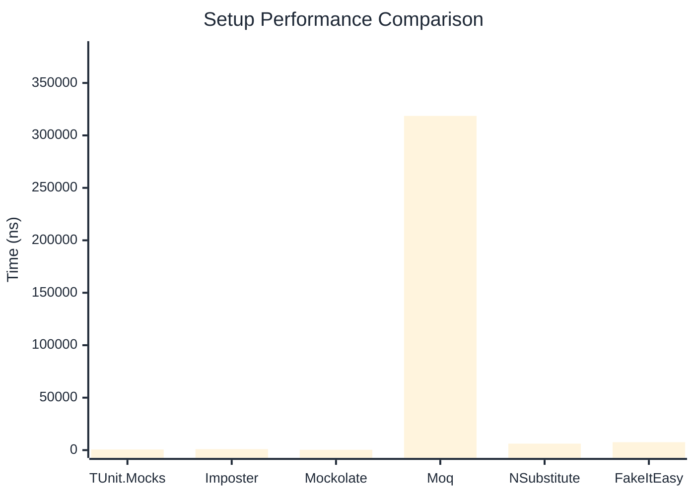
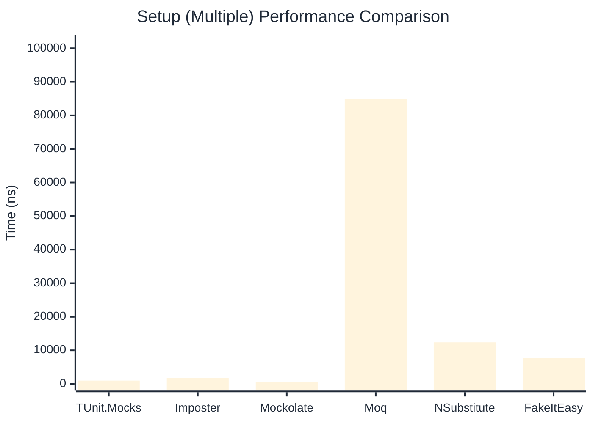

# Setup Benchmark

> Mock behavior configuration (returns, matchers) — comparing **TUnit.Mocks** (source-generated) against runtime proxy-based mocking libraries.

:::info Last Updated
This benchmark was automatically generated on **2026-10-09** from the latest CI run.

**Environment:** Ubuntu Latest • .NET SDK 10.0.401
:::

## 📊 Results

Mock behavior configuration (returns, matchers):

| Library | Mean | Error | StdDev | Allocated |
|---------|------|-------|--------|-----------|
| **TUnit.Mocks** | 645.5 ns | 10.53 ns | 9.85 ns | 2.37 KB |
| Imposter | 960.7 ns | 17.17 ns | 16.06 ns | 6.09 KB |
| Mockolate | 370.3 ns | 2.81 ns | 2.63 ns | 1.41 KB |
| Moq | 318,608.7 ns | 2,900.12 ns | 2,712.77 ns | 28.67 KB |
| NSubstitute | 6,183.3 ns | 21.15 ns | 18.75 ns | 9.06 KB |
| FakeItEasy | 7,574.7 ns | 20.35 ns | 19.04 ns | 10.46 KB |

```mermaid
%%{init: {
  'theme':'base',
  'themeVariables': {
    'primaryColor': '#2563eb',
    'primaryTextColor': '#1f2937',
    'primaryBorderColor': '#1e40af',
    'lineColor': '#6b7280',
    'secondaryColor': '#7c3aed',
    'tertiaryColor': '#dc2626',
    'background': '#ffffff',
    'pie1': '#2563eb',
    'pie2': '#7c3aed',
    'pie3': '#dc2626',
    'pie4': '#f59e0b',
    'pie5': '#10b981',
    'pie6': '#06b6d4',
    'pie7': '#ec4899',
    'pie8': '#6366f1'
  }
}}%%
xychart-beta
  title "Setup Performance Comparison"
  x-axis ["TUnit.Mocks", "Imposter", "Mockolate", "Moq", "NSubstitute", "FakeItEasy"]
  y-axis "Time (ns)" 0 --> 382331
  bar [645.5, 960.7, 370.3, 318608.7, 6183.3, 7574.7]
```

---

### Multiple

| Library | Mean | Error | StdDev | Allocated |
|---------|------|-------|--------|-----------|
| **TUnit.Mocks** | 985.4 ns | 7.05 ns | 6.25 ns | 3.18 KB |
| Imposter | 1,740.2 ns | 34.85 ns | 51.08 ns | 10.55 KB |
| Mockolate | 634.8 ns | 5.56 ns | 4.93 ns | 2.35 KB |
| Moq | 84,946.5 ns | 479.55 ns | 425.11 ns | 16.34 KB |
| NSubstitute | 12,389.8 ns | 38.64 ns | 34.25 ns | 20.31 KB |
| FakeItEasy | 7,662.1 ns | 56.51 ns | 47.19 ns | 11.83 KB |

```mermaid
%%{init: {
  'theme':'base',
  'themeVariables': {
    'primaryColor': '#2563eb',
    'primaryTextColor': '#1f2937',
    'primaryBorderColor': '#1e40af',
    'lineColor': '#6b7280',
    'secondaryColor': '#7c3aed',
    'tertiaryColor': '#dc2626',
    'background': '#ffffff',
    'pie1': '#2563eb',
    'pie2': '#7c3aed',
    'pie3': '#dc2626',
    'pie4': '#f59e0b',
    'pie5': '#10b981',
    'pie6': '#06b6d4',
    'pie7': '#ec4899',
    'pie8': '#6366f1'
  }
}}%%
xychart-beta
  title "Setup (Multiple) Performance Comparison"
  x-axis ["TUnit.Mocks", "Imposter", "Mockolate", "Moq", "NSubstitute", "FakeItEasy"]
  y-axis "Time (ns)" 0 --> 101936
  bar [985.4, 1740.2, 634.8, 84946.5, 12389.8, 7662.1]
```

## 🎯 Key Insights

This benchmark compares **TUnit.Mocks** (source-generated) against runtime proxy-based mocking libraries for mock behavior configuration (returns, matchers).

---

:::note Methodology
View the [mock benchmarks overview](/docs/benchmarks/mocks) for methodology details and environment information.
:::

*Last generated: 2026-10-09T02:42:26.464Z*
