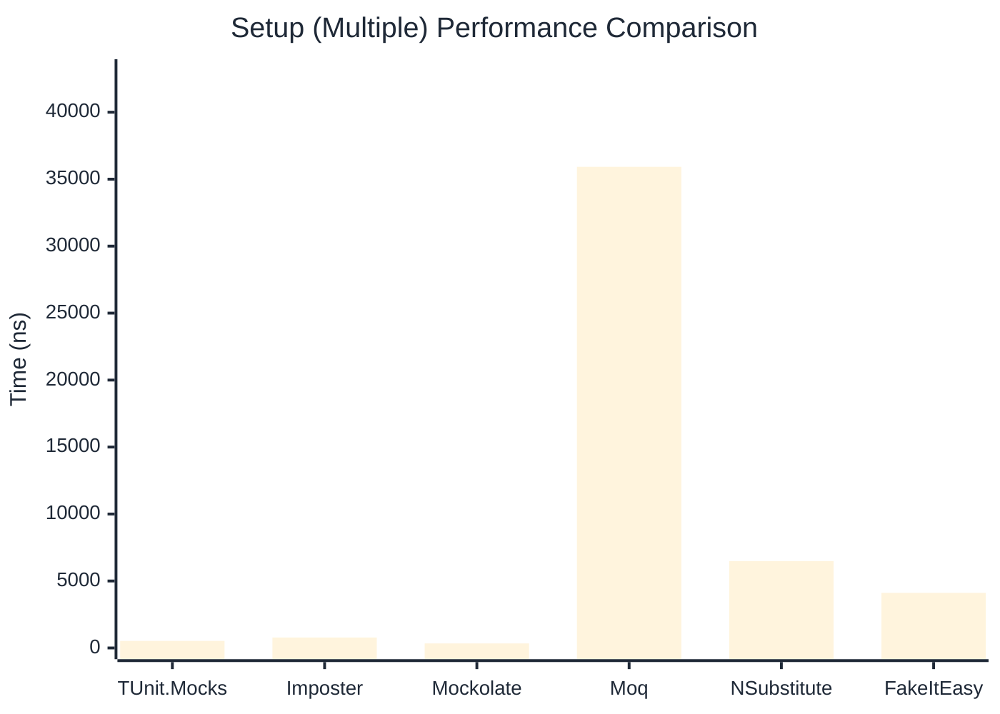

# Setup Benchmark

> Mock behavior configuration (returns, matchers) — comparing **TUnit.Mocks** (source-generated) against runtime proxy-based mocking libraries.

:::info Last Updated
This benchmark was automatically generated on **2026-10-06** from the latest CI run.

**Environment:** Ubuntu Latest • .NET SDK 10.0.401
:::

## 📊 Results

Mock behavior configuration (returns, matchers):

| Library | Mean | Error | StdDev | Allocated |
|---------|------|-------|--------|-----------|
| **TUnit.Mocks** | 366.2 ns | 7.22 ns | 6.40 ns | 2.37 KB |
| Imposter | 487.1 ns | 9.77 ns | 19.06 ns | 6.12 KB |
| Mockolate | 208.2 ns | 4.19 ns | 6.53 ns | 1.41 KB |
| Moq | 151,379.0 ns | 2,321.56 ns | 2,171.59 ns | 28.57 KB |
| NSubstitute | 3,556.6 ns | 67.98 ns | 66.77 ns | 9.01 KB |
| FakeItEasy | 4,234.1 ns | 82.89 ns | 107.79 ns | 10.53 KB |

```mermaid
%%{init: {
  'theme':'base',
  'themeVariables': {
    'primaryColor': '#2563eb',
    'primaryTextColor': '#1f2937',
    'primaryBorderColor': '#1e40af',
    'lineColor': '#6b7280',
    'secondaryColor': '#7c3aed',
    'tertiaryColor': '#dc2626',
    'background': '#ffffff',
    'pie1': '#2563eb',
    'pie2': '#7c3aed',
    'pie3': '#dc2626',
    'pie4': '#f59e0b',
    'pie5': '#10b981',
    'pie6': '#06b6d4',
    'pie7': '#ec4899',
    'pie8': '#6366f1'
  }
}}%%
xychart-beta
  title "Setup Performance Comparison"
  x-axis ["TUnit.Mocks", "Imposter", "Mockolate", "Moq", "NSubstitute", "FakeItEasy"]
  y-axis "Time (ns)" 0 --> 181655
  bar [366.2, 487.1, 208.2, 151379, 3556.6, 4234.1]
```

---

### Multiple

| Library | Mean | Error | StdDev | Allocated |
|---------|------|-------|--------|-----------|
| **TUnit.Mocks** | 525.9 ns | 9.28 ns | 8.68 ns | 3.18 KB |
| Imposter | 781.3 ns | 15.33 ns | 22.47 ns | 10.59 KB |
| Mockolate | 338.6 ns | 6.61 ns | 5.86 ns | 2.35 KB |
| Moq | 35,921.7 ns | 489.30 ns | 433.76 ns | 16.35 KB |
| NSubstitute | 6,486.0 ns | 125.63 ns | 117.52 ns | 20.31 KB |
| FakeItEasy | 4,115.0 ns | 80.80 ns | 79.36 ns | 11.71 KB |

```mermaid
%%{init: {
  'theme':'base',
  'themeVariables': {
    'primaryColor': '#2563eb',
    'primaryTextColor': '#1f2937',
    'primaryBorderColor': '#1e40af',
    'lineColor': '#6b7280',
    'secondaryColor': '#7c3aed',
    'tertiaryColor': '#dc2626',
    'background': '#ffffff',
    'pie1': '#2563eb',
    'pie2': '#7c3aed',
    'pie3': '#dc2626',
    'pie4': '#f59e0b',
    'pie5': '#10b981',
    'pie6': '#06b6d4',
    'pie7': '#ec4899',
    'pie8': '#6366f1'
  }
}}%%
xychart-beta
  title "Setup (Multiple) Performance Comparison"
  x-axis ["TUnit.Mocks", "Imposter", "Mockolate", "Moq", "NSubstitute", "FakeItEasy"]
  y-axis "Time (ns)" 0 --> 43107
  bar [525.9, 781.3, 338.6, 35921.7, 6486, 4115]
```

## 🎯 Key Insights

This benchmark compares **TUnit.Mocks** (source-generated) against runtime proxy-based mocking libraries for mock behavior configuration (returns, matchers).

---

:::note Methodology
View the [mock benchmarks overview](/docs/benchmarks/mocks) for methodology details and environment information.
:::

*Last generated: 2026-10-06T02:37:20.591Z*
