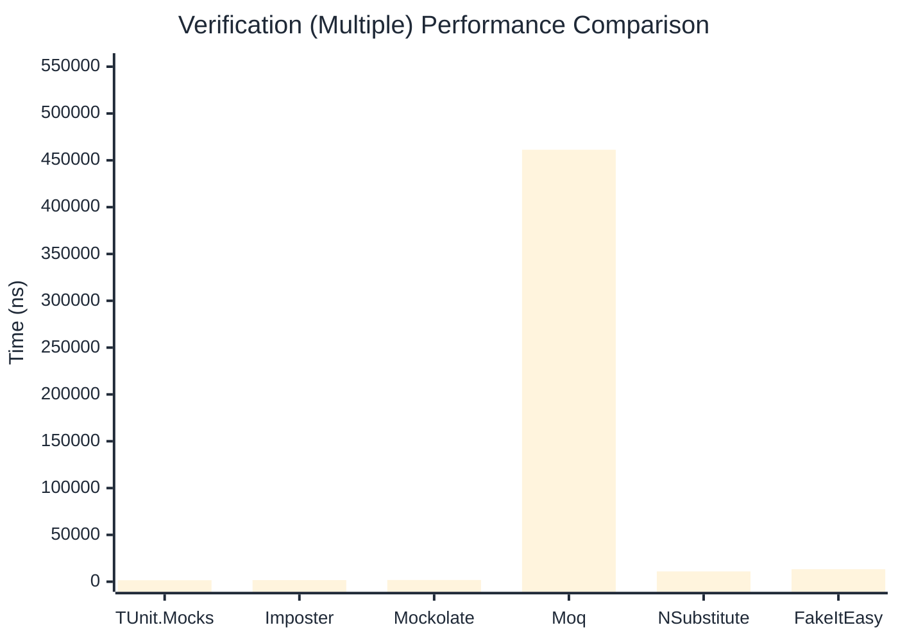

# Verification Benchmark

:::info Last Updated
This benchmark was automatically generated on **2026-03-30** from the latest CI run.

**Environment:** Ubuntu Latest • .NET SDK 10.0.201
:::

## 📊 Results

Verifying mock method calls:

| Library | Mean | Error | StdDev | Allocated |
|---------|------|-------|--------|-----------|
| **TUnit.Mocks** | 863.30 ns | 5.305 ns | 4.963 ns | 3864 B |
| Imposter | 669.60 ns | 8.722 ns | 8.158 ns | 4688 B |
| Mockolate | 873.68 ns | 2.700 ns | 2.394 ns | 3168 B |
| Moq | 334,938.35 ns | 1,044.985 ns | 872.610 ns | 24325 B |
| NSubstitute | 5,955.45 ns | 23.055 ns | 21.566 ns | 10064 B |
| FakeItEasy | 7,009.46 ns | 34.568 ns | 30.643 ns | 10722 B |

---

### Never

| Library | Mean | Error | StdDev | Allocated |
|---------|------|-------|--------|-----------|
| **TUnit.Mocks** | 68.57 ns | 0.296 ns | 0.247 ns | 392 B |
| Imposter | 310.82 ns | 2.490 ns | 2.329 ns | 2400 B |
| Mockolate | 203.53 ns | 0.483 ns | 0.428 ns | 904 B |
| Moq | 85,297.43 ns | 485.084 ns | 430.014 ns | 6918 B |
| NSubstitute | 3,387.13 ns | 16.791 ns | 15.706 ns | 7088 B |
| FakeItEasy | 3,403.87 ns | 29.549 ns | 27.641 ns | 5209 B |

---

### Multiple

| Library | Mean | Error | StdDev | Allocated |
|---------|------|-------|--------|-----------|
| **TUnit.Mocks** | 1,576.26 ns | 9.877 ns | 9.239 ns | 5592 B |
| Imposter | 1,731.41 ns | 5.623 ns | 4.985 ns | 11192 B |
| Mockolate | 1,840.88 ns | 5.602 ns | 4.678 ns | 5592 B |
| Moq | 461,283.98 ns | 2,337.671 ns | 2,072.284 ns | 34699 B |
| NSubstitute | 11,013.13 ns | 88.934 ns | 78.838 ns | 16762 B |
| FakeItEasy | 13,373.52 ns | 162.452 ns | 126.832 ns | 19233 B |

## 🎯 Key Insights

This benchmark compares **TUnit.Mocks** (source-generated) against runtime proxy-based mocking libraries for verifying mock method calls.

---

:::note Methodology
View the [mock benchmarks overview](/docs/benchmarks/mocks) for methodology details and environment information.
:::

*Last generated: 2026-03-30T03:24:56.545Z*
