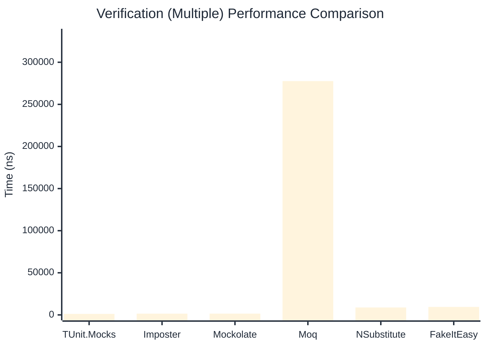

# Verification Benchmark

:::info Last Updated
This benchmark was automatically generated on **2026-04-05** from the latest CI run.

**Environment:** Ubuntu Latest • .NET SDK 10.0.201
:::

## 📊 Results

Verifying mock method calls:

| Library | Mean | Error | StdDev | Allocated |
|---------|------|-------|--------|-----------|
| **TUnit.Mocks** | 684.99 ns | 7.538 ns | 6.683 ns | 3224 B |
| Imposter | 571.94 ns | 11.322 ns | 11.627 ns | 4688 B |
| Mockolate | 740.58 ns | 6.802 ns | 6.030 ns | 3152 B |
| Moq | 195,249.30 ns | 700.701 ns | 621.153 ns | 24324 B |
| NSubstitute | 4,751.03 ns | 79.986 ns | 70.905 ns | 10064 B |
| FakeItEasy | 5,231.78 ns | 89.686 ns | 83.893 ns | 10722 B |

---

### Never

| Library | Mean | Error | StdDev | Allocated |
|---------|------|-------|--------|-----------|
| **TUnit.Mocks** | 66.30 ns | 0.573 ns | 0.479 ns | 376 B |
| Imposter | 258.88 ns | 1.843 ns | 1.634 ns | 2400 B |
| Mockolate | 177.20 ns | 0.960 ns | 0.898 ns | 952 B |
| Moq | 48,818.68 ns | 508.378 ns | 475.537 ns | 6925 B |
| NSubstitute | 2,784.69 ns | 36.399 ns | 32.267 ns | 7088 B |
| FakeItEasy | 2,609.66 ns | 50.115 ns | 46.878 ns | 5210 B |

---

### Multiple

| Library | Mean | Error | StdDev | Allocated |
|---------|------|-------|--------|-----------|
| **TUnit.Mocks** | 1,183.67 ns | 13.792 ns | 12.901 ns | 4712 B |
| Imposter | 1,493.25 ns | 27.895 ns | 26.093 ns | 11192 B |
| Mockolate | 1,517.53 ns | 19.898 ns | 18.613 ns | 5496 B |
| Moq | 277,658.31 ns | 2,013.857 ns | 1,883.763 ns | 34699 B |
| NSubstitute | 8,814.54 ns | 136.497 ns | 121.001 ns | 16762 B |
| FakeItEasy | 9,477.57 ns | 141.657 ns | 132.506 ns | 19344 B |

## 🎯 Key Insights

This benchmark compares **TUnit.Mocks** (source-generated) against runtime proxy-based mocking libraries for verifying mock method calls.

---

:::note Methodology
View the [mock benchmarks overview](/docs/benchmarks/mocks) for methodology details and environment information.
:::

*Last generated: 2026-04-05T11:44:06.333Z*
