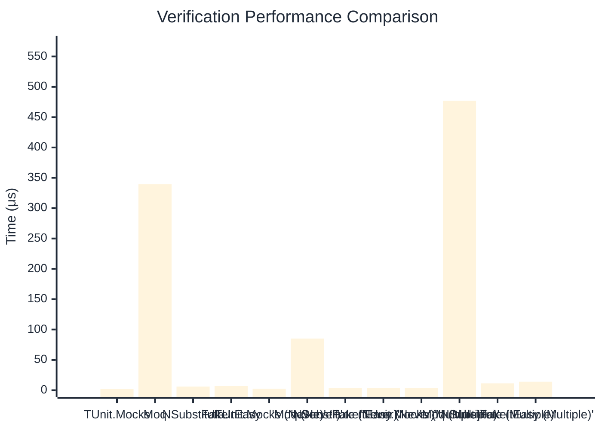

# Verification Benchmark

:::info Last Updated
This benchmark was automatically generated on **2026-03-28** from the latest CI run.

**Environment:** Ubuntu Latest • .NET SDK 10.0.201
:::

## 📊 Results

Verifying mock method calls:

| Method | Mean | Error | StdDev | Allocated |
|--------|------|-------|--------|-----------|
| **TUnit.Mocks** | 2.486 μs | 0.0313 μs | 0.0277 μs | 7.46 KB |
| Moq | 339.597 μs | 4.0745 μs | 3.8113 μs | 23.75 KB |
| NSubstitute | 6.110 μs | 0.0344 μs | 0.0305 μs | 9.83 KB |
| FakeItEasy | 7.077 μs | 0.0264 μs | 0.0221 μs | 10.47 KB |
| **'TUnit.Mocks (Never)'** | 2.560 μs | 0.0509 μs | 0.1005 μs | 4.92 KB |
| 'Moq (Never)' | 85.057 μs | 0.5842 μs | 0.5179 μs | 6.76 KB |
| 'NSubstitute (Never)' | 3.676 μs | 0.0429 μs | 0.0401 μs | 6.92 KB |
| 'FakeItEasy (Never)' | 3.646 μs | 0.0466 μs | 0.0436 μs | 5.09 KB |
| **'TUnit.Mocks (Multiple)'** | 3.776 μs | 0.0746 μs | 0.1183 μs | 9.61 KB |
| 'Moq (Multiple)' | 476.869 μs | 4.0965 μs | 3.8318 μs | 33.89 KB |
| 'NSubstitute (Multiple)' | 11.362 μs | 0.1486 μs | 0.1390 μs | 16.37 KB |
| 'FakeItEasy (Multiple)' | 14.028 μs | 0.1627 μs | 0.1358 μs | 18.78 KB |

## 📈 Visual Comparison

## 🎯 Key Insights

This benchmark compares **TUnit.Mocks** (source-generated) against runtime proxy-based mocking libraries for verifying mock method calls.

---

:::note Methodology
View the [mock benchmarks overview](/docs/benchmarks/mocks) for methodology details and environment information.
:::

*Last generated: 2026-03-28T22:34:52.304Z*
