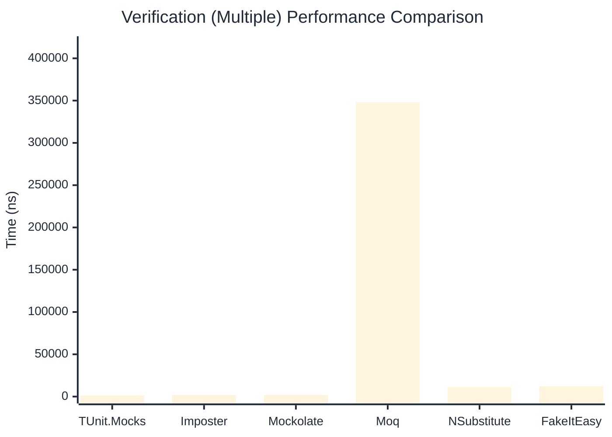

# Verification Benchmark

:::info Last Updated
This benchmark was automatically generated on **2026-04-11** from the latest CI run.

**Environment:** Ubuntu Latest • .NET SDK 10.0.201
:::

## 📊 Results

Verifying mock method calls:

| Library | Mean | Error | StdDev | Allocated |
|---------|------|-------|--------|-----------|
| **TUnit.Mocks** | 766.30 ns | 4.647 ns | 4.347 ns | 3080 B |
| Imposter | 710.72 ns | 13.332 ns | 12.471 ns | 4688 B |
| Mockolate | 1,003.08 ns | 19.549 ns | 17.330 ns | 3152 B |
| Moq | 246,139.47 ns | 1,135.665 ns | 1,006.737 ns | 24324 B |
| NSubstitute | 6,085.89 ns | 83.154 ns | 77.782 ns | 10064 B |
| FakeItEasy | 6,790.79 ns | 77.529 ns | 72.521 ns | 10722 B |

---

### Never

| Library | Mean | Error | StdDev | Allocated |
|---------|------|-------|--------|-----------|
| **TUnit.Mocks** | 70.84 ns | 0.384 ns | 0.300 ns | 328 B |
| Imposter | 340.38 ns | 4.252 ns | 3.551 ns | 2400 B |
| Mockolate | 238.11 ns | 2.148 ns | 2.010 ns | 952 B |
| Moq | 62,092.73 ns | 480.187 ns | 449.167 ns | 6925 B |
| NSubstitute | 3,532.46 ns | 28.050 ns | 24.865 ns | 7088 B |
| FakeItEasy | 3,390.19 ns | 32.098 ns | 26.803 ns | 5210 B |

---

### Multiple

| Library | Mean | Error | StdDev | Allocated |
|---------|------|-------|--------|-----------|
| **TUnit.Mocks** | 1,390.15 ns | 12.953 ns | 12.116 ns | 4608 B |
| Imposter | 1,858.61 ns | 24.956 ns | 22.123 ns | 11192 B |
| Mockolate | 1,914.36 ns | 19.722 ns | 17.483 ns | 5496 B |
| Moq | 348,235.34 ns | 1,541.299 ns | 1,203.345 ns | 34699 B |
| NSubstitute | 10,910.92 ns | 65.888 ns | 58.408 ns | 16761 B |
| FakeItEasy | 12,227.38 ns | 61.714 ns | 51.534 ns | 19232 B |

## 🎯 Key Insights

This benchmark compares **TUnit.Mocks** (source-generated) against runtime proxy-based mocking libraries for verifying mock method calls.

---

:::note Methodology
View the [mock benchmarks overview](/docs/benchmarks/mocks) for methodology details and environment information.
:::

*Last generated: 2026-04-11T03:20:45.459Z*
