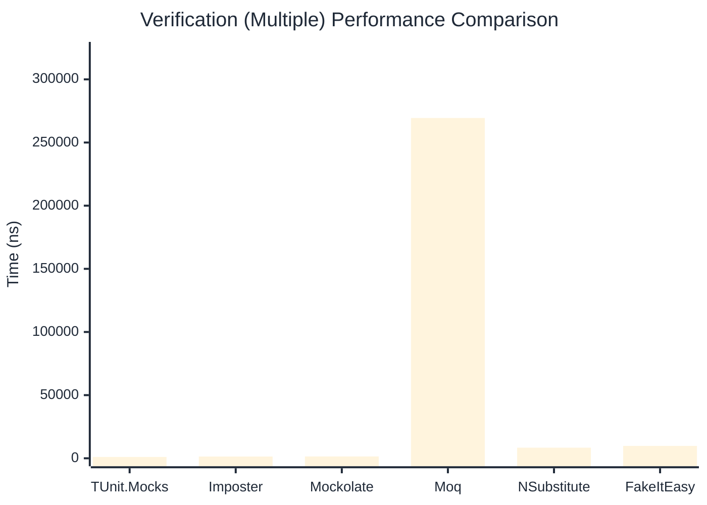

# Verification Benchmark

:::info Last Updated
This benchmark was automatically generated on **2026-04-15** from the latest CI run.

**Environment:** Ubuntu Latest • .NET SDK 10.0.202
:::

## 📊 Results

Verifying mock method calls:

| Library | Mean | Error | StdDev | Allocated |
|---------|------|-------|--------|-----------|
| **TUnit.Mocks** | 610.66 ns | 11.783 ns | 11.022 ns | 3080 B |
| Imposter | 526.40 ns | 8.487 ns | 7.523 ns | 4688 B |
| Mockolate | 713.30 ns | 7.056 ns | 6.601 ns | 3152 B |
| Moq | 189,985.44 ns | 1,748.310 ns | 1,549.831 ns | 24324 B |
| NSubstitute | 4,541.65 ns | 86.214 ns | 80.645 ns | 10064 B |
| FakeItEasy | 5,179.22 ns | 101.335 ns | 120.632 ns | 10722 B |

---

### Never

| Library | Mean | Error | StdDev | Allocated |
|---------|------|-------|--------|-----------|
| **TUnit.Mocks** | 53.40 ns | 0.706 ns | 0.626 ns | 328 B |
| Imposter | 256.65 ns | 2.370 ns | 2.101 ns | 2400 B |
| Mockolate | 186.01 ns | 3.249 ns | 3.040 ns | 952 B |
| Moq | 48,860.50 ns | 389.245 ns | 345.056 ns | 6925 B |
| NSubstitute | 2,829.88 ns | 56.381 ns | 94.200 ns | 7088 B |
| FakeItEasy | 2,558.83 ns | 41.453 ns | 71.505 ns | 5210 B |

---

### Multiple

| Library | Mean | Error | StdDev | Allocated |
|---------|------|-------|--------|-----------|
| **TUnit.Mocks** | 1,063.28 ns | 14.626 ns | 13.682 ns | 4608 B |
| Imposter | 1,394.43 ns | 26.429 ns | 29.376 ns | 11192 B |
| Mockolate | 1,441.08 ns | 21.575 ns | 18.016 ns | 5496 B |
| Moq | 269,429.84 ns | 1,872.090 ns | 1,751.154 ns | 34922 B |
| NSubstitute | 8,403.31 ns | 84.323 ns | 70.414 ns | 16763 B |
| FakeItEasy | 9,815.35 ns | 189.323 ns | 210.432 ns | 19456 B |

## 🎯 Key Insights

This benchmark compares **TUnit.Mocks** (source-generated) against runtime proxy-based mocking libraries for verifying mock method calls.

---

:::note Methodology
View the [mock benchmarks overview](/docs/benchmarks/mocks) for methodology details and environment information.
:::

*Last generated: 2026-04-15T03:22:40.574Z*
