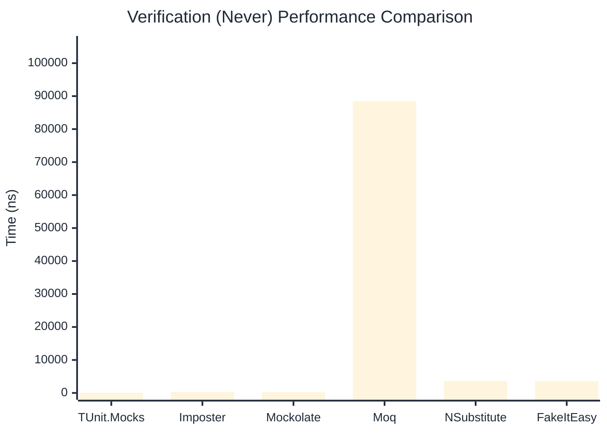

# Verification Benchmark

> Verifying mock method calls — comparing **TUnit.Mocks** (source-generated) against runtime proxy-based mocking libraries.

:::info Last Updated
This benchmark was automatically generated on **2026-06-14** from the latest CI run.

**Environment:** Ubuntu Latest • .NET SDK 10.0.301
:::

## 📊 Results

Verifying mock method calls:

| Library | Mean | Error | StdDev | Allocated |
|---------|------|-------|--------|-----------|
| **TUnit.Mocks** | 726.43 ns | 14.392 ns | 15.997 ns | 3008 B |
| Imposter | 709.66 ns | 12.601 ns | 11.170 ns | 4688 B |
| Mockolate | 437.19 ns | 8.769 ns | 9.747 ns | 2240 B |
| Moq | 345,643.09 ns | 2,485.066 ns | 2,075.142 ns | 24325 B |
| NSubstitute | 6,337.24 ns | 61.927 ns | 54.897 ns | 10064 B |
| FakeItEasy | 7,729.30 ns | 67.974 ns | 63.583 ns | 10722 B |

---

### Never

| Library | Mean | Error | StdDev | Allocated |
|---------|------|-------|--------|-----------|
| **TUnit.Mocks** | 52.79 ns | 0.426 ns | 0.356 ns | 320 B |
| Imposter | 335.46 ns | 3.877 ns | 3.627 ns | 2400 B |
| Mockolate | 249.80 ns | 3.227 ns | 3.019 ns | 1240 B |
| Moq | 88,476.37 ns | 668.638 ns | 625.445 ns | 6918 B |
| NSubstitute | 3,638.22 ns | 33.695 ns | 29.870 ns | 7088 B |
| FakeItEasy | 3,580.28 ns | 61.219 ns | 57.264 ns | 5209 B |

---

### Multiple

| Library | Mean | Error | StdDev | Allocated |
|---------|------|-------|--------|-----------|
| **TUnit.Mocks** | 1,316.24 ns | 15.467 ns | 14.468 ns | 4472 B |
| Imposter | 1,867.10 ns | 31.574 ns | 27.990 ns | 11192 B |
| Mockolate | 1,242.72 ns | 24.213 ns | 22.649 ns | 5376 B |
| Moq | 484,355.68 ns | 2,098.368 ns | 1,860.149 ns | 34779 B |
| NSubstitute | 11,469.88 ns | 68.947 ns | 61.120 ns | 16762 B |
| FakeItEasy | 14,146.45 ns | 233.737 ns | 207.202 ns | 19345 B |

## 🎯 Key Insights

This benchmark compares **TUnit.Mocks** (source-generated) against runtime proxy-based mocking libraries for verifying mock method calls.

---

:::note Methodology
View the [mock benchmarks overview](/docs/benchmarks/mocks) for methodology details and environment information.
:::

*Last generated: 2026-06-14T03:35:08.044Z*
