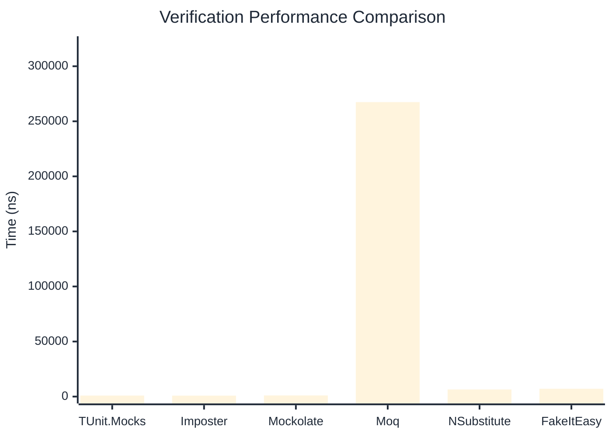

# Verification Benchmark

:::info Last Updated
This benchmark was automatically generated on **2026-04-07** from the latest CI run.

**Environment:** Ubuntu Latest • .NET SDK 10.0.201
:::

## 📊 Results

Verifying mock method calls:

| Library | Mean | Error | StdDev | Allocated |
|---------|------|-------|--------|-----------|
| **TUnit.Mocks** | 922.60 ns | 7.808 ns | 7.303 ns | 3048 B |
| Imposter | 844.24 ns | 16.870 ns | 37.383 ns | 4688 B |
| Mockolate | 1,053.70 ns | 5.925 ns | 5.252 ns | 3152 B |
| Moq | 267,438.83 ns | 1,931.282 ns | 1,806.523 ns | 24557 B |
| NSubstitute | 6,451.74 ns | 12.044 ns | 10.677 ns | 10176 B |
| FakeItEasy | 7,110.46 ns | 38.252 ns | 33.909 ns | 10731 B |

---

### Never

| Library | Mean | Error | StdDev | Allocated |
|---------|------|-------|--------|-----------|
| **TUnit.Mocks** | 97.18 ns | 1.636 ns | 1.531 ns | 376 B |
| Imposter | 406.52 ns | 8.044 ns | 12.758 ns | 2400 B |
| Mockolate | 254.73 ns | 1.878 ns | 1.756 ns | 952 B |
| Moq | 65,371.08 ns | 459.145 ns | 383.407 ns | 6925 B |
| NSubstitute | 3,524.13 ns | 17.207 ns | 15.253 ns | 7088 B |
| FakeItEasy | 3,655.87 ns | 29.015 ns | 27.140 ns | 5218 B |

---

### Multiple

| Library | Mean | Error | StdDev | Allocated |
|---------|------|-------|--------|-----------|
| **TUnit.Mocks** | 1,563.81 ns | 13.064 ns | 12.220 ns | 4544 B |
| Imposter | 2,013.84 ns | 40.150 ns | 61.313 ns | 11192 B |
| Mockolate | 2,011.89 ns | 13.868 ns | 12.972 ns | 5496 B |
| Moq | 353,473.50 ns | 3,057.036 ns | 2,709.983 ns | 34670 B |
| NSubstitute | 11,427.85 ns | 64.576 ns | 57.245 ns | 16762 B |
| FakeItEasy | 12,260.11 ns | 85.726 ns | 75.993 ns | 19238 B |

## 🎯 Key Insights

This benchmark compares **TUnit.Mocks** (source-generated) against runtime proxy-based mocking libraries for verifying mock method calls.

---

:::note Methodology
View the [mock benchmarks overview](/docs/benchmarks/mocks) for methodology details and environment information.
:::

*Last generated: 2026-04-07T03:21:31.527Z*
