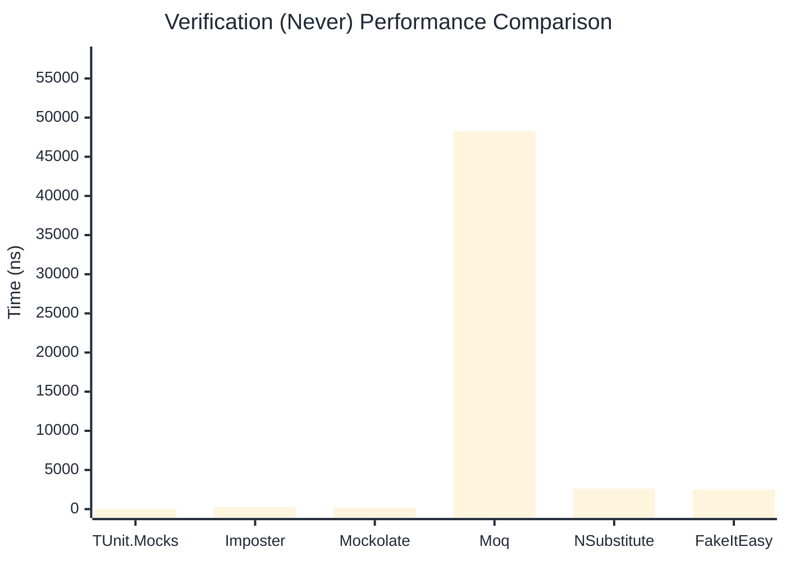

# Verification Benchmark

> Verifying mock method calls — comparing **TUnit.Mocks** (source-generated) against runtime proxy-based mocking libraries.

:::info Last Updated
This benchmark was automatically generated on **2026-06-03** from the latest CI run.

**Environment:** Ubuntu Latest • .NET SDK 10.0.300
:::

## 📊 Results

Verifying mock method calls:

| Library | Mean | Error | StdDev | Allocated |
|---------|------|-------|--------|-----------|
| **TUnit.Mocks** | 569.51 ns | 1.691 ns | 1.499 ns | 2968 B |
| Imposter | 534.10 ns | 5.588 ns | 5.227 ns | 4688 B |
| Mockolate | 313.64 ns | 1.490 ns | 1.321 ns | 2240 B |
| Moq | 187,618.43 ns | 415.545 ns | 368.370 ns | 24324 B |
| NSubstitute | 4,474.16 ns | 15.844 ns | 14.820 ns | 10064 B |
| FakeItEasy | 4,977.21 ns | 16.008 ns | 14.974 ns | 10722 B |

---

### Never

| Library | Mean | Error | StdDev | Allocated |
|---------|------|-------|--------|-----------|
| **TUnit.Mocks** | 44.01 ns | 0.399 ns | 0.373 ns | 304 B |
| Imposter | 257.05 ns | 0.644 ns | 0.602 ns | 2400 B |
| Mockolate | 198.80 ns | 1.816 ns | 1.698 ns | 1240 B |
| Moq | 48,282.80 ns | 253.295 ns | 211.513 ns | 6925 B |
| NSubstitute | 2,620.27 ns | 15.116 ns | 14.139 ns | 7088 B |
| FakeItEasy | 2,469.82 ns | 16.544 ns | 15.475 ns | 5210 B |

---

### Multiple

| Library | Mean | Error | StdDev | Allocated |
|---------|------|-------|--------|-----------|
| **TUnit.Mocks** | 957.57 ns | 3.515 ns | 2.935 ns | 4384 B |
| Imposter | 1,280.74 ns | 6.299 ns | 5.260 ns | 11192 B |
| Mockolate | 863.58 ns | 3.119 ns | 2.918 ns | 5376 B |
| Moq | 279,626.41 ns | 1,045.117 ns | 926.469 ns | 34699 B |
| NSubstitute | 8,150.31 ns | 41.718 ns | 39.023 ns | 16762 B |
| FakeItEasy | 8,769.62 ns | 59.916 ns | 56.046 ns | 19232 B |

## 🎯 Key Insights

This benchmark compares **TUnit.Mocks** (source-generated) against runtime proxy-based mocking libraries for verifying mock method calls.

---

:::note Methodology
View the [mock benchmarks overview](/docs/benchmarks/mocks) for methodology details and environment information.
:::

*Last generated: 2026-06-03T03:30:19.511Z*
