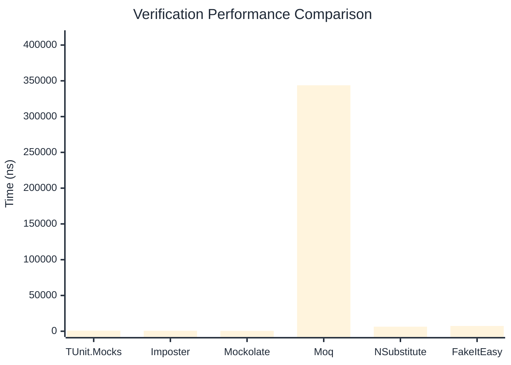

# Verification Benchmark

:::info Last Updated
This benchmark was automatically generated on **2026-05-01** from the latest CI run.

**Environment:** Ubuntu Latest • .NET SDK 10.0.203
:::

## 📊 Results

Verifying mock method calls:

| Library | Mean | Error | StdDev | Allocated |
|---------|------|-------|--------|-----------|
| **TUnit.Mocks** | 850.29 ns | 2.391 ns | 1.997 ns | 2864 B |
| Imposter | 687.26 ns | 6.695 ns | 6.262 ns | 4688 B |
| Mockolate | 549.83 ns | 0.915 ns | 0.856 ns | 2880 B |
| Moq | 343,780.89 ns | 2,001.266 ns | 1,871.986 ns | 24349 B |
| NSubstitute | 6,393.64 ns | 24.927 ns | 19.462 ns | 10064 B |
| FakeItEasy | 7,370.71 ns | 91.827 ns | 85.895 ns | 10722 B |

---

### Never

| Library | Mean | Error | StdDev | Allocated |
|---------|------|-------|--------|-----------|
| **TUnit.Mocks** | 48.04 ns | 0.173 ns | 0.144 ns | 304 B |
| Imposter | 306.63 ns | 2.252 ns | 2.106 ns | 2400 B |
| Mockolate | 301.35 ns | 1.880 ns | 1.758 ns | 1656 B |
| Moq | 88,090.19 ns | 492.445 ns | 436.540 ns | 6918 B |
| NSubstitute | 3,665.58 ns | 13.075 ns | 10.918 ns | 7088 B |
| FakeItEasy | 3,615.10 ns | 14.044 ns | 13.137 ns | 5210 B |

---

### Multiple

| Library | Mean | Error | StdDev | Allocated |
|---------|------|-------|--------|-----------|
| **TUnit.Mocks** | 1,105.25 ns | 3.038 ns | 2.537 ns | 4176 B |
| Imposter | 1,695.66 ns | 18.864 ns | 17.646 ns | 11192 B |
| Mockolate | 1,310.79 ns | 13.036 ns | 12.193 ns | 6096 B |
| Moq | 467,376.00 ns | 2,996.182 ns | 2,501.948 ns | 34811 B |
| NSubstitute | 11,581.89 ns | 45.732 ns | 35.705 ns | 16763 B |
| FakeItEasy | 13,755.33 ns | 112.269 ns | 93.749 ns | 19233 B |

## 🎯 Key Insights

This benchmark compares **TUnit.Mocks** (source-generated) against runtime proxy-based mocking libraries for verifying mock method calls.

---

:::note Methodology
View the [mock benchmarks overview](/docs/benchmarks/mocks) for methodology details and environment information.
:::

*Last generated: 2026-05-01T03:25:57.964Z*
