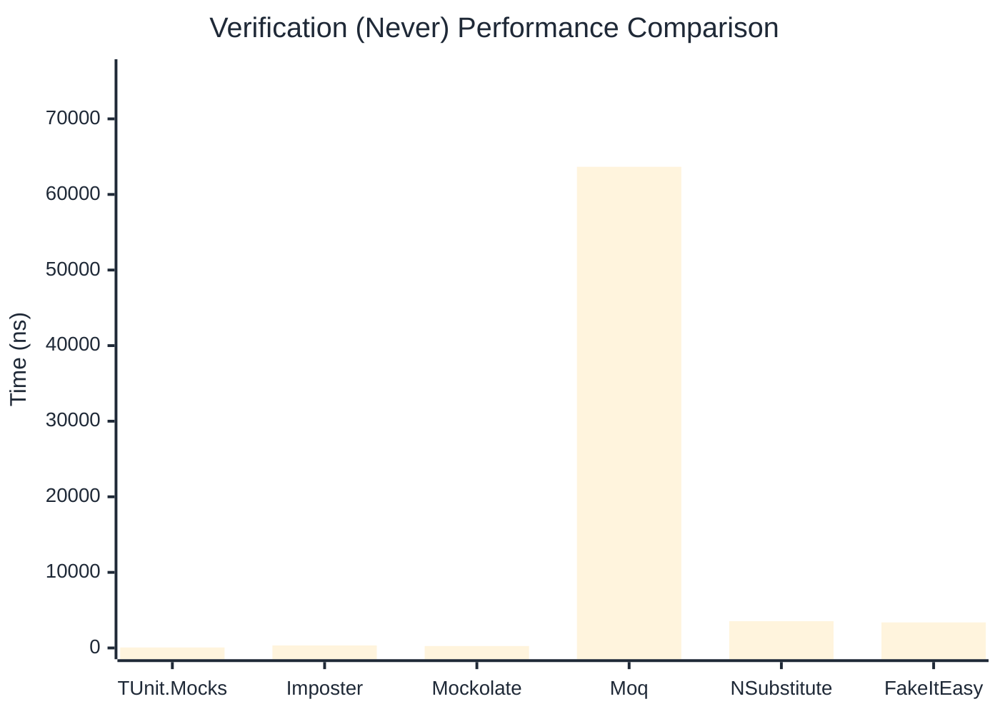
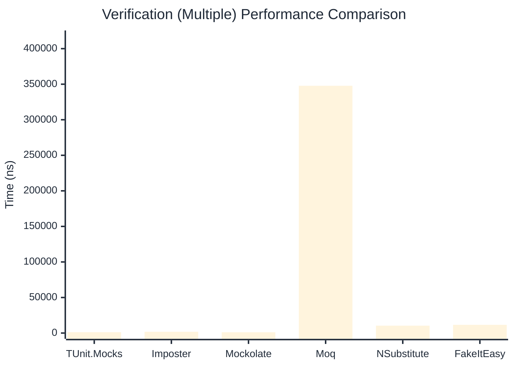

# Verification Benchmark

> Verifying mock method calls — comparing **TUnit.Mocks** (source-generated) against runtime proxy-based mocking libraries.

:::info Last Updated
This benchmark was automatically generated on **2026-06-13** from the latest CI run.

**Environment:** Ubuntu Latest • .NET SDK 10.0.301
:::

## 📊 Results

Verifying mock method calls:

| Library | Mean | Error | StdDev | Allocated |
|---------|------|-------|--------|-----------|
| **TUnit.Mocks** | 759.94 ns | 2.908 ns | 2.428 ns | 3008 B |
| Imposter | 687.04 ns | 4.514 ns | 3.769 ns | 4688 B |
| Mockolate | 417.03 ns | 2.516 ns | 2.231 ns | 2240 B |
| Moq | 248,790.88 ns | 723.038 ns | 640.954 ns | 24324 B |
| NSubstitute | 5,786.21 ns | 53.614 ns | 47.527 ns | 10064 B |
| FakeItEasy | 6,528.17 ns | 53.044 ns | 44.294 ns | 10722 B |

---

### Never

| Library | Mean | Error | StdDev | Allocated |
|---------|------|-------|--------|-----------|
| **TUnit.Mocks** | 63.32 ns | 0.246 ns | 0.231 ns | 320 B |
| Imposter | 328.10 ns | 2.315 ns | 1.808 ns | 2400 B |
| Mockolate | 254.78 ns | 0.736 ns | 0.652 ns | 1240 B |
| Moq | 63,655.82 ns | 620.735 ns | 580.636 ns | 6925 B |
| NSubstitute | 3,546.17 ns | 68.306 ns | 70.145 ns | 7088 B |
| FakeItEasy | 3,380.68 ns | 43.880 ns | 41.046 ns | 5210 B |

---

### Multiple

| Library | Mean | Error | StdDev | Allocated |
|---------|------|-------|--------|-----------|
| **TUnit.Mocks** | 1,242.60 ns | 12.277 ns | 10.883 ns | 4472 B |
| Imposter | 1,786.95 ns | 13.013 ns | 11.536 ns | 11192 B |
| Mockolate | 1,152.66 ns | 13.241 ns | 12.386 ns | 5376 B |
| Moq | 347,830.44 ns | 2,684.399 ns | 2,510.989 ns | 34699 B |
| NSubstitute | 10,396.93 ns | 80.439 ns | 75.243 ns | 16889 B |
| FakeItEasy | 11,608.86 ns | 106.561 ns | 94.464 ns | 19312 B |

## 🎯 Key Insights

This benchmark compares **TUnit.Mocks** (source-generated) against runtime proxy-based mocking libraries for verifying mock method calls.

---

:::note Methodology
View the [mock benchmarks overview](/docs/benchmarks/mocks) for methodology details and environment information.
:::

*Last generated: 2026-06-13T03:28:23.194Z*
