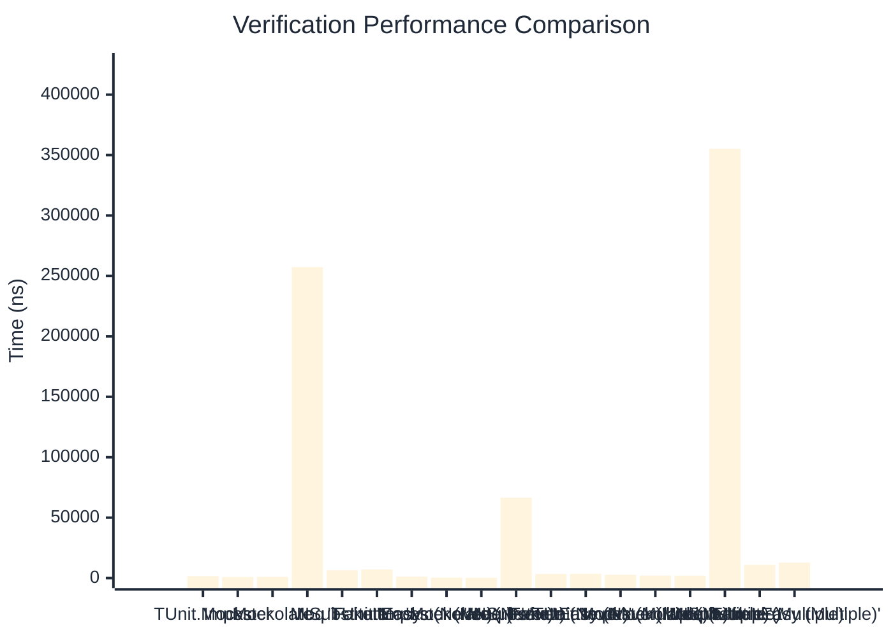

# Verification Benchmark

:::info Last Updated
This benchmark was automatically generated on **2026-03-29** from the latest CI run.

**Environment:** Ubuntu Latest • .NET SDK 10.0.201
:::

## 📊 Results

Verifying mock method calls:

| Method | Mean | Error | StdDev | Allocated |
|--------|------|-------|--------|-----------|
| **TUnit.Mocks** | 1,636.5 ns | 27.42 ns | 24.31 ns | 4204 B |
| Imposter | 834.3 ns | 16.39 ns | 26.47 ns | 4688 B |
| Mockolate | 971.5 ns | 10.71 ns | 10.02 ns | 3168 B |
| Moq | 257,269.9 ns | 968.60 ns | 906.02 ns | 24306 B |
| NSubstitute | 6,459.1 ns | 35.78 ns | 31.72 ns | 10064 B |
| FakeItEasy | 7,134.1 ns | 56.18 ns | 52.55 ns | 10731 B |
| **'TUnit.Mocks (Never)'** | 1,190.7 ns | 23.11 ns | 42.84 ns | 1613 B |
| 'Imposter (Never)' | 394.2 ns | 6.21 ns | 5.81 ns | 2400 B |
| 'Mockolate (Never)' | 255.1 ns | 5.09 ns | 5.22 ns | 904 B |
| 'Moq (Never)' | 66,533.5 ns | 534.03 ns | 499.54 ns | 6925 B |
| 'NSubstitute (Never)' | 3,427.5 ns | 18.83 ns | 16.69 ns | 7088 B |
| 'FakeItEasy (Never)' | 3,555.2 ns | 24.27 ns | 22.70 ns | 5218 B |
| **'TUnit.Mocks (Multiple)'** | 2,710.7 ns | 53.19 ns | 52.24 ns | 6413 B |
| 'Imposter (Multiple)' | 2,063.0 ns | 32.95 ns | 27.51 ns | 11192 B |
| 'Mockolate (Multiple)' | 2,001.4 ns | 21.86 ns | 20.45 ns | 5592 B |
| 'Moq (Multiple)' | 355,176.7 ns | 3,290.54 ns | 3,077.97 ns | 34670 B |
| 'NSubstitute (Multiple)' | 10,936.6 ns | 43.25 ns | 38.34 ns | 16762 B |
| 'FakeItEasy (Multiple)' | 12,788.9 ns | 96.39 ns | 90.17 ns | 19239 B |

## 📈 Visual Comparison

## 🎯 Key Insights

This benchmark compares **TUnit.Mocks** (source-generated) against runtime proxy-based mocking libraries for verifying mock method calls.

---

:::note Methodology
View the [mock benchmarks overview](/docs/benchmarks/mocks) for methodology details and environment information.
:::

*Last generated: 2026-03-29T21:50:09.525Z*
