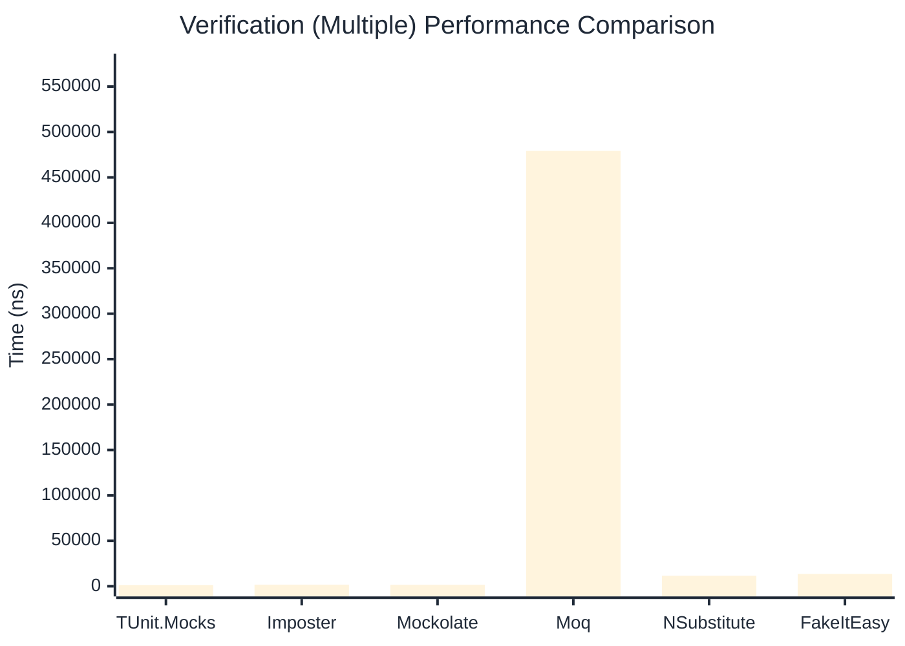

# Verification Benchmark

> Verifying mock method calls — comparing **TUnit.Mocks** (source-generated) against runtime proxy-based mocking libraries.

:::info Last Updated
This benchmark was automatically generated on **2026-06-24** from the latest CI run.

**Environment:** Ubuntu Latest • .NET SDK 10.0.301
:::

## 📊 Results

Verifying mock method calls:

| Library | Mean | Error | StdDev | Allocated |
|---------|------|-------|--------|-----------|
| **TUnit.Mocks** | 743.44 ns | 9.841 ns | 9.205 ns | 3008 B |
| Imposter | 702.30 ns | 10.562 ns | 9.879 ns | 4688 B |
| Mockolate | 417.43 ns | 7.995 ns | 10.673 ns | 2128 B |
| Moq | 346,982.80 ns | 1,893.602 ns | 1,771.276 ns | 24325 B |
| NSubstitute | 6,122.32 ns | 38.735 ns | 36.233 ns | 10064 B |
| FakeItEasy | 7,566.98 ns | 61.723 ns | 54.716 ns | 10722 B |

---

### Never

| Library | Mean | Error | StdDev | Allocated |
|---------|------|-------|--------|-----------|
| **TUnit.Mocks** | 51.95 ns | 0.574 ns | 0.537 ns | 320 B |
| Imposter | 314.50 ns | 2.558 ns | 2.136 ns | 2400 B |
| Mockolate | 227.73 ns | 2.008 ns | 1.677 ns | 1144 B |
| Moq | 89,693.34 ns | 1,147.605 ns | 1,017.322 ns | 6918 B |
| NSubstitute | 3,598.85 ns | 17.881 ns | 16.726 ns | 7088 B |
| FakeItEasy | 3,766.08 ns | 23.919 ns | 19.973 ns | 5210 B |

---

### Multiple

| Library | Mean | Error | StdDev | Allocated |
|---------|------|-------|--------|-----------|
| **TUnit.Mocks** | 1,241.97 ns | 7.098 ns | 6.292 ns | 4472 B |
| Imposter | 1,724.92 ns | 21.234 ns | 18.824 ns | 11192 B |
| Mockolate | 1,544.03 ns | 9.049 ns | 8.465 ns | 5240 B |
| Moq | 479,162.30 ns | 2,929.956 ns | 2,740.683 ns | 34699 B |
| NSubstitute | 11,506.85 ns | 46.594 ns | 41.305 ns | 16762 B |
| FakeItEasy | 13,543.39 ns | 245.881 ns | 229.997 ns | 19233 B |

## 🎯 Key Insights

This benchmark compares **TUnit.Mocks** (source-generated) against runtime proxy-based mocking libraries for verifying mock method calls.

---

:::note Methodology
View the [mock benchmarks overview](/docs/benchmarks/mocks) for methodology details and environment information.
:::

*Last generated: 2026-06-24T03:28:17.466Z*
