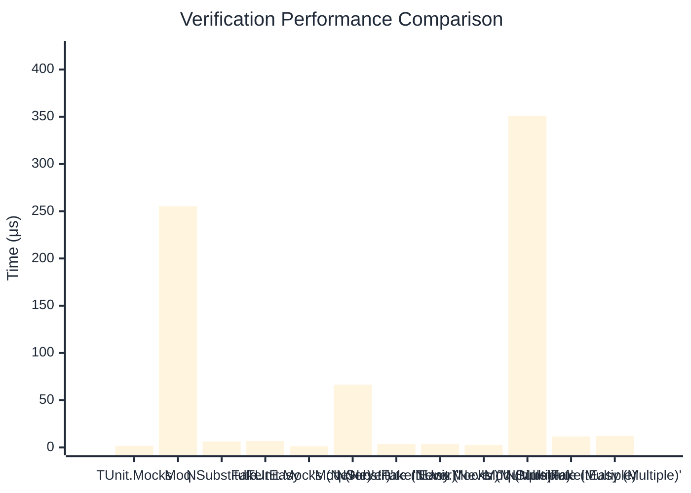

# Verification Benchmark

:::info Last Updated
This benchmark was automatically generated on **2026-03-29** from the latest CI run.

**Environment:** Ubuntu Latest • .NET SDK 10.0.201
:::

## 📊 Results

Verifying mock method calls:

| Method | Mean | Error | StdDev | Allocated |
|--------|------|-------|--------|-----------|
| **TUnit.Mocks** | 1.674 μs | 0.0300 μs | 0.0281 μs | 4.11 KB |
| Moq | 255.272 μs | 1.0882 μs | 0.9646 μs | 23.74 KB |
| NSubstitute | 6.264 μs | 0.0382 μs | 0.0357 μs | 9.83 KB |
| FakeItEasy | 7.047 μs | 0.0297 μs | 0.0263 μs | 10.48 KB |
| **'TUnit.Mocks (Never)'** | 1.193 μs | 0.0182 μs | 0.0170 μs | 1.58 KB |
| 'Moq (Never)' | 66.322 μs | 0.3183 μs | 0.2978 μs | 6.76 KB |
| 'NSubstitute (Never)' | 3.397 μs | 0.0226 μs | 0.0211 μs | 6.92 KB |
| 'FakeItEasy (Never)' | 3.475 μs | 0.0475 μs | 0.0445 μs | 5.1 KB |
| **'TUnit.Mocks (Multiple)'** | 2.462 μs | 0.0491 μs | 0.1077 μs | 6.26 KB |
| 'Moq (Multiple)' | 350.992 μs | 2.0233 μs | 1.7936 μs | 33.86 KB |
| 'NSubstitute (Multiple)' | 11.517 μs | 0.0277 μs | 0.0246 μs | 16.49 KB |
| 'FakeItEasy (Multiple)' | 12.344 μs | 0.1133 μs | 0.1060 μs | 18.79 KB |

## 📈 Visual Comparison

## 🎯 Key Insights

This benchmark compares **TUnit.Mocks** (source-generated) against runtime proxy-based mocking libraries for verifying mock method calls.

---

:::note Methodology
View the [mock benchmarks overview](/docs/benchmarks/mocks) for methodology details and environment information.
:::

*Last generated: 2026-03-29T03:29:47.877Z*
