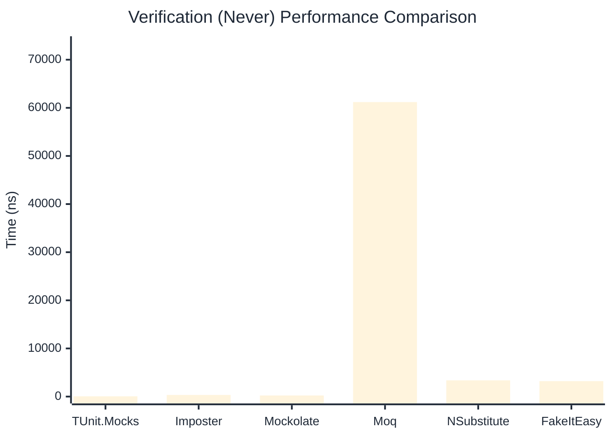

# Verification Benchmark

:::info Last Updated
This benchmark was automatically generated on **2026-04-18** from the latest CI run.

**Environment:** Ubuntu Latest • .NET SDK 10.0.202
:::

## 📊 Results

Verifying mock method calls:

| Library | Mean | Error | StdDev | Allocated |
|---------|------|-------|--------|-----------|
| **TUnit.Mocks** | 752.33 ns | 2.610 ns | 2.313 ns | 3080 B |
| Imposter | 737.09 ns | 3.416 ns | 3.196 ns | 4688 B |
| Mockolate | 950.68 ns | 12.647 ns | 11.830 ns | 3152 B |
| Moq | 236,804.32 ns | 1,186.269 ns | 1,051.597 ns | 24324 B |
| NSubstitute | 5,843.30 ns | 25.098 ns | 22.249 ns | 10064 B |
| FakeItEasy | 6,279.63 ns | 21.283 ns | 18.867 ns | 10722 B |

---

### Never

| Library | Mean | Error | StdDev | Allocated |
|---------|------|-------|--------|-----------|
| **TUnit.Mocks** | 57.04 ns | 0.376 ns | 0.352 ns | 328 B |
| Imposter | 340.46 ns | 1.543 ns | 1.443 ns | 2400 B |
| Mockolate | 231.26 ns | 1.039 ns | 0.972 ns | 952 B |
| Moq | 61,190.83 ns | 295.249 ns | 261.731 ns | 6925 B |
| NSubstitute | 3,374.38 ns | 14.405 ns | 12.029 ns | 7088 B |
| FakeItEasy | 3,206.49 ns | 18.900 ns | 16.755 ns | 5210 B |

---

### Multiple

| Library | Mean | Error | StdDev | Allocated |
|---------|------|-------|--------|-----------|
| **TUnit.Mocks** | 1,307.87 ns | 2.941 ns | 2.607 ns | 4608 B |
| Imposter | 1,706.48 ns | 11.833 ns | 11.069 ns | 11192 B |
| Mockolate | 1,811.76 ns | 5.737 ns | 5.367 ns | 5496 B |
| Moq | 349,382.07 ns | 3,607.187 ns | 3,374.165 ns | 34922 B |
| NSubstitute | 10,305.09 ns | 48.751 ns | 43.216 ns | 16762 B |
| FakeItEasy | 11,329.26 ns | 63.364 ns | 56.171 ns | 19232 B |

## 🎯 Key Insights

This benchmark compares **TUnit.Mocks** (source-generated) against runtime proxy-based mocking libraries for verifying mock method calls.

---

:::note Methodology
View the [mock benchmarks overview](/docs/benchmarks/mocks) for methodology details and environment information.
:::

*Last generated: 2026-04-18T03:21:40.293Z*
