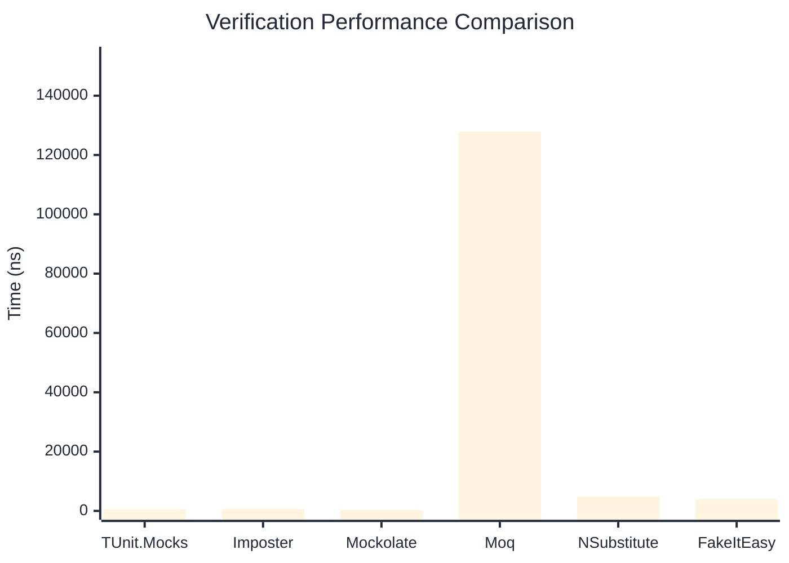

# Verification Benchmark

> Verifying mock method calls — comparing **TUnit.Mocks** (source-generated) against runtime proxy-based mocking libraries.

:::info Last Updated
This benchmark was automatically generated on **2026-08-13** from the latest CI run.

**Environment:** Ubuntu Latest • .NET SDK 10.0.400
:::

## 📊 Results

Verifying mock method calls:

| Library | Mean | Error | StdDev | Allocated |
|---------|------|-------|--------|-----------|
| **TUnit.Mocks** | 562.79 ns | 10.376 ns | 8.665 ns | 3008 B |
| Imposter | 569.05 ns | 11.322 ns | 21.266 ns | 4688 B |
| Mockolate | 326.92 ns | 3.919 ns | 3.474 ns | 2128 B |
| Moq | 127,911.27 ns | 583.043 ns | 516.852 ns | 24338 B |
| NSubstitute | 4,783.61 ns | 74.534 ns | 66.072 ns | 10064 B |
| FakeItEasy | 3,956.23 ns | 34.798 ns | 32.550 ns | 10717 B |

```mermaid
%%{init: {
  'theme':'base',
  'themeVariables': {
    'primaryColor': '#2563eb',
    'primaryTextColor': '#1f2937',
    'primaryBorderColor': '#1e40af',
    'lineColor': '#6b7280',
    'secondaryColor': '#7c3aed',
    'tertiaryColor': '#dc2626',
    'background': '#ffffff',
    'pie1': '#2563eb',
    'pie2': '#7c3aed',
    'pie3': '#dc2626',
    'pie4': '#f59e0b',
    'pie5': '#10b981',
    'pie6': '#06b6d4',
    'pie7': '#ec4899',
    'pie8': '#6366f1'
  }
}}%%
xychart-beta
  title "Verification Performance Comparison"
  x-axis ["TUnit.Mocks", "Imposter", "Mockolate", "Moq", "NSubstitute", "FakeItEasy"]
  y-axis "Time (ns)" 0 --> 153494
  bar [562.79, 569.05, 326.92, 127911.27, 4783.61, 3956.23]
```

---

### Never

| Library | Mean | Error | StdDev | Allocated |
|---------|------|-------|--------|-----------|
| **TUnit.Mocks** | 41.08 ns | 0.662 ns | 1.050 ns | 320 B |
| Imposter | 256.99 ns | 2.287 ns | 1.785 ns | 2400 B |
| Mockolate | 180.00 ns | 2.084 ns | 1.627 ns | 1144 B |
| Moq | 32,371.26 ns | 620.210 ns | 806.449 ns | 6922 B |
| NSubstitute | 2,642.51 ns | 40.532 ns | 31.645 ns | 7088 B |
| FakeItEasy | 2,152.70 ns | 23.343 ns | 20.693 ns | 5205 B |

```mermaid
%%{init: {
  'theme':'base',
  'themeVariables': {
    'primaryColor': '#2563eb',
    'primaryTextColor': '#1f2937',
    'primaryBorderColor': '#1e40af',
    'lineColor': '#6b7280',
    'secondaryColor': '#7c3aed',
    'tertiaryColor': '#dc2626',
    'background': '#ffffff',
    'pie1': '#2563eb',
    'pie2': '#7c3aed',
    'pie3': '#dc2626',
    'pie4': '#f59e0b',
    'pie5': '#10b981',
    'pie6': '#06b6d4',
    'pie7': '#ec4899',
    'pie8': '#6366f1'
  }
}}%%
xychart-beta
  title "Verification (Never) Performance Comparison"
  x-axis ["TUnit.Mocks", "Imposter", "Mockolate", "Moq", "NSubstitute", "FakeItEasy"]
  y-axis "Time (ns)" 0 --> 38846
  bar [41.08, 256.99, 180, 32371.26, 2642.51, 2152.7]
```

---

### Multiple

| Library | Mean | Error | StdDev | Allocated |
|---------|------|-------|--------|-----------|
| **TUnit.Mocks** | 1,023.21 ns | 19.657 ns | 28.192 ns | 4472 B |
| Imposter | 1,396.00 ns | 25.363 ns | 32.076 ns | 11192 B |
| Mockolate | 858.69 ns | 16.379 ns | 14.520 ns | 5240 B |
| Moq | 160,497.21 ns | 1,173.109 ns | 1,097.326 ns | 34584 B |
| NSubstitute | 8,557.76 ns | 48.712 ns | 45.566 ns | 16761 B |
| FakeItEasy | 7,504.47 ns | 93.034 ns | 82.472 ns | 19238 B |

```mermaid
%%{init: {
  'theme':'base',
  'themeVariables': {
    'primaryColor': '#2563eb',
    'primaryTextColor': '#1f2937',
    'primaryBorderColor': '#1e40af',
    'lineColor': '#6b7280',
    'secondaryColor': '#7c3aed',
    'tertiaryColor': '#dc2626',
    'background': '#ffffff',
    'pie1': '#2563eb',
    'pie2': '#7c3aed',
    'pie3': '#dc2626',
    'pie4': '#f59e0b',
    'pie5': '#10b981',
    'pie6': '#06b6d4',
    'pie7': '#ec4899',
    'pie8': '#6366f1'
  }
}}%%
xychart-beta
  title "Verification (Multiple) Performance Comparison"
  x-axis ["TUnit.Mocks", "Imposter", "Mockolate", "Moq", "NSubstitute", "FakeItEasy"]
  y-axis "Time (ns)" 0 --> 192597
  bar [1023.21, 1396, 858.69, 160497.21, 8557.76, 7504.47]
```

## 🎯 Key Insights

This benchmark compares **TUnit.Mocks** (source-generated) against runtime proxy-based mocking libraries for verifying mock method calls.

---

:::note Methodology
View the [mock benchmarks overview](/docs/benchmarks/mocks) for methodology details and environment information.
:::

*Last generated: 2026-08-13T03:11:34.997Z*
