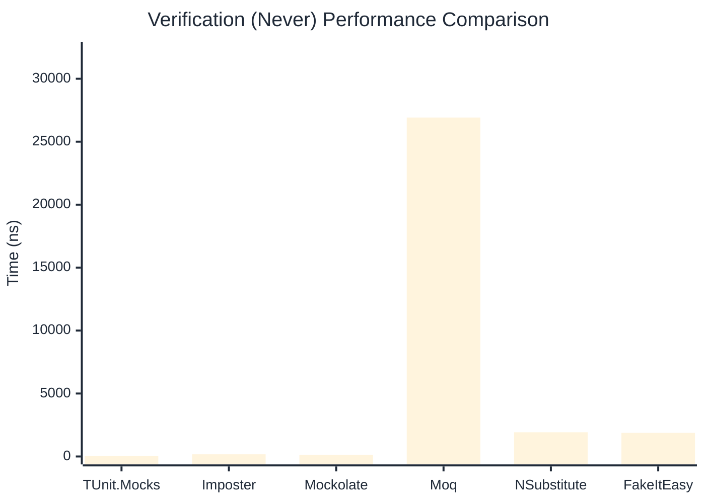
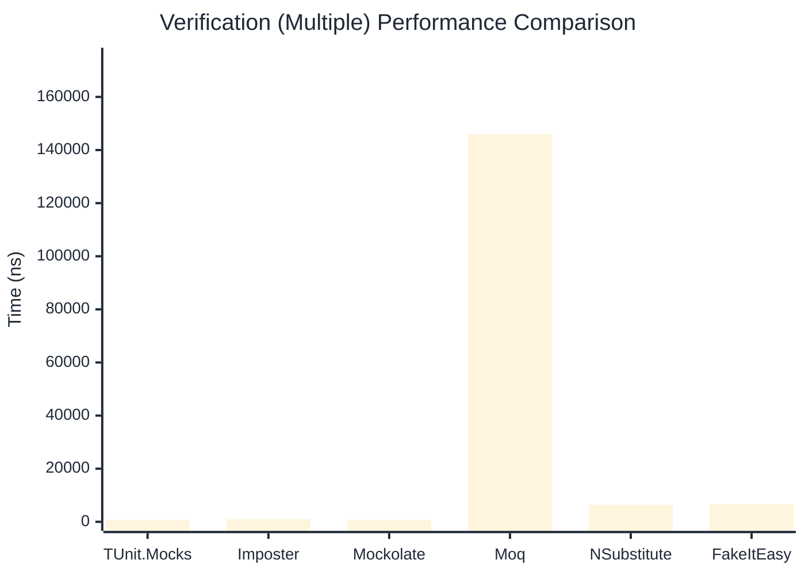

# Verification Benchmark

> Verifying mock method calls — comparing **TUnit.Mocks** (source-generated) against runtime proxy-based mocking libraries.

:::info Last Updated
This benchmark was automatically generated on **2026-08-22** from the latest CI run.

**Environment:** Ubuntu Latest • .NET SDK 10.0.400
:::

## 📊 Results

Verifying mock method calls:

| Library | Mean | Error | StdDev | Allocated |
|---------|------|-------|--------|-----------|
| **TUnit.Mocks** | 440.48 ns | 7.705 ns | 6.830 ns | 3008 B |
| Imposter | 376.01 ns | 7.012 ns | 8.347 ns | 4688 B |
| Mockolate | 246.60 ns | 2.675 ns | 2.502 ns | 2128 B |
| Moq | 108,344.12 ns | 1,190.311 ns | 993.964 ns | 24340 B |
| NSubstitute | 3,530.05 ns | 64.137 ns | 56.855 ns | 10064 B |
| FakeItEasy | 3,566.14 ns | 41.114 ns | 38.458 ns | 10722 B |

```mermaid
%%{init: {
  'theme':'base',
  'themeVariables': {
    'primaryColor': '#2563eb',
    'primaryTextColor': '#1f2937',
    'primaryBorderColor': '#1e40af',
    'lineColor': '#6b7280',
    'secondaryColor': '#7c3aed',
    'tertiaryColor': '#dc2626',
    'background': '#ffffff',
    'pie1': '#2563eb',
    'pie2': '#7c3aed',
    'pie3': '#dc2626',
    'pie4': '#f59e0b',
    'pie5': '#10b981',
    'pie6': '#06b6d4',
    'pie7': '#ec4899',
    'pie8': '#6366f1'
  }
}}%%
xychart-beta
  title "Verification Performance Comparison"
  x-axis ["TUnit.Mocks", "Imposter", "Mockolate", "Moq", "NSubstitute", "FakeItEasy"]
  y-axis "Time (ns)" 0 --> 130013
  bar [440.48, 376.01, 246.6, 108344.12, 3530.05, 3566.14]
```

---

### Never

| Library | Mean | Error | StdDev | Allocated |
|---------|------|-------|--------|-----------|
| **TUnit.Mocks** | 32.68 ns | 0.563 ns | 0.527 ns | 320 B |
| Imposter | 173.57 ns | 2.116 ns | 1.875 ns | 2400 B |
| Mockolate | 136.28 ns | 2.152 ns | 1.908 ns | 1144 B |
| Moq | 26,920.63 ns | 256.781 ns | 227.630 ns | 6925 B |
| NSubstitute | 1,923.76 ns | 15.942 ns | 12.446 ns | 7088 B |
| FakeItEasy | 1,874.41 ns | 33.616 ns | 29.800 ns | 5210 B |

```mermaid
%%{init: {
  'theme':'base',
  'themeVariables': {
    'primaryColor': '#2563eb',
    'primaryTextColor': '#1f2937',
    'primaryBorderColor': '#1e40af',
    'lineColor': '#6b7280',
    'secondaryColor': '#7c3aed',
    'tertiaryColor': '#dc2626',
    'background': '#ffffff',
    'pie1': '#2563eb',
    'pie2': '#7c3aed',
    'pie3': '#dc2626',
    'pie4': '#f59e0b',
    'pie5': '#10b981',
    'pie6': '#06b6d4',
    'pie7': '#ec4899',
    'pie8': '#6366f1'
  }
}}%%
xychart-beta
  title "Verification (Never) Performance Comparison"
  x-axis ["TUnit.Mocks", "Imposter", "Mockolate", "Moq", "NSubstitute", "FakeItEasy"]
  y-axis "Time (ns)" 0 --> 32305
  bar [32.68, 173.57, 136.28, 26920.63, 1923.76, 1874.41]
```

---

### Multiple

| Library | Mean | Error | StdDev | Allocated |
|---------|------|-------|--------|-----------|
| **TUnit.Mocks** | 754.70 ns | 7.535 ns | 6.292 ns | 4472 B |
| Imposter | 976.70 ns | 13.380 ns | 12.516 ns | 11192 B |
| Mockolate | 637.50 ns | 12.457 ns | 13.329 ns | 5240 B |
| Moq | 145,914.45 ns | 2,916.790 ns | 2,864.678 ns | 34698 B |
| NSubstitute | 6,421.25 ns | 125.627 ns | 111.365 ns | 16761 B |
| FakeItEasy | 6,540.16 ns | 123.346 ns | 115.378 ns | 19232 B |

```mermaid
%%{init: {
  'theme':'base',
  'themeVariables': {
    'primaryColor': '#2563eb',
    'primaryTextColor': '#1f2937',
    'primaryBorderColor': '#1e40af',
    'lineColor': '#6b7280',
    'secondaryColor': '#7c3aed',
    'tertiaryColor': '#dc2626',
    'background': '#ffffff',
    'pie1': '#2563eb',
    'pie2': '#7c3aed',
    'pie3': '#dc2626',
    'pie4': '#f59e0b',
    'pie5': '#10b981',
    'pie6': '#06b6d4',
    'pie7': '#ec4899',
    'pie8': '#6366f1'
  }
}}%%
xychart-beta
  title "Verification (Multiple) Performance Comparison"
  x-axis ["TUnit.Mocks", "Imposter", "Mockolate", "Moq", "NSubstitute", "FakeItEasy"]
  y-axis "Time (ns)" 0 --> 175098
  bar [754.7, 976.7, 637.5, 145914.45, 6421.25, 6540.16]
```

## 🎯 Key Insights

This benchmark compares **TUnit.Mocks** (source-generated) against runtime proxy-based mocking libraries for verifying mock method calls.

---

:::note Methodology
View the [mock benchmarks overview](/docs/benchmarks/mocks) for methodology details and environment information.
:::

*Last generated: 2026-08-22T02:40:44.558Z*
